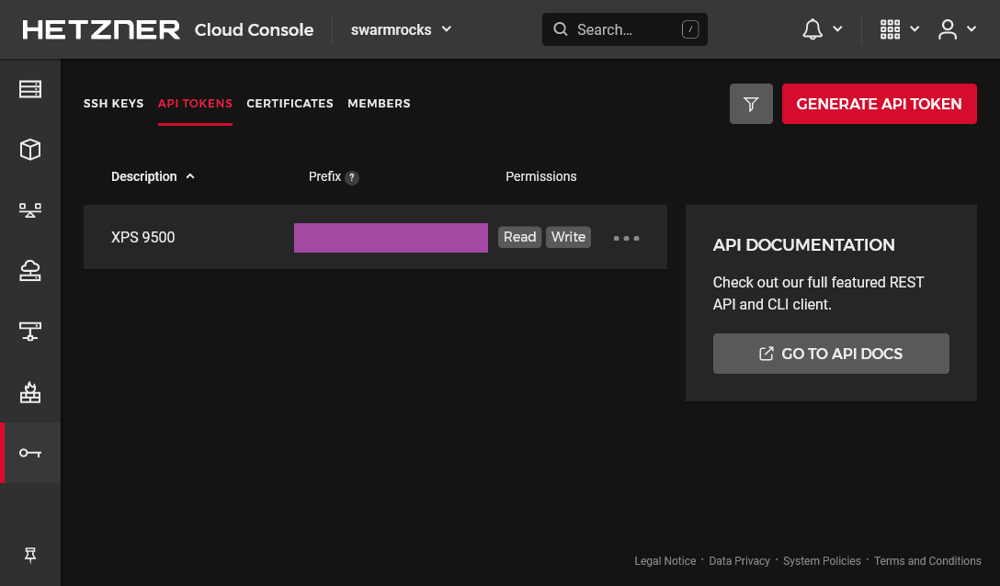


Build your own cheap but powerful self-hosted cluster and be free from any SaaS solutions by following this opinionated guide 🎉


This is the **Part II** of more global topic tutorial. [Back to first part]() for intro.

## Requirements 🛑

Before continue I presume you have :

* Hetzner cloud account ready
* Installed [hcloud cli](https://github.com/hetznercloud/cli)
* Have a local account SSH key

Initiate the project by following this simple steps :

1. Create the project through the UI (I will use `swarmrocks` as project's name here)
2. Navigate to security > API tokens
3. Generate new API key with *Read Write* permissions and copy the generated token

[](hetzner-api-token.png)

Then go to the terminal and prepare the new context.

```sh
hcloud context create swarmrocks # set the copied token at prompt
hcloud context list # check that your new project is active

# set your ssh public key to the project, mine is .ssh/id_ed25519.pub
hcloud ssh-key create --name swarm --public-key-from-file .ssh/id_ed25519.pub
```

Note as we don't need to return to the Hetzner UI anymore, all the rest is pure CLI. We're ready to set up the cluster architecture presented in the first part !

## Create the cloud servers and networks ☁️

```sh
# create private network
hcloud network create --name network-01 --ip-range 10.0.0.0/16

# create a subnet for the network
hcloud network add-subnet network-01 --type server --network-zone eu-central --ip-range 10.0.0.0/24

# create manager server
hcloud server create --name manager-01 --ssh-key swarm --image ubuntu-20.04 --type cx21 --location nbg1 --network network-01

# create worker server
hcloud server create --name worker-01 --ssh-key swarm --image ubuntu-20.04 --type cx21 --location nbg1 --network network-01

# create runner server
hcloud server create --name runner-01 --ssh-key swarm --image ubuntu-20.04 --type cpx11 --location nbg1 --network network-01

# create data server
hcloud server create --name data-01 --ssh-key swarm --image ubuntu-20.04 --type cx21 --location nbg1 --network network-01

# create the volume that will be used by gluster and automount it to the data server (fstab will be already setted)
hcloud volume create --name volume-01 --size 20 --server data-01 --automount --format ext4
```


Location is important ! Choose wisely between Germany, Finland and US. Here I go for `nbg1`, aka Nuremberg.


## Prepare the servers 🛠️

It's time to do the classic minimal boring viable security setup for each server. Use `hcloud server ssh xxxxxx-01` for ssh connect and apply the same following commands for each nodes.

```sh
# ensure last upgrades
apt update && apt upgrade -y && reboot

# configure your locales and timezone
dpkg-reconfigure locales
dpkg-reconfigure tzdata

# create your default non root user (swarm in this sample)
adduser swarm # enter any strong password at prompt

# set the user to sudoer group and sync the same ssh root key
usermod -aG sudo swarm
rsync --archive --chown=swarm:swarm ~/.ssh /home/swarm

# setting vim for personal taste and remove sudo password
update-alternatives --config editor
visudo # replace %sudo... line by %sudo ALL=(ALL:ALL) NOPASSWD:ALL

# finally change default ssh port by anything else
vim /etc/ssh/sshd_config # Port 2222
service ssh reload
```


The change of SSH port is not only for better security, but also for allowing more later git ssh operations into your custom git provider as GitLab, Gitea, etc. that will pass through Traefik 22 port, which will be far more practical.


Finally, test your new `swarm` user by using `hcloud server ssh --user swarm --port 2222 xxxxxx-01` for each server and be sure that the user can do commands as sudo before continue.

Then edit `/etc/hosts` file for each server accordingly for internal DNS :



```txt
10.0.0.3 worker-01 sw-worker-01
10.0.0.4 runner-01 sw-runner-01
10.0.0.5 data-01 sw-data-01
```





```txt
10.0.0.2 manager-01
10.0.0.5 data-01
```





```txt
10.0.0.2 manager-01
10.0.0.5 data-01
```





```txt
10.0.0.2 manager-01
```




IPs are only showed here as samples, use `hcloud server describe xxxxxx-01` in order to get the right private IP under `Private Net`. The additional `sw-***-01` DNS name is for having a better unique name for next ssh config.


## Setup DNS and SSH config 🌍

Now use `hcloud server ip manager-01` to get the unique frontal IP address of the cluster that will be used for any entry point, including SSH. Then edit the DNS of your domain and apply this IP to a particular subdomain, as well as a wildcard subdomain. I will use `sw.dockerswarm.rocks` as sample with `123.123.123.123` as public IP. Choose between two solutions :




Use `xyz.dockerswarm.rocks` format for our cluster apps.

```txt
sw      3600    IN A        123.123.123.123
*       43200   IN CNAME    sw
```

As soon as the above DNS is applied, you should ping `sw.dockerswarm.rocks` or any `xyz.dockerswarm.rocks`.




Use namespaced `xyz.sw.dockerswarm.rocks` format for our cluster apps.

```txt
sw      3600    IN A        123.123.123.123
*.sw    43200   IN CNAME    sw
```

As soon as the above DNS is applied, you should ping `sw.dockerswarm.rocks` or any `xyz.sw.dockerswarm.rocks`.




It's now time to finalize your local SSH config for optimal access. Go to `~/.ssh/config` and add following hosts (change it accordingly to your own setup) :



```txt
Host sw
    User swarm
    Port 2222
    HostName sw.dockerswarm.rocks

Host sw-data-01
    User swarm
    HostName sw-data-01
    ProxyCommand ssh sw -W %h:2222

Host sw-runner-01
    User swarm
    HostName sw-runner-01
    ProxyCommand ssh sw -W %h:2222

Host sw-worker-01
    User swarm
    HostName sw-worker-01
    ProxyCommand ssh sw -W %h:2222
```



And that's it ! You should now quickly ssh to these servers easily with a single endpoint by `ssh sw`, `ssh sw-worker-01`, `ssh sw-runner-01`, `ssh sw-data-01`, which will be far more practical.


Note as I only use the `sw.dockerswarm.rocks` as unique endpoint for ssh access to all internal server, without using external IP of servers behind from `manager-01`. It's known as SSH proxy, which allows single access point by simply jumping from frontal server to any internal server.


## The firewall 🧱

Now it's time to finish this preparation section by putting some security.
You should never let any cluster without properly configured firewall. It's generally preferable to use the cloud provider firewall instead of standard `ufw` because more easy to manage, no risk of being stupidly blocked, and settled once and for all.

You need at least 2 firewalls :

1. One external for allowing only SSH and web standard ports. You'll need a full set of rules, and it will be only enabled for `manager-01`. The main SSH port will be IP whitelisted to your public IP only.
2. The second firewall is to block all **ANY** external incoming requests, even for SSH as we don't need it anymore thanks to above SSH proxy.


Note as the Hetzner Cloud Firewall will not apply to the private network at all, as it's [already considered to be "secured"](https://docs.hetzner.com/cloud/firewalls/faq/#can-firewalls-secure-traffic-to-my-private-hetzner-cloud-networks) ! I hope so, but I'm pretty sure that it will be possible to set a firewall in private networks in the future as we can just believe Hetzner word for word.  
How can be sure that any other internal client has no access to our private network ? Use `ufw` if you're paranoid about that...


First create the next JSON file somewhere locally in your machine :



```json
[
    {
        "direction": "in",
        "port": "22",
        "protocol": "tcp",
        "source_ips": [
            "0.0.0.0/0",
            "::/0"
        ]
    },
    {
        "direction": "in",
        "port": "80",
        "protocol": "tcp",
        "source_ips": [
            "0.0.0.0/0",
            "::/0"
        ]
    },
    {
        "direction": "in",
        "port": "443",
        "protocol": "tcp",
        "source_ips": [
            "0.0.0.0/0",
            "::/0"
        ]
    },
    {
        "direction": "in",
        "port": "2222",
        "protocol": "tcp",
        "source_ips": [
            "xx.xx.xx.xx/32"
        ]
    }
]
```



It corresponds to the incoming allowed port for `manager-01` host.


Adapt the 4st rule accordingly to your own chosen SSH port and set your own public IP inside `source_ips` in place of `xx.xx.xx.xx` value. In case you have dynamic IP, just use `0.0.0.0/0` or any better sub range.


Create the 2 firewalls as next :

```sh
# internal firewall to protect internal server from all external access
hcloud firewall create --name firewall-internal
hcloud firewall apply-to-resource firewall-internal --type server --server worker-01
hcloud firewall apply-to-resource firewall-internal --type server --server runner-01
hcloud firewall apply-to-resource firewall-internal --type server --server data-01

# external firewall to protect manager-01 with only required ports
hcloud firewall create --name firewall-external --rules-file firewall-rules.json
hcloud firewall apply-to-resource firewall-external --type server --server manager-01
```

You should have now good protection against any unintended external access with only few required ports to your `manager-01` server, aka :

| port     | description                                                                                                                  |
| -------- | ---------------------------------------------------------------------------------------------------------------------------- |
| **2222** | the main SSH port, with IP whitelist                                                                                         |
| **443**  | the HTTPS port for Traefik, our main access for all of your web apps                                                         |
| **80**   | the HTTP port for Traefik, only required for proper HTTPS redirection                                                        |
| **22**   | the SSH standard port for Traefik, required for proper usage through your main Git provider container such as GitLab / Gitea |

## Manage all nodes 🧑‍🍳

Maintain all nodes up2date one by one can be really time-consuming. Let's try [SaltStack](https://github.com/saltstack/salt) for this. Salt uses an agent system (called minion) connected to a master for remote management. This is notably more scalable than Ansible which use simple SSH connection for each node. Use following commands on `manager-01`.



```sh
curl -o bootstrap-salt.sh -L https://bootstrap.saltproject.io
sudo sh bootstrap-salt.sh -M
```



Then same without `-M` commutator an all other servers :

```sh
curl -o bootstrap-salt.sh -L https://bootstrap.saltproject.io
sudo sh bootstrap-salt.sh
```

Edit minion configuration on all hosts as following in order to connect agent to the master host :



```conf
#...
master: manager-01
#...
```



Then restart all with `sudo systemctl restart salt-minion`.

A cache key will be automatically generated and all you have to do is accept all clients on manager host :



```sh
sudo salt-key -L # list all currently unaccepted client keys
sudo salt-key -A # accept all clients
```



And that's it ! You can manage efficiently all nodes in one single time via SSH on master node. Here some classic exemples :



```sh
sudo salt '*' test.version # show all minion client version
sudo salt '*' pkg.upgrade # classic apt upgrade on all nodes
sudo salt '*' system.reboot # reboot all nodes
sudo salt '*' kernelpkg.needs_reboot # show reboot need status for all nodes
sudo salt '*' kernelpkg.upgrade reboot=True # upgrade kernel and reboot for applying it
```



## Network file system 📄

Before go further away, we'll quickly need of proper unique shared storage location for all managers and workers. It's mandatory in order to keep same state when your app containers are automatically rearranged by Swarm manager across multiple workers for convergence purpose.

We'll use **GlusterFS** for that. You can of course use a simple NFS bind mount. But GlusterFS make more sense as it allows easy replication for HA. You will not regret it when you'll need a `data-02`. We'll not cover GlusterFS replication here, just a unique master replica.


flowchart TD
subgraph manager-01
traefik((Traefik))
end
subgraph worker-01
my-app-01-01((My App 01))
my-app-02-01((My App 02))
end
subgraph worker-02
my-app-01-02((My App 01))
my-app-02-02((My App 02))
end
subgraph data-01
storage[/GlusterFS/]
db1[(MySQL)]
db2[(PostgreSQL)]
end
traefik-->my-app-01-01
traefik-->my-app-02-01
traefik-->my-app-01-02
traefik-->my-app-02-02
worker-01-- glusterfs bind mount -->storage
worker-02-- glusterfs bind mount -->storage
my-app-02-01-->db2
my-app-02-02-->db2



Note that manager node can be used as worker as well. However, I think it's not well suited for production apps in my opinion.


### Install GlusterFS 🐜

It's 2 steps :

* Installing the file system server on dedicated volume mounted on `data-01`
* Mounting the above volume on all clients where docker will be installed




```sh
sudo add-apt-repository -y ppa:gluster/glusterfs-10

sudo apt install -y glusterfs-server
sudo systemctl enable glusterd.service
sudo systemctl start glusterd.service

# get the path of external mounted disk volume
df -h # it should be like /mnt/HC_Volume_xxxxxxxx

# create the volume
sudo gluster volume create volume-01 data-01:/mnt/HC_Volume_xxxxxxxx/gluster-storage
sudo gluster volume start volume-01

# ensure volume is present with this command
sudo gluster volume status

# next line for testing purpose
sudo touch /mnt/HC_Volume_xxxxxxxx/gluster-storage/test.txt
```




Do following commands on every docker client host, aka `master-01`, `worker-01`, `runner-01` :

```sh
sudo add-apt-repository -y ppa:gluster/glusterfs-10

sudo apt install -y glusterfs-client

# I will choose this path as main bind mount
sudo mkdir /mnt/storage-pool

# append mount to /etc/fstab for persistent mount
echo "data-01:/volume-01 /mnt/storage-pool glusterfs defaults,_netdev,x-systemd.automount 0 0" | sudo tee -a /etc/fstab

# test fstab with next command
sudo mount -a

# you should see test.txt
ls /mnt/storage-pool/
```





You can ask why using bind mounts directly on the host instead of more featured docker volumes directly (Kubernetes does similar way). Besides, it's not really the first recommendation on [official docs](https://docs.docker.com/storage/bind-mounts/), as it states to prefer volumes directly.  
It's just as I didn't find reliable and really maintained GlusterFS driver for Docker. Kubernetes is far more mature in this domain sadly. Please let me know if you know production grade solution for that !


## 1st check ✅

We've done all the boring nevertheless essential stuff of this tutorial by preparing the physical layer + OS part + cloud native NFS.

Go to the [next part]() for the serious work !
