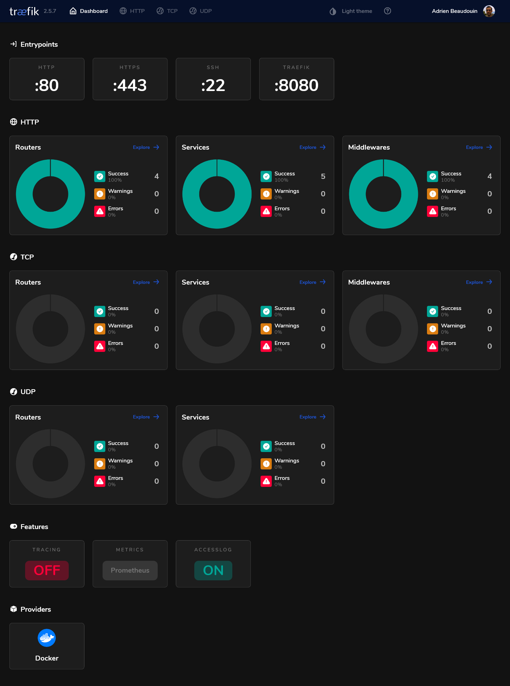
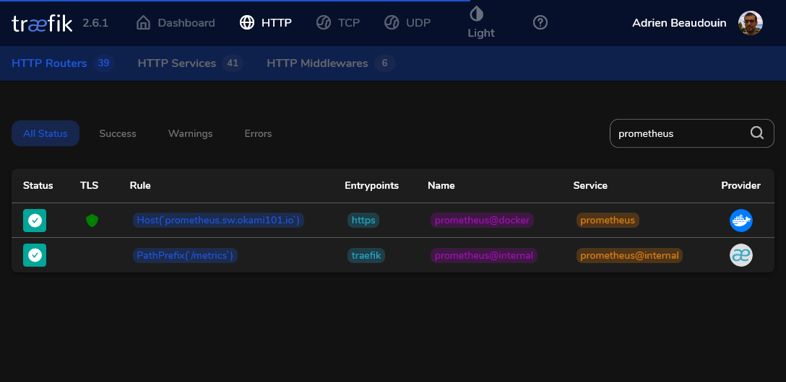
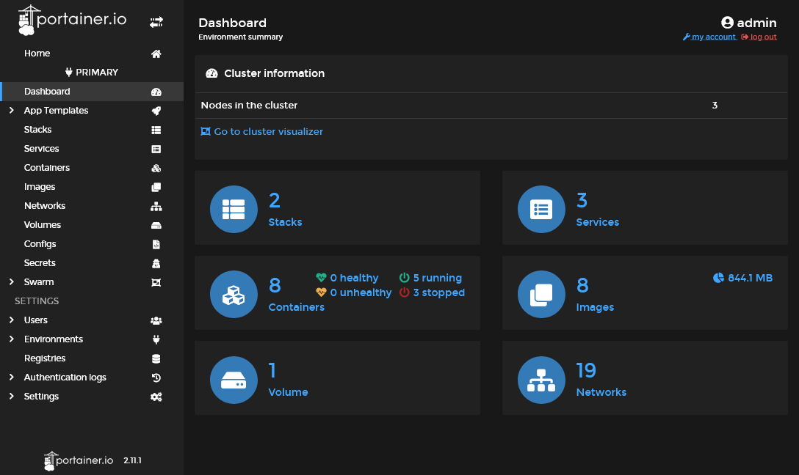
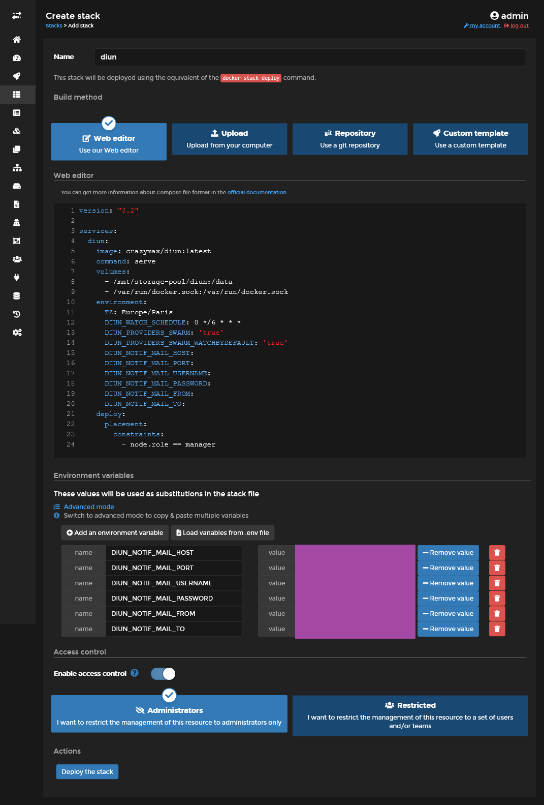
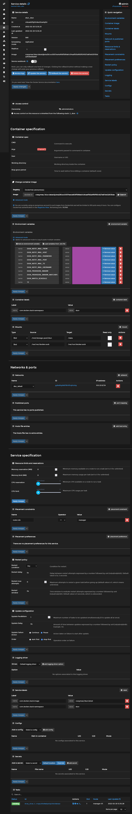
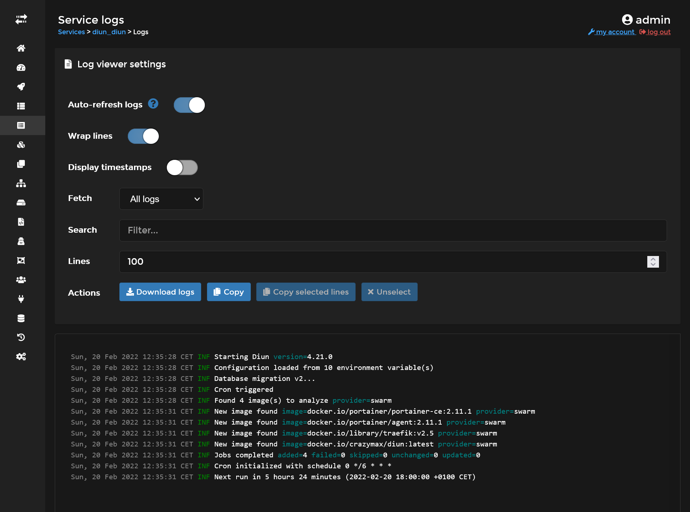


Build your own cheap but powerful self-hosted cluster and be free from any SaaS solutions by following this opinionated guide 🎉


This is the **Part III** of more global topic tutorial. [Back to first part]() for intro.

## Docker 🐳

Now we must do the classic Docker installation on each stateless servers. Repeat following commands on `manager-01`, `worker-01` and `runner-01`.

```sh
curl -fsSL https://download.docker.com/linux/ubuntu/gpg | sudo gpg --dearmor -o /usr/share/keyrings/docker-archive-keyring.gpg
echo \
  "deb [arch=$(dpkg --print-architecture) signed-by=/usr/share/keyrings/docker-archive-keyring.gpg] https://download.docker.com/linux/ubuntu \
  $(lsb_release -cs) stable" | sudo tee /etc/apt/sources.list.d/docker.list > /dev/null

sudo apt-get update
sudo apt-get install -y docker-ce docker-ce-cli containerd.io

sudo usermod -aG docker $USER
```

Then logout and use `docker run hello-world` and be sure all is OK. Follow [official installation](https://docs.docker.com/engine/install/ubuntu/) if not.

### Enable Docker Swarm

Finally, enable Swarm mode on `manager-01` :

```sh
docker swarm init --advertise-addr 10.0.0.2
```


Use private network IP of manager, it' should be the same defined on `/et/hosts` on other worker servers.


The above command will show the command to launch to other worker nodes. Apply it on `worker-01` and `runner-01`.

When done use `docker node ls` on manager node in order to confirm the presence of the 2 workers with `Ready` status and active.

Yeah, cluster is already properly configured. Far less overwhelming than Kubernetes, I should say.

### CLI tools & environment labels

[`ctop`](https://github.com/bcicen/ctop) is a very useful CLI tools that works like `htop` but dedicated for docker containers. Install it on every docker hosts :

```sh
echo "deb http://packages.azlux.fr/debian/ buster main" | sudo tee /etc/apt/sources.list.d/azlux.list
wget -qO - https://azlux.fr/repo.gpg.key | sudo apt-key add -
sudo apt update
sudo apt install -y docker-ctop
```

Before continue, let's add some labels on nodes in order to differentiate properly *production* from *build* nodes :



```sh
# worker-01 is intended for running production app container
docker node update --label-add environment=production worker-01
# runner-01 is intended to build docker image through CI/CD pipeline
docker node update --label-add environment=build runner-01
```



## Installing the Traefik - Portainer combo 💞

It's finally time to start our first container services. The minimal setup will be :

* [Traefik](https://doc.traefik.io/traefik/) as main proxy with dynamic services discovery through that Docker API
* [Portainer](https://www.portainer.io/) as main GUI for docker containers management and deployement

This 2 services will be deployed as docker services on `manager-01`.

### Traefik 🛣️

The main task of traefik will be to redirect correct URL path to corresponding app service, according to regex rules (which domain or subdomain, which prefix URL path, etc.).

Thankfully, Traefik can be configured to take cares of all SSL certificates generation automatically without any intervention. We will use simple Let's encrypt for this.

#### The static Traefik configuration

I should say that Traefik is not really easy to setup for new comers. The essential part to keep in mind is that this reverse proxy has 2 types of configuration, *static* and *dynamic*. [Go here](https://doc.traefik.io/traefik/getting-started/configuration-overview/) for detail explication of difference between these types of configuration.

Here we'll talk about static configuration. Create a YAML file under `/etc/traefik/traefik.yml` of `manager-01` server with following content (TOML is also supported) :



```yml
entryPoints:
  https:
    address: :443
    http:
      middlewares:
        - gzip
      tls:
        certResolver: le
  http:
    address: :80
    http:
      redirections:
        entryPoint:
          to: https
          scheme: https
          permanent: true
  ssh:
    address: :22
certificatesResolvers:
  le:
    acme:
      email: admin@sw.dockerswarm.rocks
      storage: /certificates/acme.json
      tlsChallenge: {}
providers:
  docker:
    defaultRule: Host(`{{ index .Labels "com.docker.stack.namespace" }}.sw.dockerswarm.rocks`)
    exposedByDefault: false
    swarmMode: true
    network: traefik_public
api: {}
accessLog: {}
metrics:
  prometheus: {}
```






| name            | description                                                                                                                                                                                                          |
| --------------- | -------------------------------------------------------------------------------------------------------------------------------------------------------------------------------------------------------------------- |
| **HTTPS (443)** | Main Web access, I added a global middleware called `gzip` that will be configured on next dynamic configuration for proper on-demand compression as well as `le`, aka *Let's encrypt*, as main certificate resolver |
| **HTTP (80)**   | Automatic permanent HTTPS redirection, so every web service will be assured to be accessed through HTTPS only (and you should)                                                                                       |
| **SSH (22)**    | For specific advanced case, such as give possibility of SSH clone through your main self-hosted Git provider                                                                                                         |


Don't forget to have your main SSH for terminal operations on different port than 22 as explained, as the 22 port will be taken by Traefik.





The certificate resolver (aka [*Let's encrypt*](https://doc.traefik.io/traefik/https/acme/)) will be configured with **TLS-ALPN-01** challenge. The certificate results of this challenge will be stored on `acme.json` local cache file on the host in order to obviously avoid a certificate regeneration on every Traefik service restart.




This is the famous source of Traefik dynamic configuration. We only need of Docker as main provider here, but it supports [plenty else](https://doc.traefik.io/traefik/providers/overview/).

It indicates Traefik to read through Docker API in order to discover any new services and apply automatic configurations as well as SSL certificate without any restart. [Docker labels](https://docs.docker.com/config/labels-custom-metadata/) will be used for dynamic configuration.

| name               | description                                                                                                                                                                                                           |
| ------------------ | --------------------------------------------------------------------------------------------------------------------------------------------------------------------------------------------------------------------- |
| `swarmMode`        | Tell Traefik to uses labels found on services instead of individual containers (case of Docker Standalone mode).                                                                                                      |
| `exposedByDefault` | When false, force us to use `traefik.enable=true` as explicit label for automatic docker service discovery                                                                                                            |
| `network`          | Default network connection for all exposed containers                                                                                                                                                                 |
| `defaultRule`      | Default rule that will be applied to HTTP routes, in order to redirect particular URL to the right service. Each service container can override this default value with `traefik.http.routers.my-service.rule` label. |

As a default route rule, I set here a value adapted for an automatic subdomain discovery. `{{ index .Labels "com.docker.stack.namespace" }}.sw.dockerswarm.rocks` is a dynamic Go template string that means to use the `com.docker.stack.namespace` label that is applied by default on Docker Swarm on each deployed service. So if I deploy a swarm stack called `myapp`, Traefik will automatically set `myapp.sw.dockerswarm.rocks` as default domain URL to my service, with automatic TLS challenge !

All I have to do is to add a specific label `traefik.enable=true` inside the Docker service configuration and be sure that it's on the same docker network.




| name        | description                                                                                                                                                 |
| ----------- | ----------------------------------------------------------------------------------------------------------------------------------------------------------- |
| `api`       | Enable a nice Traefik dashboard (with dark theme support !) that will be exposed on the local 8080 port by default                                          |
| `accessLog` | Show all incoming requests through Docker STDOUT                                                                                                            |
| `metrics`   | Expose a `/metrics` REST endpoint in order to provide all request metrics. It'll be consumed by Prometheus that we'll install later on the monitoring part. |




#### Traefik deployment

In order to deploy Traefik on our shiny new Docker Swarm, we must write a Docker Swarm deployment file that looks like to a classic Docker compose file. Create a `traefik-stack.yml` file somewhere in your manager server with following content :



```yml
version: '3'

services:
  traefik:
    image: traefik:v2.6
    ports:
      - target: 22
        published: 22
        mode: host
      - target: 80
        published: 80
        mode: host
      - target: 443
        published: 443
        mode: host
    networks:
      - public
    volumes:
      - /etc/traefik:/etc/traefik
      - /var/run/docker.sock:/var/run/docker.sock:ro
      - certificates:/certificates
    deploy:
      placement:
        constraints:
          - node.labels.traefik-public.certificates == true
      labels:
        - traefik.enable=true
        - traefik.http.middlewares.gzip.compress=true
        - traefik.http.middlewares.admin-auth.basicauth.users=admin:${HASHED_PASSWORD?Variable not set}
        - traefik.http.middlewares.admin-ip.ipwhitelist.sourcerange=82.82.82.82
        - traefik.http.routers.traefik-public-api.service=api@internal
        - traefik.http.routers.traefik-public-api.middlewares=admin-ip,admin-auth
        - traefik.http.services.traefik-public.loadbalancer.server.port=8080

networks:
  public:

volumes:
  certificates:
```






We declare 3 ports for each entry point, note as I will use [host mode](https://docs.docker.com/network/host/), for extra performance and getting real IPs from clients.

Then we create a `public` network that will be created with [`overlay driver`](https://docs.docker.com/network/overlay/) (this is by default on swarm). This is the very important part in order to have a dedicated NAT across all nodes for container services that will be exposed to the internet.




We'll declare 3 volumes :

| name                   | description                                                                                                            |
| ---------------------- | ---------------------------------------------------------------------------------------------------------------------- |
| `/etc/traefik`         | Location where we putted our above static configuration file                                                           |
| `/var/run/docker.sock` | Required for allowing Traefik to access to Docker API in order to have automatic dynamic docker configuration working. |
| `certificates`         | Named docker volume in order to store our acme.json generated file from all TLS challenge by Let's Encrypt.            |


Note as we add `node.labels.traefik-public.certificates` inside `deploy.constraints` in order to ensure Traefik will run on the same server where certificates are located every time when Docker Swarm does service convergence.





This is the Traefik dynamic configuration part. I declare here many services that I will use later. Adapt for your own needs !

| name                  | type       | description                                                                                                                                                                                                                  |
| --------------------- | ---------- | ---------------------------------------------------------------------------------------------------------------------------------------------------------------------------------------------------------------------------- |
| `traefik.enable=true` | global     | Tell Traefik to expose himself through the network                                                                                                                                                                           |
| `gzip`                | middleware | Provides on-demand [gzip compression](https://doc.traefik.io/traefik/middlewares/http/compress/). It's applied globally on the above static configuration.                                                                   |
| `admin-auth`          | middleware | Provides basic HTTP authorization. `basicauth.users` will use standard `htpasswd` format. I use `HASHED_PASSWORD` as dynamic environment variable.                                                                           |
| `admin-ip`            | middleware | Provides IP whitelist protection, given a source range. Use your own IP.                                                                                                                                                     |
| `traefik-public-api`  | router     | For proper redirection to internal dashboard Traefik API from `traefik.sw.dockerswarm.rocks`, which is already defined by default rule. It's configured with above `admin-auth` and `admin-ip` for proper access protection. |
| `traefik-public`      | service    | Allow proper redirection to the default exposed 8080 port of Traefik container. This is sadly mandatory when using [Docker Swarm](https://doc.traefik.io/traefik/providers/docker/#port-detection_1)                         |


Keep in mind that the middlewares here are just declared as available for further usage in our services, but not applied globally, except for `gzip` that been declared globally to HTTPS entry point above in the static configuration.





It's finally time to test all this configuration !

Go to the `manager-01`, be sure to have above /etc/traefik/traefik.yml file, and do following commands :



```sh
# declare the current node manager as main certificates host, required in order to respect above deploy constraint
docker node update --label-add traefik-public.certificates=true manager-01

# generate your main admin password hash for any admin HTTP basic auth access into specific environment variable
export HASHED_PASSWORD=$(openssl passwd -apr1 aNyR4nd0mP@ssw0rd)

# deploy our 1st stack and cross the fingers...
docker stack deploy -c traefik-stack.yml traefik

# check status of the service, it should have 1 replica
docker service ls

# check logs for detail or any errors
docker service logs traefik_traefik
```



After few seconds, Traefik should launch and generate proper SSL certificate for its own domain. You can finally go to <https://traefik.sw.dockerswarm.rocks>. `http://` should work as well thanks to permanent redirection.

If properly configured, you will be prompted for access. After entering admin as user and your own chosen password, you should finally access to the traefik dashboard !

[](traefik-dashboard.png)

### Portainer ⛵

The hard part is done, we'll finish this 2nd part by installing Portainer. Portainer is constituted of :

* A main GUI that can be exposed through Traefik
* An active agent for each docker node, done by the global deployment mode of Docker Swarm. This agent will be responsible for getting all running dockers through API and send them to Portainer manager.

Create `portainer-agent-stack.yml` swarm stack file with follogin content :



```yml
version: '3'

services:
  agent:
    image: portainer/agent:2.11.1
    volumes:
      - /var/run/docker.sock:/var/run/docker.sock
      - /var/lib/docker/volumes:/var/lib/docker/volumes
    networks:
      - agent_network
    deploy:
      mode: global

  portainer:
    image: portainer/portainer-ce:2.11.1
    command: -H tcp://tasks.agent:9001 --tlsskipverify
    volumes:
      - /mnt/storage-pool/portainer:/data
    networks:
      - agent_network
      - traefik_public
    deploy:
      placement:
        constraints: [node.role == manager]
      labels:
        - traefik.enable=true
        - traefik.http.routers.portainer.middlewares=admin-ip
        - traefik.http.services.portainer.loadbalancer.server.port=9000

networks:
  agent_network:
  traefik_public:
    external: true
```



This is an adapted file from the official [Portainer Agent Stack](https://downloads.portainer.io/portainer-agent-stack.yml).

We use `agent_network` as overlay network for communication between agents and portainer. No need of `admin-auth` middleware here as Portainer has its own authentication.


Note that `traefik_public` must be set to **external** in order to reuse the original Traefik network.


Deploy the portainer stack :



```sh
# create the local storage for portainer in Gluster storage
sudo mkdir /mnt/storage-pool/portainer

# deploy portainer stack
docker stack deploy -c portainer-agent-stack.yml portainer

# check status
docker service ls
```



As soon as the main portainer service has successfully started, Traefik will detect it and configure it with SSL. The specific router for Portainer should appear in Traefik dashboard on HTTP section as below.

[](traefik-routers.png)

It's time to create your admin account through <https://portainer.sw.dockerswarm.rocks>. If all goes well, aka Portainer agent are accessible from Portainer portal, you should have access to your cluster home environment with 2 stacks active.

[](portainer-home.png)


If you go to the stacks menu, you will note that both `traefik` and `portainer` are *Limited* control, because these stacks were done outside Portainer. From now, we'll create and deploy stacks directly from Portainer GUI.


## Keep the containers image up-to-date ⬆️

It's finally time to test our new cluster environment by testing some stacks through the Portainer GUI. We'll start by installing [`Diun`](https://crazymax.dev/diun/), a very useful tool which notify us when used docker images has available update in its Docker registry.

Create a new `diun` stack through Portainer and set following content :



```yml
version: '3'

services:
  diun:
    image: crazymax/diun:latest
    command: serve
    volumes:
      - /mnt/storage-pool/diun:/data
      - /var/run/docker.sock:/var/run/docker.sock
    environment:
      TZ: Europe/Paris
      DIUN_WATCH_SCHEDULE: 0 */6 * * *
      DIUN_PROVIDERS_SWARM: 'true'
      DIUN_PROVIDERS_SWARM_WATCHBYDEFAULT: 'true'
      DIUN_NOTIF_MAIL_HOST:
      DIUN_NOTIF_MAIL_PORT:
      DIUN_NOTIF_MAIL_USERNAME:
      DIUN_NOTIF_MAIL_PASSWORD:
      DIUN_NOTIF_MAIL_FROM:
      DIUN_NOTIF_MAIL_TO:
    deploy:
      placement:
        constraints:
          - node.role == manager
```






| name                     | description                                                                                                                                                                                                                                                 |
| ------------------------ | ----------------------------------------------------------------------------------------------------------------------------------------------------------------------------------------------------------------------------------------------------------- |
| `/mnt/storage-pool/diun` | It will be used for storage of Diun db location, Diun need it for storing detection of new images version and avoid notification spams. **Don't forget** to create a new dedicated folder in the GlusterFS volume with `sudo mkdir /mnt/storage-pool/diun`. |
| `/var/run/docker.sock`   | For proper current docker images used detection through Docker API                                                                                                                                                                                          |




| name                                  | description                                                                           |
| ------------------------------------- | ------------------------------------------------------------------------------------- |
| `TZ`                                  | Required for proper timezone schedule                                                 |
| `DIUN_WATCH_SCHEDULE`                 | The standard linux cron schedule                                                      |
| `DIUN_PROVIDERS_SWARM`                | Required for detecting all containers on all nodes                                    |
| `DIUN_PROVIDERS_SWARM_WATCHBYDEFAULT` | If `true`, no need of explicit docker label everywhere                                |
| `DIUN_NOTIF_MAIL_*`                   | Set all according to your own mail provider, or use any other supported notification. |


Use below section of Portainer for setting all personal environment variable. In all cases, all used environment variables must be declared inside YML.





[](diun-stack.png)

Finally click on **Deploy the stack**, it's equivalent of precedent `docker stack deploy`, nothing magic here. At the difference that Portainer will store the YML inside its volume, allowing full control, contrary to limited Traefik and Portainer cases.

Diun should now be deployed and manager host and ready to scan images for any updates !

You can check the full service page which will allows manual scaling, on-fly volumes mounting, environment variable modification, and show current running tasks (aka containers).

[](diun-service.png)

You can check the service logs which consist of all tasks logs aggregate.

[](diun-logs.png)

## 2nd check ✅

We've done the minimal viable Swarm setup with a nice cloud native reverse proxy and a containers GUI manager.

It's time to go further with self-hosted managed databases in [next part]().
