
Build your own cheap while powerful self-hosted complete CI/CD solution by following this opinionated guide 🎉


This is the **Part V** of more global topic tutorial. [Back to first part]() to start from beginning.


This part is totally optional, as it's mainly focused on monitoring. Feel free to skip this part.


## Metrics with Prometheus 🔦

Prometheus is become the standard de facto for self-hosted monitoring in part thanks to his architecture. It's a TSDB (Time Series Database) that will poll (aka scrape) standard metrics REST endpoints, provided by the tools to monitor. It's the case of Traefik, as we seen in [part III](). For tools that don't support it natively, like databases, you'll find many exporters that will do the job for you.

### Prometheus install 💽

I'll not use GlusterFS volume for storing Prometheus data, because :

* 1 instance needed on the master
* No critical data, it's just metrics
* No need of backup, and it can be pretty huge

First go to the `master-01` node settings in Portainer inside *Swarm Cluster overview*, and apply a new label that indicates that this node is the host of Prometheus data.

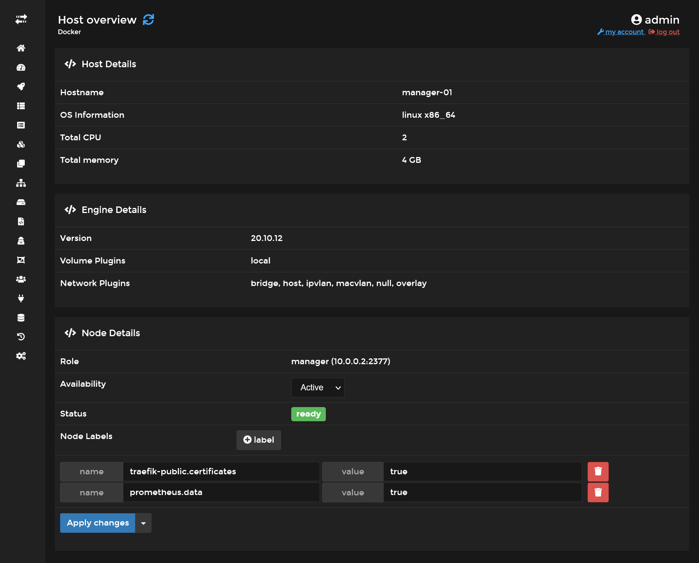

It's equivalent of doing :

```sh
export NODE_ID=$(docker info -f '{{.Swarm.NodeID}}')
docker node update --label-add prometheus.data=true $NODE_ID
```

Then create a config file at `/etc/prometheus/prometheus.yml` in `master-01` node :

```yml
global:
  scrape_interval: 5s

scrape_configs:
  - job_name: "prometheus"
    static_configs:
      - targets: ["localhost:9090"]

  - job_name: "traefik"
    static_configs:
      - targets: ["traefik_traefik:8080"]
```

It consists on 2 scrapes job, use `targets` in order to indicate to Prometheus the `/metrics` endpoint locations. I configure `5s` as interval, that means Prometheus will scrape `/metrics` endpoints every 5 seconds.

Finally create a `prometheus` stack in Portainer :

```yml
version: '3.7'

services:

  prometheus:
    image: prom/prometheus
    networks:
      - private
      - traefik_public
    command:
      - --config.file=/etc/prometheus/prometheus.yml
      - --storage.tsdb.retention.size=5GB
      - --storage.tsdb.retention.time=15d
    volumes:
      - /etc/hosts:/etc/hosts
      - /etc/prometheus/prometheus.yml:/etc/prometheus/prometheus.yml
      - data:/prometheus
    deploy:
      placement:
        constraints:
          - node.labels.prometheus.data == true
      labels:
        - traefik.enable=true
        - traefik.http.routers.prometheus.middlewares=admin-ip,admin-auth
        - traefik.http.services.prometheus.loadbalancer.server.port=9090

networks:
  private:
  traefik_public:
    external: true

volumes:
  data:
```

The `private` network will serve us later for exporters. Next config are useful in order to control the DB usage, as metrics can go up very quickly :

| argument                    | description                 |
| --------------------------- | --------------------------- |
| storage.tsdb.retention.size | The max DB size             |
| storage.tsdb.retention.time | The max data retention date |

Deploy it and <https://prometheus.sw.okami101.io> should be available after few seconds. Use same traefik credentials for login.

You should now have access to some metrics !

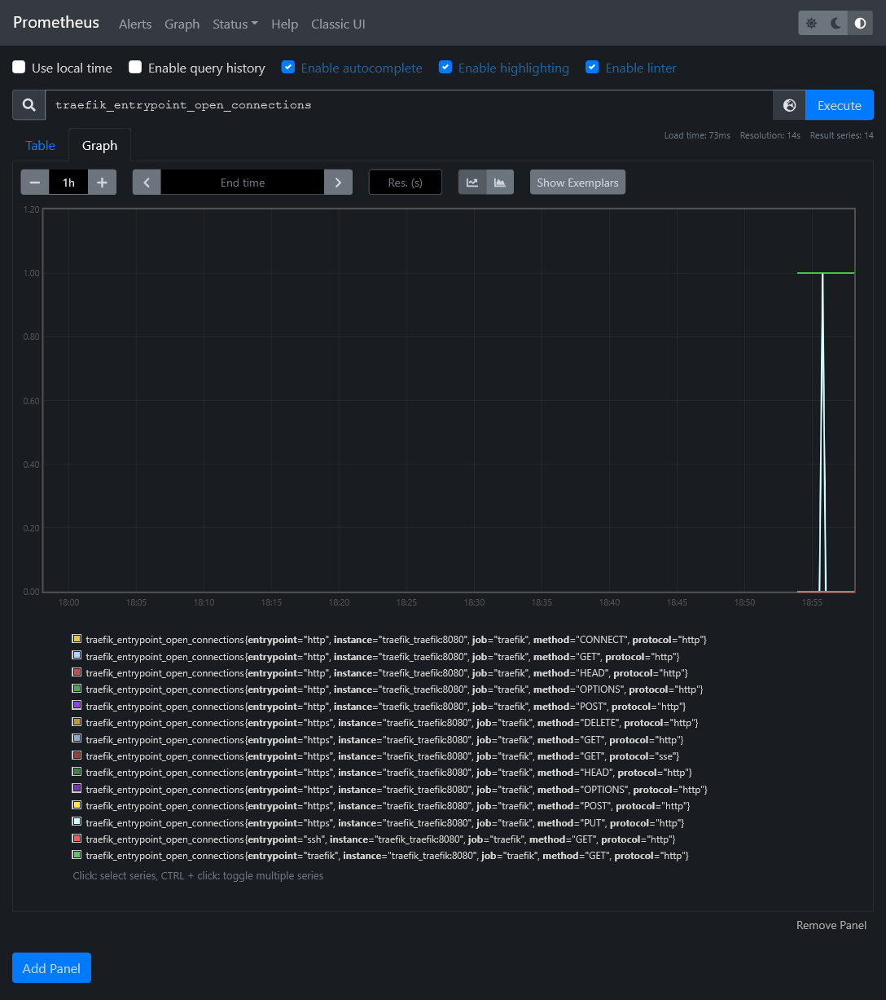

In *Status > Targets*, you should have 2 endpoints enabled, which correspond to above scrape config.

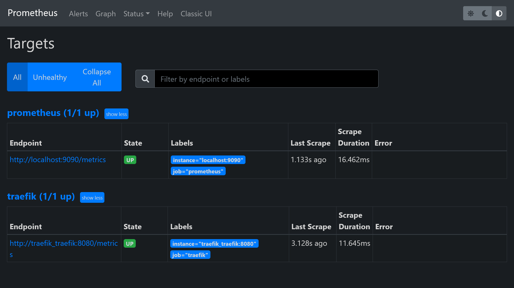

### Get cluster metrics

We have the monitor brain, new it's time to have some more relevant metrics data from all containers as well as docker nodes. It's doable thanks to exporters :

* `cAdvisor` from Google which scrape metrics of all running containers
* `Node exporter` for more global cluster evaluation

Before edit above stack, we need to make a specific docker entrypoint for node exporter that will help us to fetch the original hostname of the docker host machine name. This is because we run node exporter as docker container, which have no clue of docker hostname.

Besides this node exporter (like cAdvisor) work as an agent which must be deployed in *global* mode. In order to avoid have a file to put on each host, we'll use the *config* docker feature availabe in swarm mode.

Go to *Configs* menu inside Portainer and add a `node_exporter_entrypoint` config file with next content :

```sh
#!/bin/sh -e

NODE_NAME=$(cat /etc/nodename)
echo "node_meta{node_id=\"$NODE_ID\", container_label_com_docker_swarm_node_id=\"$NODE_ID\", node_name=\"$NODE_NAME\"} 1" > /home/node-meta.prom

set -- /bin/node_exporter "$@"

exec "$@"
```

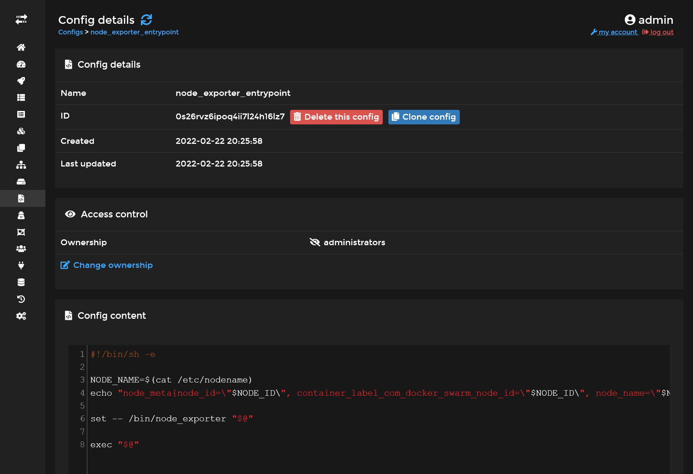

It will take the node hostname and create an exploitable data metric for prometheus.

Next we'll edit our `prometheus` stack by expanding YML config with next 2 additional services :

```yml
#...
  cadvisor:
    image: gcr.io/cadvisor/cadvisor:v0.39.3
    volumes:
      - /:/rootfs:ro
      - /var/run:/var/run:rw
      - /sys:/sys:ro
      - /var/lib/docker/:/var/lib/docker:ro
    networks:
      - private
    command:
      - --docker_only
      - --housekeeping_interval=5s
      - --disable_metrics=disk,diskIO,tcp,udp,percpu,sched,process
    deploy:
      mode: global

  node-exporter:
    image: quay.io/prometheus/node-exporter:latest
    environment:
      - NODE_ID={{.Node.ID}}
    networks:
      - private
    volumes:
      - /:/host:ro,rslave
      - /etc/hostname:/etc/nodename
    command:
      - --collector.textfile.directory=/home
    configs:
      - source: node_exporter_entrypoint
        target: /docker-entrypoint.sh
    entrypoint:
      - /bin/sh
      - /docker-entrypoint.sh
    deploy:
      mode: global
#...

# Don't forget to add this lines in the end !
configs:
  node_exporter_entrypoint:
    external: true
```

Finally, add the 2 next jobs on `/etc/prometheus/prometheus.yml` :

```yml
#...
  - job_name: "cadvisor"
    dns_sd_configs:
      - names:
          - "tasks.cadvisor"
        type: "A"
        port: 8080

  - job_name: "node-exporter"
    dns_sd_configs:
      - names:
          - "tasks.node-exporter"
        type: "A"
        port: 9100
#...
```

The `tasks.*` is a specific DNS from specific to Docker Swarm which allows multiple communication at once when using *global* mode, similarly as `tcp://tasks.agent:9001` for Portainer.

You need to restart Prometheus service in order to apply above config.

Go back to the Prometheus targets UI in order to confirm the apparition of 2 new targets.

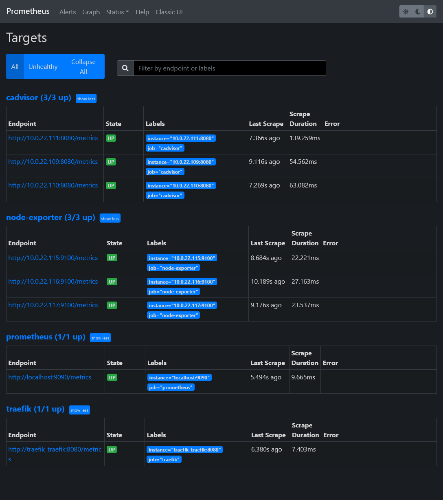

Confirm you fetch the `node_meta` metric with proper hostnames :

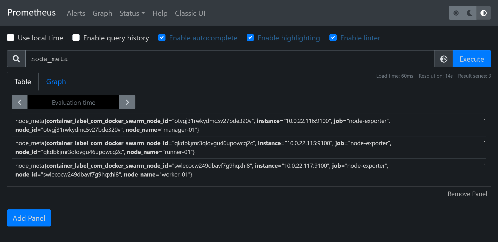

## Visualization with Grafana 📈

Okay so now we have plenty metrics from our cluster and containers, but Prometheus UI Graph is a bit rude to use. It's time to go to the next level.

### Redis

Before install Grafana, let's quickly install a powerful key-value database cache on `data-01` :

```sh
sudo add-apt-repository ppa:redislabs/redis
sudo apt install -y redis-server
sudo systemctl enable redis-server.service
```

### Grafana install 💽

As always, it's just a Swarm stack to deploy ! Like [N8N](), we'll use a proper real production database and production cache.

First connect to pgAdmin and create new grafana user and database. Don't forget *Can login?* in *Privileges* tab, and set grafana as owner on database creation.

Create storage folder with :

```sh
sudo mkdir /mnt/storage-pool/grafana
sudo chown -R 472:472 /mnt/storage-pool/grafana
```

Next create new following `grafana` stack :

```yml
version: '3.7'

services:
  grafana:
    image: grafana/grafana:8.4.1
    environment:
      GF_SERVER_DOMAIN: grafana.sw.okami101.io
      GF_SERVER_ROOT_URL: https://grafana.sw.okami101.io
      GF_DATABASE_TYPE: postgres
      GF_DATABASE_HOST: data-01:5432
      GF_DATABASE_NAME: grafana
      GF_DATABASE_USER: grafana
      GF_DATABASE_PASSWORD:
      GF_REMOTE_CACHE_TYPE: redis
      GF_REMOTE_CACHE_CONNSTR: addr=data-01:6379,pool_size=100,db=0,ssl=false
    volumes:
      - /etc/hosts:/etc/hosts
      - /mnt/storage-pool/grafana:/var/lib/grafana
    networks:
      - traefik_public
    deploy:
      labels:
        - traefik.enable=true
        - traefik.http.routers.grafana.middlewares=admin-ip
        - traefik.http.services.grafana.loadbalancer.server.port=3000
      placement:
        constraints:
          - node.role == manager

networks:
  traefik_public:
    external: true
```

Set proper `GF_DATABASE_PASSWORD` and deploy. Database migration should be automatic (don't hesitate to check inside pgAdmin). Go to <https://grafana.sw.okami101.io> and login as admin / admin.


### Docker Swarm dashboard

For best show-case scenario of Grafana, let's import an [existing dashboard](https://grafana.com/grafana/dashboards/11939) suited for complete Swarm monitor overview.

First we need to add Prometheus as main metrics data source. Go to *Configuration > Data source* menu and click on *Add data source*. Select Prometheus and set the internal docker prometheus URL, which should be `http://prometheus:9090`.

Then go to *Create > Import*, load `11939` as dashboard ID, and select Prometheus source and woha!

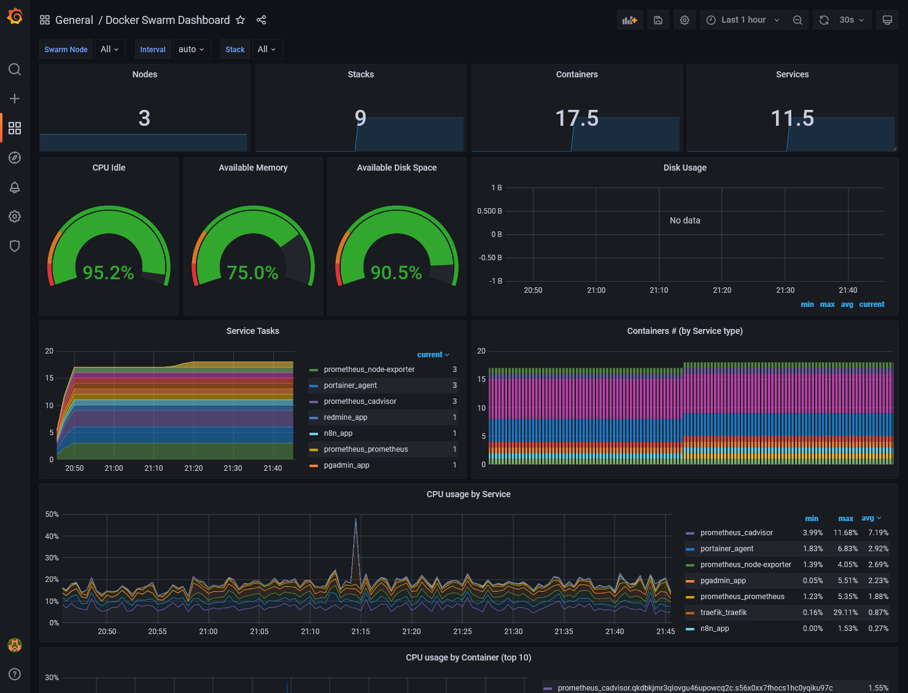

The *Available Disk Space* metrics card should indicate N/A because not properly configured for Hetzner disks. Just edit the card and change the PromQL inside *Metrics browser* field by replacing `device="rootfs", mountpoint="/"` by `device="/dev/sda1", mountpoint="/host"`.

## External node, MySQL and PostgreSQL exports

We have done for the cluster metrics part but what about the external `data-01` host and databases ? Just more exporters of course !

### Node exporter for data

For node exporter, we have no other choice to install it locally as a service binary, so we must go through old fashion install.

```sh
wget https://github.com/prometheus/node_exporter/releases/download/v1.3.1/node_exporter-1.3.1.linux-amd64.tar.gz
tar xzf node_exporter-1.3.1.linux-amd64.tar.gz
rm node_exporter-1.3.1.linux-amd64.tar.gz
sudo mv node_exporter-1.3.1.linux-amd64/node_exporter /usr/local/bin/
rm -r node_exporter-1.3.1.linux-amd64/
```

Create a new systemd file service `/etc/systemd/system/node-exporter.service` :

```conf
[Unit]
Description=Node Exporter

[Service]
Type=simple
ExecStart=/usr/local/bin/node_exporter

[Install]
WantedBy=default.target
```

Then enable the service and check status :

```sh
sudo systemctl enable node-exporter.service
sudo systemctl start node-exporter.service
sudo systemctl status node-exporter.service
```

### Exporter for databases

For MySQL, we need to create a specific `exporter` user. Do `sudo mysql` and execute following SQL (replace *** by your password) :

```sql
CREATE USER 'exporter'@'10.0.0.0/8' IDENTIFIED BY '***' WITH MAX_USER_CONNECTIONS 3;
GRANT PROCESS, REPLICATION CLIENT, SELECT ON *.* TO 'exporter'@'10.0.0.0/8';
```

Then we just have to expand the above `prometheus` stack description with 2 new exporter services, one for MySQL, and other for PostgreSQL :

```yml
#...
  mysql-exporter:
    image: prom/mysqld-exporter
    environment:
      DATA_SOURCE_NAME: exporter:${MYSQL_PASSWORD}@(data-01:3306)/
    networks:
      - private
    volumes:
      - /etc/hosts:/etc/hosts
    deploy:
      placement:
        constraints:
          - node.role == manager

  postgres-exporter:
    image: quay.io/prometheuscommunity/postgres-exporter
    environment:
      DATA_SOURCE_URI: data-01:5432/postgres?sslmode=disable
      DATA_SOURCE_USER: swarm
      DATA_SOURCE_PASS: ${POSTGRES_PASSWORD}
    networks:
      - private
    volumes:
      - /etc/hosts:/etc/hosts
    deploy:
      placement:
        constraints:
          - node.role == manager
#...
```

Set proper `MYSQL_PASSWORD` and `POSTGRES_PASSWORD` environment variables and deploy the stack. Be sure that the 2 new services have started.

### Configure Prometheus

Expand the prometheus config with 3 new jobs :

```yml
  - job_name: "node-exporter-data-01"
    static_configs:
      - targets: ["data-01:9100"]

  - job_name: "mysql-exporter-data-01"
    static_configs:
      - targets: ["mysql-exporter:9104"]

  - job_name: "postgres-exporter-data-01"
    static_configs:
      - targets: ["postgres-exporter:9187"]
```

Then restart Prometheus service and go back to targets to check you have all new `data-01` endpoints.

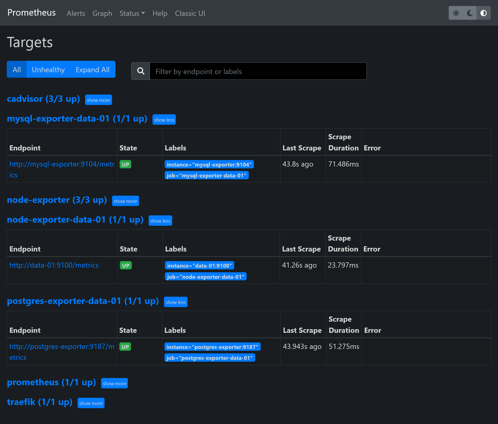

### Grafana dashboards for data

Now it's time to end this by some new optimized dashboards for data metrics !

It's simple just import the next dashboards, with Prometheus as data source, same as previous for Docker Swarm dashboard :

* `1860` : For Node exporter
* `7362` : For MySQL exporter
* `9628` : For PostgreSQL exporter

Nothing more to do !

#### Node Dashboard

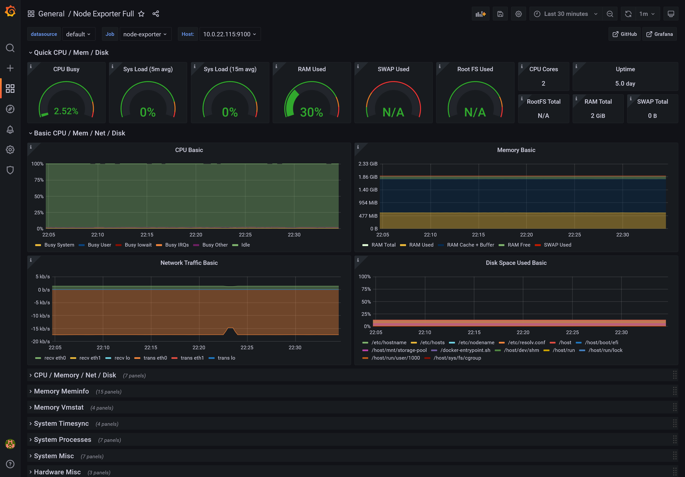

#### MySQL Dashboard

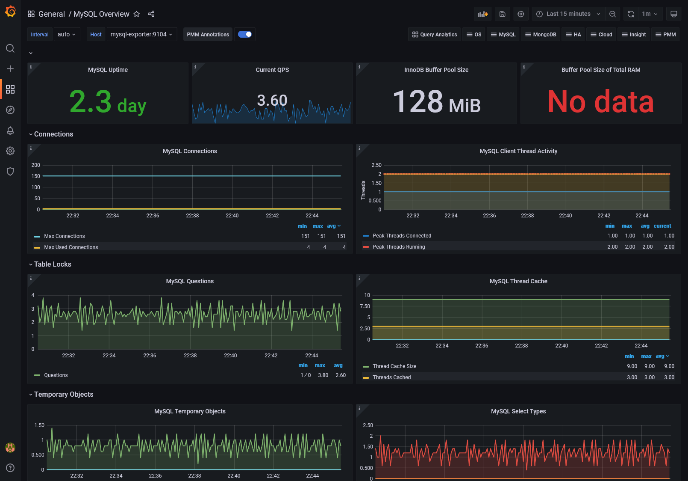

#### PostgreSQL Dashboard

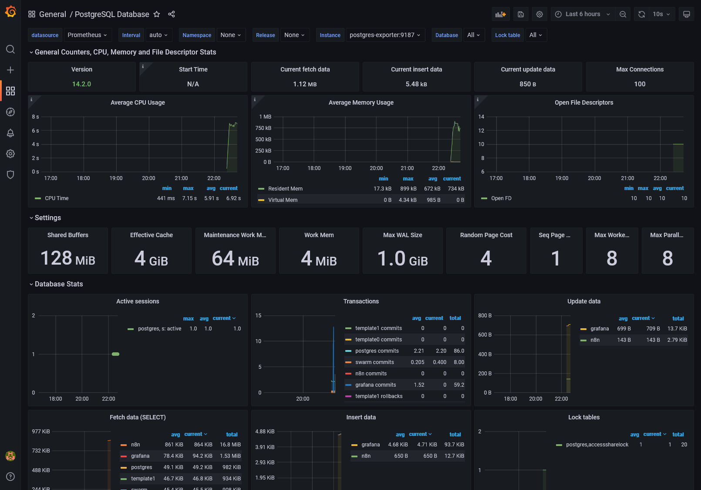

## 4th check ✅

We've done all the monitoring part with installation of DB times series, exports and UI visualization.

What about logging and tracing, which are another essential aspects for production analyzing and debugging ? We'll see that in the [next part]().
