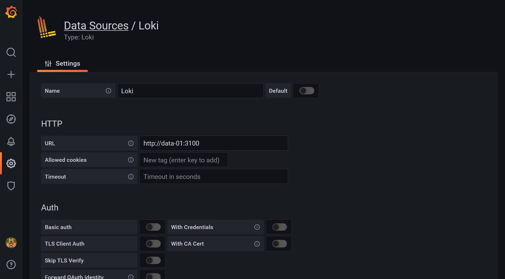
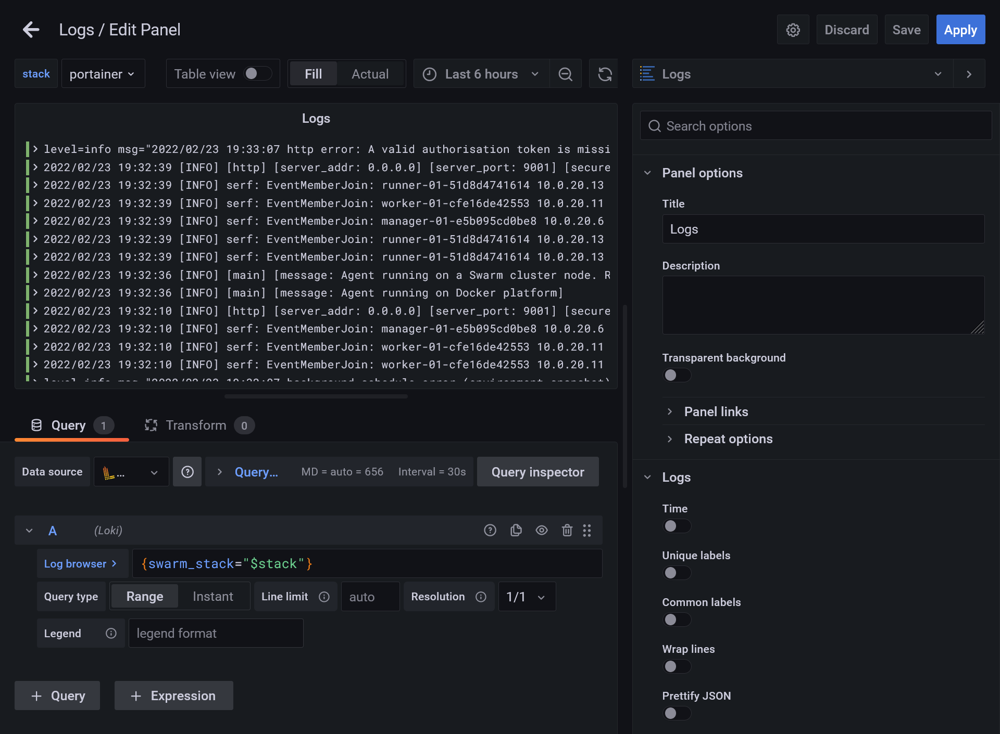
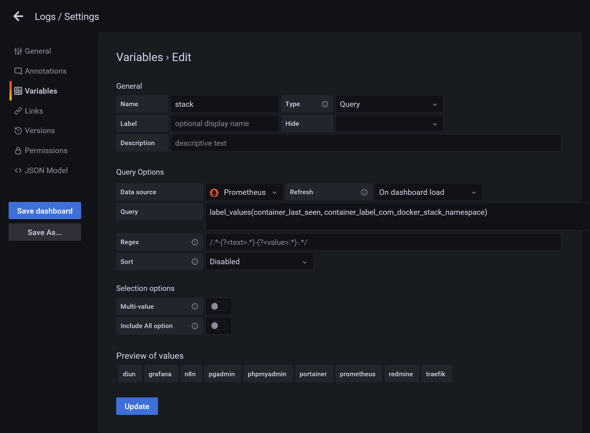
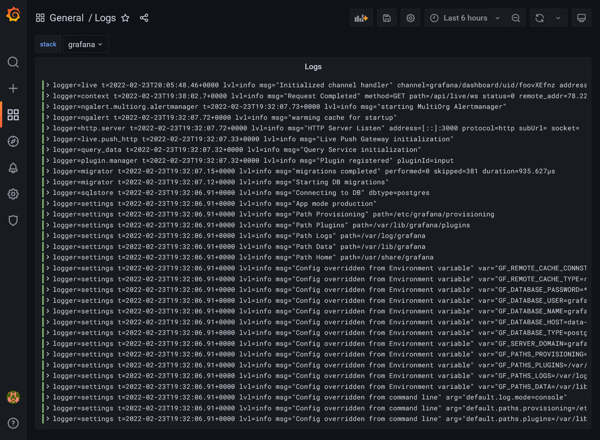
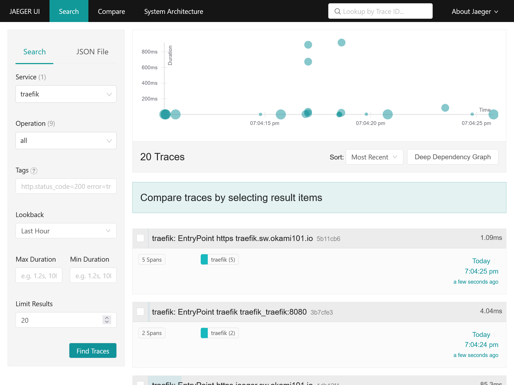
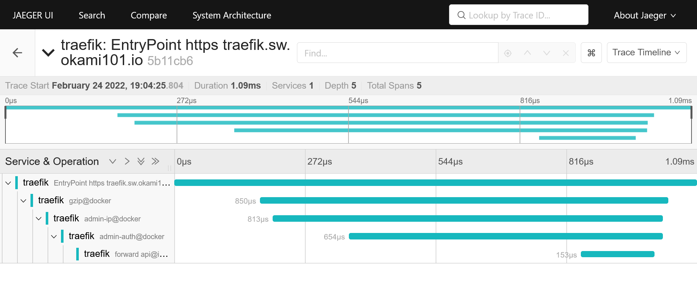


Build your own cheap but powerful self-hosted cluster and be free from any SaaS solutions by following this opinionated guide 🎉


This is the **Part VI** of more global topic tutorial. [Back to first part]() for intro.

## Why centralized logs ?

A real production cluster should have centralized logs. Of course, we have some basic service logs viewer on Portainer, which shows the containers STDOUT, but :

* With more and more containers, it can be unmanageable
* Not very powerful to navigate, can be tedious with huge logs

Moreover, it'll be nice if logs of `data-01` services (MySQL, PostgreSQL, etc.) can be centralized too.

### Why Loki ?

The common way to deal with this is to use *ELK*, but I'll show you a better option which is far less resource demanding. *Loki* is a perfect viable option and perfectly integrated to Grafana. It works exactly like Prometheus in terms of architecture, but for logs :

* Loki as itself is a powerful database index search service like Elasticsearch, but optimized for logs
* Completely integrated to Grafana thanks to LogQL language, similar to PromQL for Prometheus
* Like Prometheus, we need to install many type of exporters in order to feed the Loki database.

The mains exporters are :

* Promtail which fetch local logs file based on some patterns, which is perfect for our `data-01` managed server
* Docker driver plugin which redirect all containers STDOUT to Loki.

## Logs with Loki 📄

First, let's install the main Loki service on `data-01` (be sure to have unzip with `sudo apt install -y unzip`) :



```sh
curl -O -L "https://github.com/grafana/loki/releases/download/v2.4.2/loki-linux-amd64.zip"
unzip "loki-linux-amd64.zip"
chmod a+x "loki-linux-amd64"
sudo mv loki-linux-amd64 /usr/local/bin/loki

wget https://raw.githubusercontent.com/grafana/loki/master/cmd/loki/loki-local-config.yaml
sudo mkdir /etc/loki
sudo mv loki-local-config.yaml /etc/loki/
sudo mkdir /var/lib/loki
sudo chown swarm:swarm /var/lib/loki
```



Edit `/etc/loki/loki-local-config.yaml` and change `/tmp/loki` by `/var/lib/loki`.

Then prepare the service :



```txt
[Unit]
Description=Loki
After=network.target

[Service]
Type=simple
User=swarm
ExecStart=/usr/local/bin/loki -config.file=/etc/loki/loki-local-config.yaml

[Install]
WantedBy=multi-user.target
```



Finally, start the service :



```sh
sudo systemctl enable loki.service
sudo systemctl start loki.service
sudo systemctl status loki.service
```



It's running !

### Data logs with Promtail

It's time to feed the Loki database with Promtail. First, let's install the main service, always in `data-01` (we don't need it on docker hosts) :



```sh
curl -O -L "https://github.com/grafana/loki/releases/download/v2.4.2/promtail-linux-amd64.zip"
unzip "promtail-linux-amd64.zip"
chmod a+x "promtail-linux-amd64"
sudo mv promtail-linux-amd64 /usr/local/bin/promtail
```



Create following file :



```yml
server:
  http_listen_port: 9080
  grpc_listen_port: 0

positions:
  filename: /tmp/positions.yaml

clients:
  - url: http://data-01:3100/loki/api/v1/push

scrape_configs:
  - job_name: system
    static_configs:
      - labels:
          job: varlogs
          host: data-01
          __path__: /var/log/*log
      - labels:
          job: mysql-logs
          host: data-01
          __path__: /var/log/mysql/*log
      - labels:
          job: postgresql-logs
          host: data-01
          __path__: /var/log/postgresql/*log

```



The above config is pretty itself explanatory. We declare the URL of Loki rest API endpoint, and a list of jobs which consist of simple regex where to tail log files. The `positions.yaml` avoid duplications by keeping the last line where the service stopped for each log file.

Then prepare the service :



```txt
[Unit]
Description=Promtail
After=network.target

[Service]
Type=simple
ExecStart=/usr/local/bin/promtail -config.file=/etc/loki/promtail-local-config.yaml

[Install]
WantedBy=multi-user.target
```



Finally, start the service :



```sh
sudo systemctl enable promtail.service
sudo systemctl start promtail.service
sudo systemctl status promtail.service
```



Recheck status after few seconds to confirm local var logs have been pushed successfully to Loki. Check `sudo cat /tmp/positions.yaml` for current tail status.


You can eventually repeat all this Promtail install procedure for each Docker host if you want to have system logs for all nodes.


### Docker hosts

Now we need to push all container logs to Loki. The official [Docker driver](https://grafana.com/docs/loki/latest/clients/docker-driver) is a nice way to do it for perfect integration. Install it on all docker hosts :

```sh
docker plugin install grafana/loki-docker-driver:latest --alias loki --grant-all-permissions

# ensure plugin is enabled
docker plugin ls
```

Now we have 2 options, reedit all active docker stack YAML description for using the Loki driver instead of default docker *json-file* (boring), or downright consider it as default driver for all containers, which is relevant in our case, I think.

Create following file on each docker host :



```json
{
  "log-driver": "loki",
  "log-opts": {
    "loki-url": "http://data-01:3100/loki/api/v1/push",
    "loki-batch-size": "400"
  }
}
```



Then restart docker service `sudo service docker restart`.

And voilà, Loki is the default log driver for all containers. Note as you can still access your logs from Portainer.

### Grafana explore and dashboard

Now it's time to set up our central logs dashboard. First add *Loki* as a new data source inside Grafana, similarly to previous Prometheus. Set `http://data-01:3100` inside URL field and save it.

[](grafana-loki-datasource.png)

Then create a new Dashboard. No need to import this time :

1. Add a new panel
2. Set logs as visualization type
3. Select Loki in Data source
4. Test some basic LogQL in Log browser in order to confirm all is working. Simply type `{` It should have full autocomplete. You should have plenty of access logs when using `{swarm_stack="traefik"}`

[](grafana-panel-editor.png)

After this primary testing, let's use the power of Grafana with variables :

1. Set `{swarm_stack="$stack"}"` in log browser
2. Go to dashboard settings and enter the *Variables* section
3. Create a `stack` variable, select Prometheus as *Data source*, and insert following value inside *Query* field : `label_values(container_last_seen, container_label_com_docker_stack_namespace)`
4. It's a PromQL which fetch all detected docker stacks, click on *Update* to confirm the validity of *Preview of values* that will be show up

[](grafana-variables.png)

1. Return to your panel editor. A new *stack* selector will appear in the top, allowing selection of the stack logs to show !
2. Let's apply for saving the panel and test the selector. The Panel should reactive with the *stack* selector.
3. Save the dashboard.

[](grafana-logs-dashboard.png)

## Tracing with Jaeger 🔍

For further advanced development or any complex troubleshoot analysis, notably in a performance point of view, a tracing tool can be a real capital gain. It really helps for getting a high detail level of all code execution stacks, with granular time execution for each function call, like an SQL query executed from a backend stack, etc.

We'll not discuss development side here, as it's a subject that will be treated in next parts. But we'll use Traefik as a perfect integration example.

It's important to use a really efficient asynchronous tool for this task as it will receive potentially a huge amount of calls. A popular tracing tool nowadays is Jaeger, which is CNCF compliant. Jaeger is a flexible tool made of multiple little services that serves specific task.

### Elasticsearch for Jaeger

Elasticsearch is the recommended production choice for trace storage. I don't really like it because it can be pretty heavy to manage. But it should be okay for our usage with our 4 GB `data-01`, even with both MySQL and PostgreSQL (when minimal/personal usage...).

Let's install it on `data-01` :



```sh
wget -qO - https://artifacts.elastic.co/GPG-KEY-elasticsearch | sudo apt-key add -
sudo apt-get install apt-transport-https
echo "deb https://artifacts.elastic.co/packages/7.x/apt stable main" | sudo tee /etc/apt/sources.list.d/elastic-7.x.list
sudo apt-get update && sudo apt-get install elasticsearch
```




Jaeger is not yet compatible with Elasticsearch 8...


Then allow remote network access by adding docker hosts :



```yml
#...
network.host: 0.0.0.0
#...
discovery.seed_hosts: ["manager-01", "worker-01", "runner-01"]
#...
```



Before starting, let's calm down Java legendary memory consumption by creating following file :



```txt
-Xms512m
-Xmx512m
```



Then start the service :



```sh
sudo /bin/systemctl daemon-reload
sudo /bin/systemctl enable elasticsearch.service
sudo systemctl start elasticsearch.service
```



Be sure that Elasticsearch is correctly responding from docker nodes by doing `curl http://data-01:9200`.

As a bonus, expand above promtail config file for visualizing Elasticsearch logs in Grafana by adding a new job :



```yml
#...
        - labels:
          job: elasticsearch-logs
          host: data-01
          __path__: /var/log/elasticsearch/*log
#...
```



Restart Promtail with `sudo service promtail restart`.

### Jaeger cluster installation

It's just a new `jaeger` docker stack to deploy :



```yml
version: '3'

services:
  collector:
    image: jaegertracing/jaeger-collector:1.31
    volumes:
      - /etc/hosts:/etc/hosts
    networks:
      - private
    environment:
      SPAN_STORAGE_TYPE: elasticsearch
      ES_SERVER_URLS: http://data-01:9200
    deploy:
      placement:
        constraints:
          - node.role == manager

  agent:
    image: jaegertracing/jaeger-agent:1.31
    networks:
      - private
    command: --reporter.grpc.host-port=collector:14250
    deploy:
      mode: global

  query:
    image: jaegertracing/jaeger-query:1.31
    volumes:
      - /etc/hosts:/etc/hosts
    networks:
      - traefik_public
    environment:
      SPAN_STORAGE_TYPE: elasticsearch
      ES_SERVER_URLS: http://data-01:9200
    deploy:
      labels:
        - traefik.enable=true
        - traefik.http.routers.jaeger.entrypoints=https
        - traefik.http.routers.jaeger.middlewares=admin-auth
        - traefik.http.services.jaeger.loadbalancer.server.port=16686
      placement:
        constraints:
          - node.role == manager

networks:
  private:
  traefik_public:
    external: true
```



| name        | description                                                                                                                                                              |
| ----------- | ------------------------------------------------------------------------------------------------------------------------------------------------------------------------ |
| `collector` | Acts as a simple GRPC endpoint for saving all traces in particular span storage, as Elasticsearch.                                                                       |
| `agent`     | A simple REST endpoint for receiving traces, the latter being forwarded to the collector. An agent should be proper to a machine host, similarly as the portainer agent. |
| `query`     | A simple UI that connects to the span storage and allows simple visualization.                                                                                           |

After few seconds, go to <https://jaeger.sw.dockerswarm.rocks> and enter Traefik credentials. You will land to Jaeger Query UI with empty data.

It's time to inject some trace data. Be sure all above Jaeger services are started through Portainer before continue.

### Traefik integration

Edit Traefik config file and add following `tracing` option :



```yml
#...
tracing:
  jaeger:
    samplingServerURL: http://tasks.jaeger_agent:5778/sampling
    localAgentHostPort: tasks.jaeger_agent:6831
#...
```



Then edit original Traefik stack file and add `traefik` service into `jaeger` network.



```yml
version: '3'

services:
  traefik:
    #...
    networks:
      - public
      - jaeger_private
    #...
#...
networks:
  public:
  jaeger_private:
    external: true
```



Then redeploy the stack by `docker stack deploy -c traefik-stack.yml traefik`. You'll probably need to reexport the `HASHED_PASSWORD` variable environment. Note as you can eventually add the `jaeger_private` network directly from Portainer in `traefik` service instead of doing this in CLI.

Go back to Traefik dashboard and ensure Jaeger is enabled in *Features* section. Traefik should now correctly send traces to Jaeger agent.

Go back now to Jaeger UI. You should have a new `traefik` service available. Click on *Find Traces* in order to get a simple graph a all traces, aka requests with duration !

[](jaeger-ui-traefik.png)

Detail view of request with duration time on each operation, aka traefik middlewares, docker container request process duration, etc.

[](jaeger-ui-request.png)

## 5th check ✅

We've done all the logging part with complete centralized logging for cluster + data, as well as tracing.

Now it's time to test a real case scenario usage for a developer perspective. We'll see that in the [next part]().
