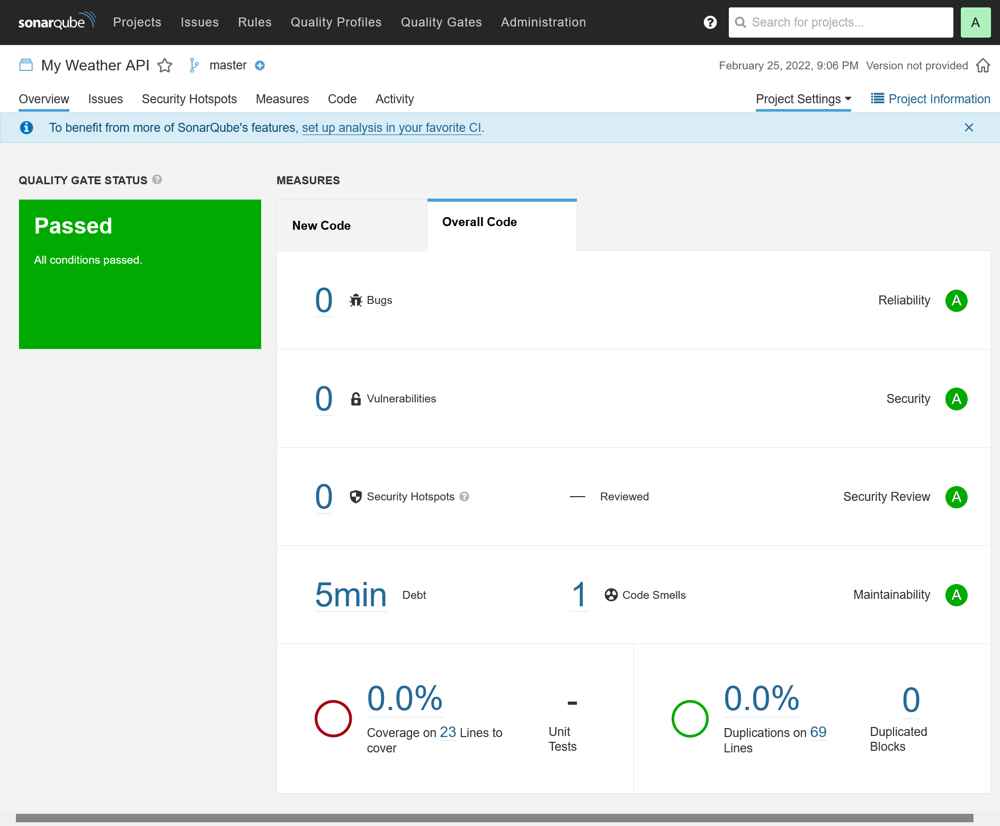
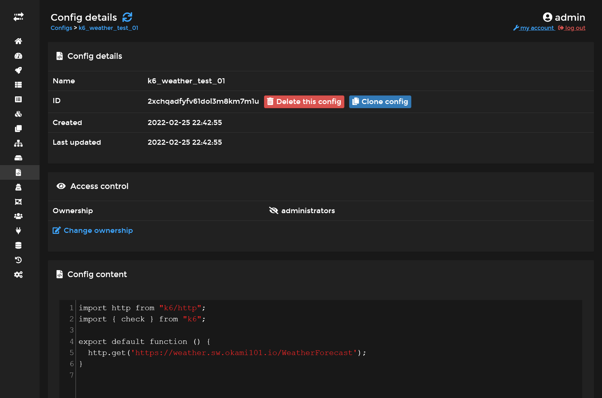
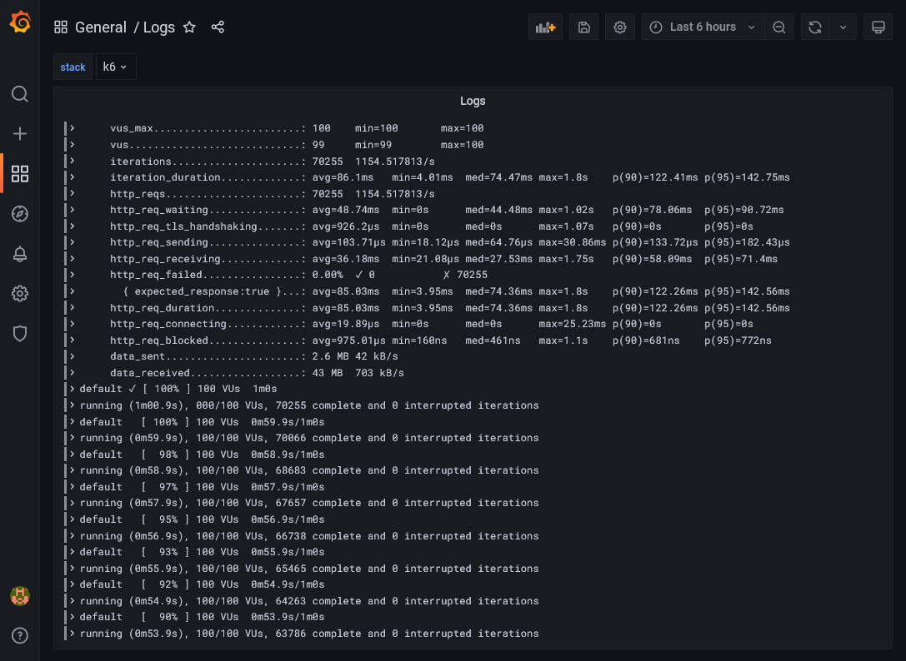
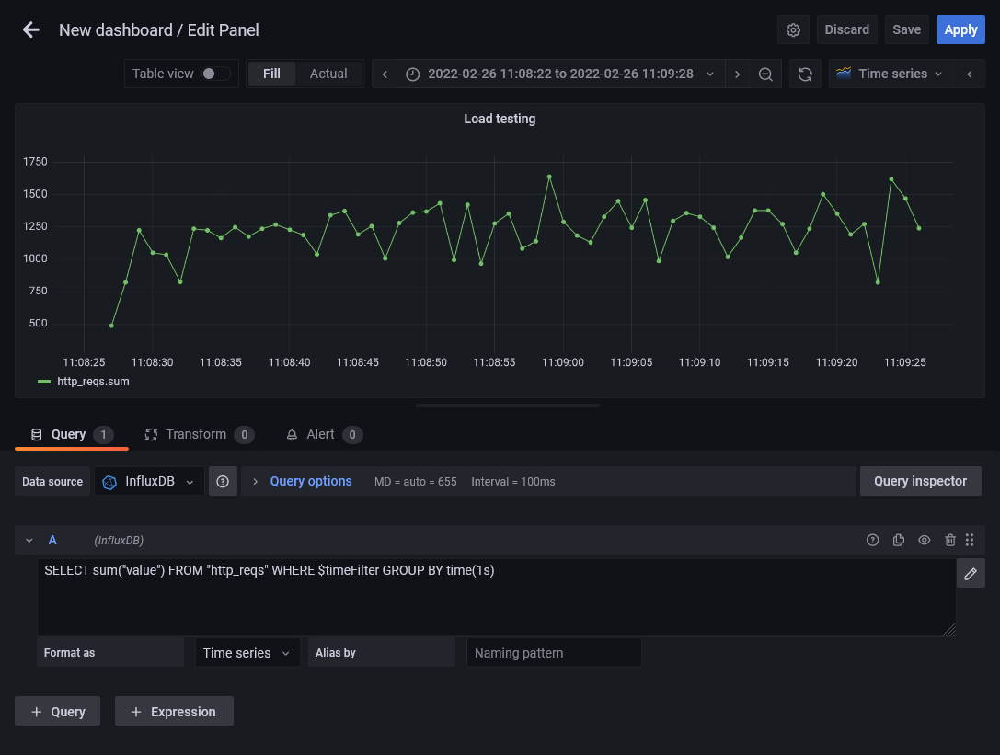
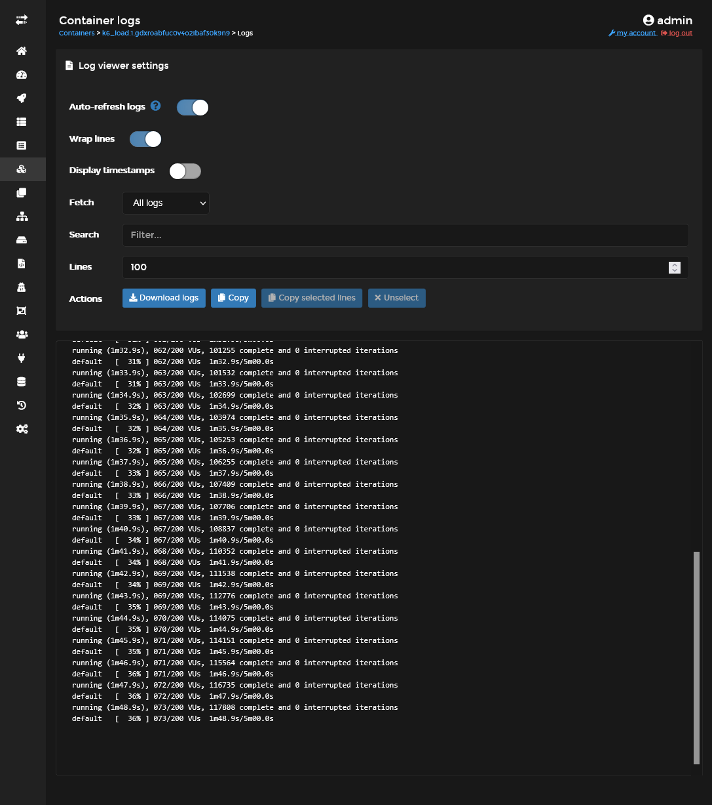


Build your own cheap while powerful self-hosted complete CI/CD solution by following this opinionated guide 🎉


This is the **Part VIII** of more global topic tutorial. [Back to first part]() to start from beginning.

## Tracing with OpenTelemetry 🕰️

Now it's time to test our Jaeger tracing for further integration to our cluster. For that we'll use [OpenTelemetry toolkit](https://opentelemetry.io/).

Install all the required libraries to above weather project :

```sh
# we use prerelease for better .NET 6 compatibility
dotnet add package OpenTelemetry.Extensions.Hosting --prerelease
dotnet add package OpenTelemetry.Instrumentation.AspNetCore --prerelease
dotnet add package OpenTelemetry.Exporter.Jaeger --prerelease
```

Then add automatic ASP.NET instrumentation and configure Jaeger exporter in `Program.cs` by adding following lines before `builder.Build()` :

```cs
using OpenTelemetry.Resources;
using OpenTelemetry.Trace;

//...

builder.Services.AddOpenTelemetryTracing(b => b
    .SetResourceBuilder(ResourceBuilder
        .CreateDefault()
        .AddService("Weather API"))
    .AddAspNetCoreInstrumentation()
    .AddJaegerExporter(o =>
    {
        o.AgentHost = builder.Configuration.GetValue<string>("Jaeger:Host");
        o.AgentPort = builder.Configuration.GetValue<int>("Jaeger:Port");
    })
);

//...
```

Push the code and ensure all CI/CD workflow passes.

Then edit the `weather` docker stack and configure Jaeger connection.

```yml
version: "3"

services:
  app:
    image: registry.sw.mydomain.rocks/adr1enbe4udou1n/my-weather-api
    environment:
      ASPNETCORE_ENVIRONMENT: Development
      Jaeger__Host: tasks.jaeger_agent
      Jaeger__Port: 6831
    networks:
      - traefik_public
      - jaeger_private
    #...

networks:
  traefik_public:
    external: true
  jaeger_private:
    external: true
```

Ensure the weather API is deployed and do some API calls. Finally, go back to Jaeger UI, a second service `Weather API` should appear, select it and click on *Find Traces*. You should get all API call traces detail !

Feel free to add any other traces. There are 2 types of traces :

* Automatic : like above ASP.NET instrumentation, for any standardized library integration. If you use PostgreSQL, use [Npgsql OpenTelemetry package](https://www.nuget.org/packages/Npgsql.OpenTelemetry/) for each SQL call traces.
* Manual : simple manual traces inside your application, for even further granular view.

## SonarQube 📈

Let's get some automatic quality code metrics.

On `manager-01` :

```sh
sudo mkdir -p /mnt/storage-pool/sonar/data
sudo mkdir -p /mnt/storage-pool/sonar/logs
sudo mkdir -p /mnt/storage-pool/sonar/extensions

# specific thing for embed elasticsearch of sonarqube
echo "vm.max_map_count=262144" | tee /etc/sysctl.d/local.conf
sudo service procps restart
```

Create a `sonar` PostgresSQL database, and create a `sonar` stack :

```yml
version: '3.8'

services:
  server:
    image: sonarqube:9-community
    volumes:
      - /etc/hosts:/etc/hosts
      - ${ROOT_PATH}/data:/opt/sonarqube/data
      - ${ROOT_PATH}/logs:/opt/sonarqube/logs
      - ${ROOT_PATH}/extensions:/opt/sonarqube/extensions
    environment:
      SONAR_JDBC_URL: jdbc:postgresql://data-01:5432/sonar
      SONAR_JDBC_USERNAME: sonar
      SONAR_JDBC_PASSWORD:
    networks:
      - traefik_public
    deploy:
      labels:
        - traefik.enable=true
        - traefik.http.services.sonarqube.loadbalancer.server.port=9000
      placement:
        constraints:
          - node.role == manager

networks:
  traefik_public:
    external: true
```

Set proper `ROOT_PATH` with `/mnt/storage-pool/sonar` and `SONAR_JDBC_PASSWORD` with above DB password.

Go to <https://sonar.sw.mydomain.rocks>, use admin / admin credentials and update password.

### Project analysis

Create manual project "My Weather API" and go to *Other CI*. Generate a token, select *.NET* project, back to above `my-weather-api` project, and go through all prerequisite.


You must have at least Java 11 installed locally.


```sh
dotnet tool install --global dotnet-sonarscanner

dotnet sonarscanner begin /k:"My-Weather-API" /d:sonar.host.url="https://sonar.sw.mydomain.rocks"  /d:sonar.login="above-generated-token"

dotnet build

dotnet sonarscanner end /d:sonar.login="above-generated-token"
```

Wait few minutes and the final rapport analysis should automatically appear. Add `.sonarqube` to `.gitignore`.

[](sonarqube-analysis.png)

### CI integration

Because running scanner manually is boring, let's integrate it in our favorite CI. Create following secrets through Drone UI :

| name             | level        | description                                              |
| ---------------- | ------------ | -------------------------------------------------------- |
| `sonar_host_url` | organization | Set the sonar host URL `https://sonar.sw.mydomain.rocks` |
| `sonar_token`    | repository   | Set the above token                                      |

Change the `build` step on `.drone.yml` file :

```yml
#...
  - name: build
    image: mcr.microsoft.com/dotnet/sdk:6.0
    commands:
      - apt-get update
      - apt-get install --yes openjdk-11-jre
      - dotnet tool install --global dotnet-sonarscanner
      - export PATH="$PATH:$HOME/.dotnet/tools"
      - dotnet sonarscanner begin /k:"My-Weather-API" /d:sonar.login="$SONAR_TOKEN" /d:"sonar.host.url=$SONAR_HOST_URL"
      - dotnet build
      - dotnet sonarscanner end /d:sonar.login="$SONAR_TOKEN"
      - dotnet publish -c Release -o ./publish
#...
```

And voilà ! You should have automatic code analysis on every code push.


This is not an optimized build for sonar analysis, because the first 3 command lines will be done every time !  
You should build a proper custom dedicated docker image for build, based on .NET SDK and with JRE and `dotnet-sonarscanner` preinstalled.  
Besides, you should cache `/root/.sonar/cache` directory for quickest analysis.  
This above 2 methods will speed up CI drastically.


## Load testing 💣

We have now a perfect environment for a well-balanced load testing ! There are 2 popular options :

* **Locust** which offers a nice integrated chart web UI and master-workers architecture which allows distributed loading. Load scripts are written on Python.
* **k6** which is more efficient and less resource demanding for the same load. Load scripts are written on Javascript.

Here I'll cover usage of k6. Note that it can be integrated to a time series database for a nice graphical extraction. And guess what, Grafana is the perfect tool for that ! Let's profit of our powerful tools we have !

### TSDB with InfluxDB

Create a new influxdb stack :

```yml
version: '3.8'

services:
  db:
    image: influxdb:1.8
    volumes:
      - data:/var/lib/influxdb
    networks:
      - private
    deploy:
      placement:
        constraints:
          - node.labels.influxdb.data=true == true

networks:
  private:

volumes:
  data:
```


Add proper `influxdb.data=true` docker label in the node you want to store the influx data. Here I chose to put in the `runner-01` node by taping this command : `docker node update --label-add influxdb.data=true runner-01`.


Add InfluxDB private network to Grafana stack :

```yml
version: '3.7'

services:
  grafana:
    #...
    networks:
      - influxdb_private
      - traefik_public
    #...

networks:
  influxdb_private:
    external: true
  traefik_public:
    external: true
```

### Test loading with k6

First create a simple JS script as docker swarm *Config* named `k6_weather_test_01` through Portainer UI :

```js
import http from "k6/http";
import { check } from "k6";

export default function () {
  http.get('https://weather.sw.mydomain.rocks/WeatherForecast');
}
```

[](portainer-configs-k6.png)

```yml
version: '3.8'

services:
  load:
    image: grafana/k6
    configs:
      - source: k6_weather_test_01
        target: /scripts/k6-weather.js
    environment:
      - K6_VUS=100
      - K6_DURATION=1m
      - K6_OUT=influxdb=http://db:8086/k6weather
    entrypoint: ['k6', 'run', '/scripts/k6-weather.js']
    networks:
      - influxdb_private
    deploy:
      restart_policy:
        condition: none
      placement:
        constraints:
          - node.labels.environment == build

networks:
  influxdb_private:
    external: true

configs:
  k6_weather_test_01:
    external: true
```

| variable      | description                                     |
| ------------- | ----------------------------------------------- |
| `K6_VUS`      | The number of active user connections.          |
| `K6_DURATION` | Duration of test.                               |
| `K6_OUT`      | The data source where to store current results. |


The `restart_policy` in above deploy section is important here, as we don't want the service restarting every time. This is a specific stack intended to be launch once.


Deploy the stack, and it should launch a load testing for 1 minute. In the end, the task status of docker service should indicate `complete` status.

With Loki as the default log driver, we get only current logs of running tasks in Portainer, so when completed, the logs are wiped. You must go through Grafana in the *Logs* dashboard that we built on previous part in order to check the final raw results.

[](grafana-k6-logs.png)

### Visualization through Grafana

It's now time to go back to Grafana and try to get some charts. First Add a new InfluxDB *Data source*. Set `http://influxdb_db:8086` inside *URL* field and `k6weather` in *Database* field, then *Save & test*.

Now create a new dashboard, a new panel, and keep *Time series* as main graph system. Select above InfluxDB data source and switch to raw query expression. Finally, put following query `SELECT sum("value") FROM "http_reqs" WHERE $timeFilter GROUP BY time(1s)` in fields. Some graph should appear, select the right time interval where you have done previous load testing and voilà !

[](grafana-load-testing)

We now have the current HTTP requests count for every second. Below the *Chart.js* result of my own loading test.


type: 'line',
options: {
  scales: {
    x: {
      ticks: {
        autoSkip: false,
        callback: function(val, index) {
          return val % 5 === 0 ? (this.getLabelForValue(val) + 's') : '';
        },
      }
    }
  },
},
data: {
  labels: [0, 1, 2, 3, 4, 5, 6, 7, 8, 9, 10, 11, 12, 13, 14, 15, 16, 17, 18, 19, 20, 21, 22, 23, 24, 25, 26, 27, 28, 29, 30, 31, 32, 33, 34, 35, 36, 37, 38, 39, 40, 41, 42, 43, 44, 45, 46, 47, 48, 49, 50, 51, 52, 53, 54, 55, 56, 57, 58, 59],
  datasets: [{
    label: 'HTTP reqs count',
    data: [486, 822, 1224, 1051, 1034, 826, 1237, 1224, 1164, 1249, 1178, 1239, 1269, 1230, 1189, 1041, 1343, 1375, 1194, 1260, 1008, 1283, 1363, 1370, 1435, 994, 1424, 967, 1280, 1354, 1084, 1142, 1642, 1291, 1185, 1131, 1333, 1454, 1248, 1459, 986, 1300, 1361, 1331, 1246, 1018, 1171, 1378, 1381, 1274, 1053, 1236, 1503, 1355, 1194, 1276, 821, 1622, 1471, 1241],
    tension: 0.2
  }]
}


### Test loading scenario

You can go even further with more progressive scenario. Create a new `k6_weather_test_02` docker config script :

```js
import http from "k6/http";
import { check } from "k6";

export const options = {
  stages: [
    { duration: '5m', target: 200 },
  ],
};

export default function () {
  http.get('https://weather.sw.mydomain.rocks/WeatherForecast');
}
```

This is a progressive 5 minutes load testing scenario from 1 user to 200 concurrent users.

Then use this script on above `k6` stack and be sure to comment `K6_VUS` and `K6_DURATION` environment variables. Check the logs to ensure that you have correct scenario :

[](portainer-k6-logs.png)

Check the raw and graph result in Grafana as previous scenario. Here the corresponding *Chart.js* result in my case for the 1st minute :


type: 'line',
options: {
  scales: {
    x: {
      ticks: {
        autoSkip: false,
        callback: function(val, index) {
          return val % 5 === 0 ? (this.getLabelForValue(val) + 's') : '';
        },
      }
    }
  },
},
data: {
  labels: [0, 1, 2, 3, 4, 5, 6, 7, 8, 9, 10, 11, 12, 13, 14, 15, 16, 17, 18, 19, 20, 21, 22, 23, 24, 25, 26, 27, 28, 29, 30, 31, 32, 33, 34, 35, 36, 37, 38, 39, 40, 41, 42, 43, 44, 45, 46, 47, 48, 49, 50, 51, 52, 53, 54, 55, 56, 57, 58, 59],
  datasets: [{
    label: 'HTTP reqs count',
    data: [28, 211, 321, 464, 588, 720, 671, 589, 639, 743, 913, 895, 912, 896, 1085, 939, 936, 1024, 844, 1020, 994, 1068, 1064, 951, 1105, 1140, 1186, 1079, 951, 1326, 1199, 1288, 1053, 866, 1193, 1318, 1214, 1047, 954, 1153, 1250, 1144, 1191, 992, 1254, 1313, 1102, 1232, 933, 1044, 1326, 1453, 1210, 941, 1263, 1121, 1205, 1111, 1119, 1153],
    tension: 0.2
  }]
}


## Final check 🎊🏁🎊

Congratulation if you're getting that far !!!

I'm personally happy to finish this pretty massive tutorial...

You've done all the basic parts of installing, using, testing a professional grade Docker Swarm cluster.
