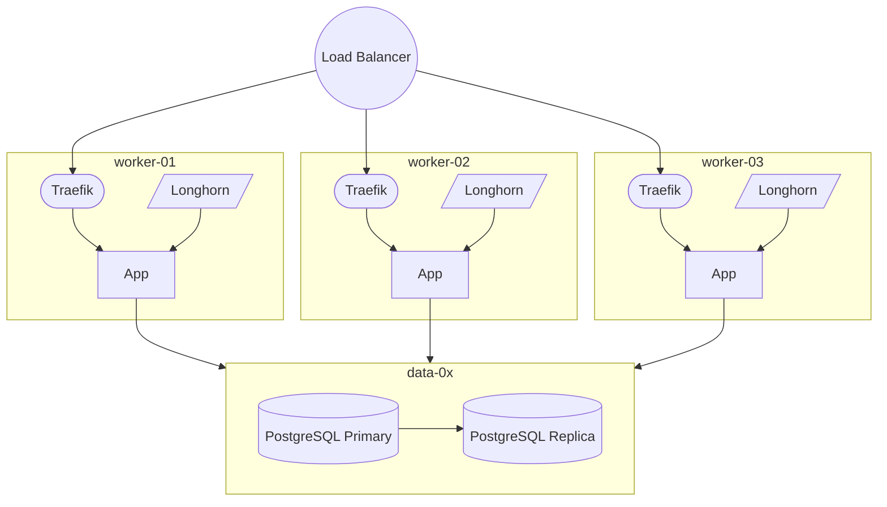


Build your self-hosted Kubernetes cluster and be free from any SaaS solutions by following this opinionated guide 🎉


## For who

This guide is mainly intended for any developers or some SRE who want a Kubernetes cluster that respect following conditions :

1. On-Premise management (The Hard Way), no managed Kubernetes provider, will use `K3s` as lightweight solution
2. Follow the **GitOps** principles
3. **High availability** with cloud Load Balancer and resilient storage and DB
4. Fully **monitored**
5. Complete **CI/CD pipeline**
6. Not too much expensive (from €30 to €70 /month depending on your needs)

### You may don't need Kubernetes

If you prefer to stay away of all overwhelming Kubernetes features, but just interested in a very simple self-hosted orchestration platform (as 99% of any personal usage), keep in mind that **Docker Swarm** is probably the best solution for you. Don't listen people that say it's outdated, because [it's not](https://dockerlabs.collabnix.com/intermediate/swarm/difference-between-docker-swarm-vs-swarm-mode-vs-swarmkit.html) and will always be supported as long as Docker CE live, as it's built in into the Docker Engine, and it's far easier and cheaper to maintain it than K8S. The downside is that there is no longer any new features added to Swarm.

I wrote a [complete dedicated guide here]() that explains all steps in order to have a production grade Swarm cluster.

### Cloud provider choice

As a HA Kubernetes cluster can be quickly expensive, a good cloud provider is an essential part.

After testing many providers, as Digital Ocean, Vultr, Linode, Civo , OVH, Scaleway, it seems like **Hetzner** is very well suited **in my opinion** :

* Very competitive price for middle-range performance (plan only around **$6** for 2CPU/4GB for each node)
* No frills, just the basics, VMs, block volumes, load balancer, DNS, firewall, and that's it
* Simple nice UI + CLI tool
* Official [Terraform support](https://registry.terraform.io/providers/hetznercloud/hcloud/latest), so GitOps ready
* cert-manager [DSN01 challenge support](https://github.com/vadimkim/cert-manager-webhook-hetzner)

Please let me know in below comments if you have other better suggestions !

## Cluster Architecture 🏘️

Here are the nodes that we'll need for a complete self-hosted kubernetes cluster :

| server          | description                                                                                            |
| --------------- | ------------------------------------------------------------------------------------------------------ |
| `controller-0x` | The control planes nodes, use at least 3 or any greater odd number (when etcd) for HA kube API server  |
| `worker-0x`     | Workers for your production/staging apps, at least 3 for running Longhorn for resilient storage        |
| `data-0x`       | Dedicated nodes for any DB / critical statefulset pods, recommended if you won't use managed databases |
| `monitor-0x`    | Workers dedicated for monitoring, optional                                                             |
| `runner-0x`     | Workers dedicated for CI/CD pipelines execution, optional                                              |

Basic target complete HA architecture for a basic app that needs replicated storage (with Longhorn) and DB (PostgreSQL) :

## Cheap solution with Hetzner VPS 🖥️

| Server Name  | Type     | Quantity                        | Unit Price |
| ------------ | -------- | ------------------------------- | ---------- |
|              | **LB1**  |                                 | 5.39       |
| `manager-0x` | **CX21** | 1 or 3 for HA cluster           | 0.5 + 4.85 |
| `worker-0x`  | **CX21** | 3 minimum required for Longhorn | 0.5 + 4.85 |
| `data-0x`    | **CX21** | 2 for HA database               | 0.5 + 4.85 |
| `monitor-0x` | **CX21** | 1 can be enough                 | 0.5 + 4.85 |
| `runner-0x`  | **CX21** | 1 for start                     | 0.5 + 4.85 |

(5.39+**10**\*(0.5+4.85))*1.2 = **€70.67** / month

This is of course for a complete HA cluster, for a minimal working cluster, you can easily get down to **4 nodes**, i.e. **€32.15**. You can even get rid of Load Balancer and simply use basic DNS round-robin.

## Let’s party 🎉

Enough talk, [let's go Charles !]().
