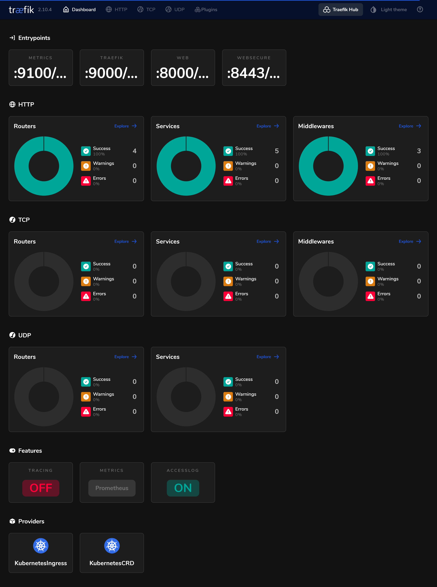


Be free from AWS/Azure/GCP by building a production grade On-Premise Kubernetes cluster on cheap VPS provider, fully GitOps managed, and with complete CI/CD tools 🎉


This is the **Part III** of more global topic tutorial. [Back to first part]() for intro.

## 2nd Terraform project

For this part let's create a new Terraform project that will be dedicated to Kubernetes infrastructure provisioning. Start from scratch with a new empty folder and the following `main.tf` file then `terraform init`.



```tf
terraform {
  backend "local" {}
}
```



Let's begin with automatic upgrades management.

### CRD prerequisites

Before we go next steps, we need to install critical monitoring CRDs that will be used by many components for monitoring.

```sh
kubectl apply --server-side -f https://raw.githubusercontent.com/prometheus-operator/prometheus-operator/v0.67.1/example/prometheus-operator-crd/monitoring.coreos.com_servicemonitors.yaml
kubectl apply --server-side -f https://raw.githubusercontent.com/prometheus-operator/prometheus-operator/v0.67.1/example/prometheus-operator-crd/monitoring.coreos.com_podmonitors.yaml
```

### Automatic reboot

When OS kernel is upgraded, the system needs to be rebooted to apply it. This is a critical operation for a Kubernetes cluster as can cause downtime. To avoid this, we'll use [kured](https://github.com/kubereboot/kured) that will take care of cordon & drains before rebooting nodes one by one.



```tf
resource "helm_release" "kubereboot" {
  chart      = "kured"
  version    = "5.1.0"
  repository = "https://kubereboot.github.io/charts"

  name = "kured"
  namespace = "kube-system"

  set {
    name  = "configuration.period"
    value = "1m"
  }

  set {
    name  = "tolerations[0].effect"
    value = "NoSchedule"
  }

  set {
    name  = "tolerations[0].operator"
    value = "Exists"
  }
  
  set {
    name  = "metrics.create"
    value = "true"
  }
}
```



After applying this with `terraform apply`, ensure that the `daemonset` is running on all nodes with `kg ds -n kube-system`.

`tolerations` will ensure all tainted nodes will receive the daemonset.

`metrics.create` will create a `servicemonitor` custom k8s resource that allow Prometheus to scrape all kured metrics. You can check it with `kg smon  -n kube-system -o yaml`. The monitoring subject will be covered in a future post, but let's be monitoring ready from the start.

You can test it by exec `touch /var/run/reboot-required` to a specific node.

### Automatic K3s upgrade

Now let's take care of K3s upgrade. We'll use [system-upgrade-controller](https://github.com/rancher/system-upgrade-controller). It will take care of upgrading K3s binary automatically on all nodes one by one.

However, as Terraform doesn't offer a proper way to apply a remote multi-document Yaml file natively, the simplest way is to sacrifice some GitOps by installing system-upgrade-controller manually.


Don't push yourself get fully 100% GitOps everywhere if the remedy give far more code complexity. Sometimes a simple documentation of manual steps in README is better.


```sh
ka https://github.com/rancher/system-upgrade-controller/releases/latest/download/system-upgrade-controller.yaml
kg deploy -n system-upgrade
```

Next apply the following upgrade plans for servers and agents.



```tf
resource "kubernetes_manifest" "server_plan" {
  manifest = {
    apiVersion = "upgrade.cattle.io/v1"
    kind       = "Plan"
    metadata = {
      name      = "server-plan"
      namespace = "system-upgrade"
    }
    spec = {
      concurrency = 1
      cordon      = true
      nodeSelector = {
        matchExpressions = [
          {
            key      = "node-role.kubernetes.io/control-plane"
            operator = "Exists"
          }
        ]
      }
      tolerations = [
        {
          operator = "Exists"
          effect   = "NoSchedule"
        }
      ]
      serviceAccountName = "system-upgrade"
      upgrade = {
        image = "rancher/k3s-upgrade"
      }
      channel = "https://update.k3s.io/v1-release/channels/stable"
    }
  }
}

resource "kubernetes_manifest" "agent_plan" {
  manifest = {
    apiVersion = "upgrade.cattle.io/v1"
    kind       = "Plan"
    metadata = {
      name      = "agent-plan"
      namespace = "system-upgrade"
    }
    spec = {
      concurrency = 1
      cordon      = true
      nodeSelector = {
        matchExpressions = [
          {
            key      = "node-role.kubernetes.io/control-plane"
            operator = "DoesNotExist"
          }
        ]
      }
      tolerations = [
        {
          operator = "Exists"
          effect   = "NoSchedule"
        }
      ]
      prepare = {
        args  = ["prepare", "server-plan"]
        image = "rancher/k3s-upgrade"
      }
      serviceAccountName = "system-upgrade"
      upgrade = {
        image = "rancher/k3s-upgrade"
      }
      channel = "https://update.k3s.io/v1-release/channels/stable"
    }
  }
}
```




You may set the same channel as previous step for hcloud cluster creation.


## External access

Now it's time to expose our cluster to the outside world. We'll use Traefik as ingress controller and cert-manager for SSL certificates management.

### Traefik

Apply following file :



```tf
locals {
  certificate_secret_name = "tls-cert"
}

resource "kubernetes_namespace_v1" "traefik" {
  metadata {
    name = "traefik"
  }
}

resource "helm_release" "traefik" {
  chart      = "traefik"
  version    = "24.0.0"
  repository = "https://traefik.github.io/charts"

  name      = "traefik"
  namespace = kubernetes_namespace_v1.traefik.metadata[0].name

  set {
    name  = "ports.web.redirectTo"
    value = "websecure"
  }

  set {
    name  = "ports.websecure.forwardedHeaders.trustedIPs"
    value = "{127.0.0.1/32,10.0.0.0/8}"
  }

  set {
    name  = "ports.websecure.proxyProtocol.trustedIPs"
    value = "{127.0.0.1/32,10.0.0.0/8}"
  }

  set {
    name  = "logs.access.enabled"
    value = "true"
  }

  set {
    name  = "providers.kubernetesCRD.allowCrossNamespace"
    value = "true"
  }

  set {
    name  = "tlsStore.default.defaultCertificate.secretName"
    value = local.certificate_secret_name
  }
}
```



`ports.web.redirectTo` will redirect all HTTP traffic to HTTPS.

`forwardedHeaders` and `proxyProtocol` will allow Traefik to get real IP of clients.

`providers.kubernetesCRD.allowCrossNamespace` will allow Traefik to read ingress from all namespaces.

`tlsStore.default.defaultCertificate.secretName` will be used to store the default certificate that will be used for all ingress that don't have a specific certificate.

By default, it will deploy 1 single replica of Traefik. But don't worry, when upgrading, the default update strategy is `RollingUpdate`, so it will be upgraded one by one without downtime.

### Load balancer

Traefik should be running with `kg deploy -n traefik`. Check now with `kg svc -n traefik` if the traefik `LoadBalancer` service is available in all nodes.

```txt
NAME      TYPE           CLUSTER-IP      EXTERNAL-IP                           PORT(S)                      AGE
traefik   LoadBalancer   10.43.134.216   10.0.0.2,10.0.1.1,10.0.1.2,10.0.1.3   80:32180/TCP,443:30273/TCP   21m
```

External IP are privates IPs of all nodes. In order to access them, we only need to put a load balancer in front of workers. It's time to get back to our 1st Terraform project.



```tf
//...

module "hcloud_kube" {
  //...

  agent_nodepools = [
    {
      name = "worker"
      // ...
      lb_type = "lb11"
    }
  ]
}

resource "hcloud_load_balancer_service" "http_service" {
  load_balancer_id = module.hcloud_kube.lbs.worker.id
  protocol         = "tcp"
  listen_port      = 80
  destination_port = 80
}

resource "hcloud_load_balancer_service" "https_service" {
  load_balancer_id = module.hcloud_kube.lbs.worker.id
  protocol         = "tcp"
  listen_port      = 443
  destination_port = 443
  proxyprotocol    = true
}
```



Use `hcloud load-balancer-type list` to get the list of available load balancer types.


Don't forget to add `hcloud_load_balancer_service` resource for each service (aka port) you want to serve.

We use `tcp` protocol as Traefik will handle SSL termination. Set `proxyprotocol` to true to allow Traefik to get real IP of clients.


One applied, use `hcloud load-balancer list` to get the public IP of the load balancer and try it. You should be properly redirected to HTTPS and have certificate error. It's time to get SSL certificates.

### cert-manager

First we need to install cert-manager for proper distributed SSL management. First install CRDs manually.

```sh
ka https://github.com/cert-manager/cert-manager/releases/download/v1.12.3/cert-manager.crds.yaml
```

Then apply the following Terraform code.



```tf
resource "kubernetes_namespace_v1" "cert_manager" {
  metadata {
    name = "cert-manager"
  }
}

resource "helm_release" "cert_manager" {
  chart      = "cert-manager"
  version    = "v1.12.3"
  repository = "https://charts.jetstack.io"

  name      = "cert-manager"
  namespace = kubernetes_namespace_v1.cert_manager.metadata[0].name

  set {
    name  = "prometheus.servicemonitor.enabled"
    value = true
  }
}
```




You can use `installCRDs` option to install CRDs automatically. But uninstall cert-manager will delete all associated resources including generated certificates. That's why I generally prefer to install CRDs manually.  
As always we enable `prometheus.servicemonitor.enabled` to allow Prometheus to scrape cert-manager metrics.


All should be ok with `kg deploy -n cert-manager`.

#### Wildcard certificate via DNS01

We'll use [DNS01 challenge](https://cert-manager.io/docs/configuration/acme/dns01/) to get wildcard certificate for our domain. This is the most convenient way to get a certificate for a domain without having to expose the cluster.


You may use a DNS provider that is supported by cert-manager. Check the [list of supported providers](https://cert-manager.io/docs/configuration/acme/dns01/#supported-dns01-providers). But cert-manager is highly extensible, and you can easily add your own provider if needed with some efforts. Check [available contrib webhooks](https://cert-manager.io/docs/configuration/acme/dns01/#webhook).


First prepare variables and set them accordingly :



```tf
variable "domain" {
  type = string
}

variable "acme_email" {
  type = string
}

variable "dns_api_token" {
  type      = string
  sensitive = true
}
```





```tf
acme_email    = "me@kube.rocks"
domain        = "kube.rocks"
dns_api_token = "xxx"
```



Finally, apply the following Terraform code in order to issue the new wildcard certificate for your domain.



```tf
resource "kubernetes_secret_v1" "cloudflare_api_token" {
  metadata {
    name      = "cloudflare-api-token-secret"
    namespace = kubernetes_namespace_v1.cert_manager.metadata[0].name
  }

  data = {
    "api-token" = var.dns_api_token
  }
}

resource "kubernetes_manifest" "letsencrypt_production_issuer" {
  manifest = {
    apiVersion = "cert-manager.io/v1"
    kind       = "ClusterIssuer"
    metadata = {
      name = "letsencrypt-production"
    }
    spec = {
      acme = {
        email = var.acme_email
        privateKeySecretRef = {
          name = "letsencrypt-production"
        }
        server = "https://acme-v02.api.letsencrypt.org/directory"
        solvers = [
          {
            dns01 = {
              cloudflare = {
                apiTokenSecretRef = {
                  name = kubernetes_secret_v1.cloudflare_api_token.metadata[0].name
                  key  = "api-token"
                }
              }
            }
          }
        ]
      }
    }
  }
}

resource "kubernetes_manifest" "tls_certificate" {
  manifest = {
    apiVersion = "cert-manager.io/v1"
    kind       = "Certificate"
    metadata = {
      name      = "default-certificate"
      namespace = kubernetes_namespace_v1.traefik.metadata[0].name
    }
    spec = {
      commonName = var.domain
      dnsNames = [
        var.domain,
        "*.${var.domain}",
      ]
      issuerRef = {
        kind = kubernetes_manifest.letsencrypt_production_issuer.manifest.kind
        name = kubernetes_manifest.letsencrypt_production_issuer.manifest.metadata.name
      }
      secretName = local.certificate_secret_name
      privateKey = {
        rotationPolicy = "Always"
      }
    }
  }
}
```



In the meantime, go to your DNS provider and add a new `*.kube.rocks` entry pointing to the load balancer IP.

Try `test.kube.rocks` to check certificate validity. If not valid, check the certificate status with `kg cert -n traefik` and get challenge status `kg challenges -n traefik`. The certificate must be in `Ready` state after many minutes.

### Access to Traefik dashboard

Traefik dashboard is a nice tool to check all ingress and their status. Let's expose it with a simple ingress and protecting with IP whitelist and basic auth, which can be done with middlewares.

First the auth variables :

First prepare variables and set them accordingly :



```tf
variable "http_username" {
  type = string
}

variable "http_password" {
  type      = string
  sensitive = true
}

variable "whitelisted_ips" {
  type      = list(string)
  sensitive = true
}

resource "null_resource" "encrypted_admin_password" {
  triggers = {
    orig = var.http_password
    pw   = bcrypt(var.http_password)
  }

  lifecycle {
    ignore_changes = [triggers["pw"]]
  }
}
```





```tf
http_username   = "admin"
http_password   = "xxx"
whitelisted_ips = ["82.82.82.82"]
```




Note on encrypted_admin_password, we generate a bcrypt hash of the password compatible for HTTP basic auth and keep the original to avoid to regenerate it each time.


Then apply the following Terraform code :



```tf
resource "helm_release" "traefik" {
  //...

  set {
    name  = "ingressRoute.dashboard.entryPoints"
    value = "{websecure}"
  }

  set {
    name  = "ingressRoute.dashboard.matchRule"
    value = "Host(`traefik.${var.domain}`)"
  }

  set {
    name  = "ingressRoute.dashboard.middlewares[0].name"
    value = "middleware-ip"
  }

  set {
    name  = "ingressRoute.dashboard.middlewares[1].name"
    value = "middleware-auth"
  }
}

resource "kubernetes_secret_v1" "traefik_auth_secret" {
  metadata {
    name      = "auth-secret"
    namespace = kubernetes_namespace_v1.traefik.metadata[0].name
  }

  data = {
    "users" = "${var.http_username}:${null_resource.encrypted_admin_password.triggers.pw}"
  }
}

resource "kubernetes_manifest" "traefik_middleware_auth" {
  manifest = {
    apiVersion = "traefik.io/v1alpha1"
    kind       = "Middleware"
    metadata = {
      name      = "middleware-auth"
      namespace = kubernetes_namespace_v1.traefik.metadata[0].name
    }
    spec = {
      basicAuth = {
        secret = kubernetes_secret_v1.traefik_auth_secret.metadata[0].name
      }
    }
  }
}

resource "kubernetes_manifest" "traefik_middleware_ip" {
  manifest = {
    apiVersion = "traefik.io/v1alpha1"
    kind       = "Middleware"
    metadata = {
      name      = "middleware-ip"
      namespace = kubernetes_namespace_v1.traefik.metadata[0].name
    }
    spec = {
      ipWhiteList = {
        sourceRange = var.whitelisted_ips
      }
    }
  }
}
```



Now go to `https://traefik.kube.rocks` and you should be asked for credentials. After login, you should see the dashboard.

[](traefik-dashboard.png)

This allow to validate that `auth` and `ip` middelwares are working properly.


If you get `Forbidden`, it's because `middleware-ip` can't get your real IP, try to disable it firstly to confirm you have dashboard access with credentials. Then try to re-enable it by changing the [IP strategy](https://doc.traefik.io/traefik/middlewares/http/ipwhitelist/#ipstrategy). For example, if you're behind Cloudflare edge proxies :



```tf
//...

resource "kubernetes_manifest" "traefik_middleware_ip" {
  manifest = {
    //...
    spec = {
      ipWhiteList = {
        sourceRange = var.whitelisted_ips
        ipStrategy = {
          depth = 1
        }
      }
    }
  }
}
```





## 2nd check ✅

Our cluster is now perfectly securely accessible from outside with automatic routing. The next important part is now to have a [resilient storage and database]().
