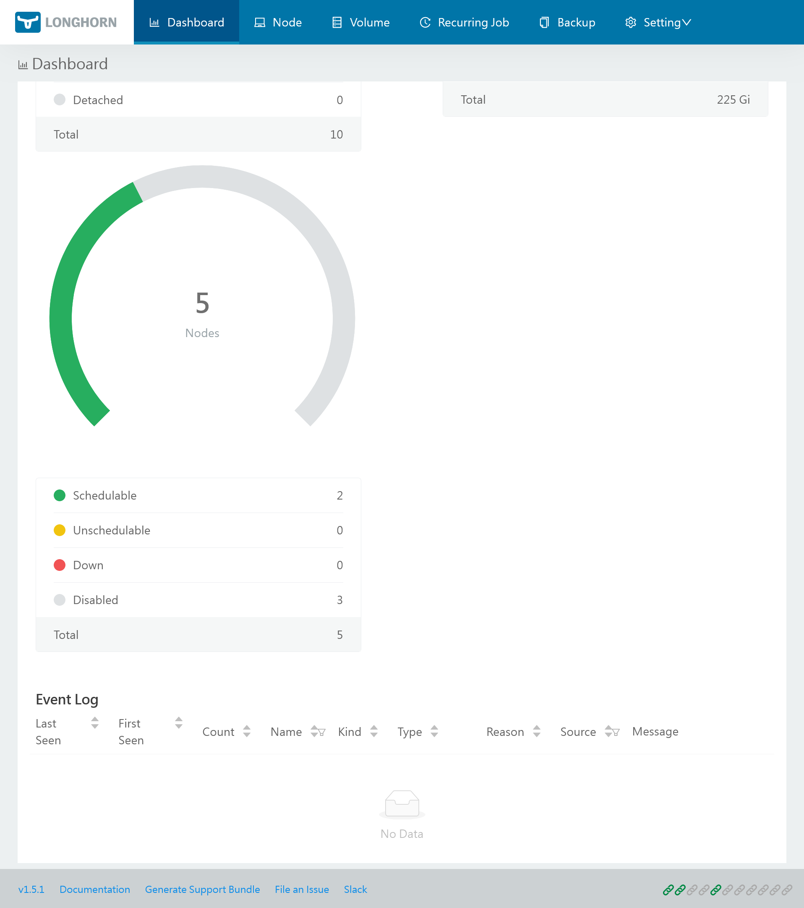


Use GitOps workflow for building a production grade on-premise Kubernetes cluster on cheap VPS provider, with complete CI/CD 🎉


This is the **Part III** of more global topic tutorial. [Back to guide summary]() for intro.

## Resilient storage with Longhorn

In Kubernetes world, the most difficult while essential part is probably the storage. It's not easy to find a solution that combine resiliency, scalability and performance.


If you are not familiar with Kubernetes storage, you must at least be aware of pros and cons of `RWO` and `RWX` volumes when creating `PVC`.  
In general `RWO` is more performant, but only one pod can mount it, while `RWX` is slower, but allow sharing between multiple pods.  
`RWO` is a single node volume, and `RWX` is a shared volume between multiple nodes.


`K3s` comes with a built-in `local-path` provisioner, which is the most performant `RWO` solution by directly using local NVMe SSD. But it's not resilient neither scalable. I think it's a good solution for what you consider as not critical data.

A dedicated NFS server is a good `RWX` solution, by using [this provisioner](https://github.com/kubernetes-sigs/nfs-subdir-external-provisioner). It allows scalability and resiliency with [GlusterFS](https://www.gluster.org/). But it stays a single point of failure in case of network problems, and give of course low IOPS. It's also a separate server to maintain.

For Hetzner, the easiest `RWO` solution is to use the [official CSI](https://github.com/hetznercloud/csi-driver) for automatic block volumes mounting. It's far more performant than NFS (but still less than local SSD), but there is no resiliency neither scalability. It's really easy to go with and very resource efficient for the cluster, note that multiple pods can [reference same volume](https://github.com/hetznercloud/csi-driver/issues/146) which allow reusability without wasting 10 GB each time.

As a more advanced solution storage, [Longhorn](https://longhorn.io/) seems to get some traction by combining most requirements with nice UI, with the price of high resource usage inside cluster. Moreover, it offers integrated backup solution with snapshots and remote S3, which avoid us to have to manage a dedicated backup solution like [velero](https://velero.io/) and some annotations for each pod volumes to be backup.

### Storage node pool

When it comes storage management, it's generally recommended having a dedicated node pool for it for better scalability.


flowchart TB
subgraph worker-01
  app-01([My App replica 1])
end
subgraph worker-02
  app-02([My App replica 2])
end
subgraph worker-03
  app-03([My App replica 3])
end
overlay(Overlay network)
worker-01 --> overlay
worker-02 --> overlay
worker-03 --> overlay
overlay --> storage-01
overlay --> storage-02
subgraph storage-01
  longhorn-01[(Longhorn<br>volume)]
end
subgraph storage-02
  longhorn-02[(Longhorn<br>volume)]
end
streaming(Data replication)
storage-01 --> streaming
storage-02 --> streaming


Let's get back to our 1st Hcloud Terraform Project, and add a new node pool for storage:



```tf
module "hcloud_kube" {
  //...

  agent_nodepools = [
    //...
    {
      name              = "storage"
      server_type       = "cx21"
      location          = "nbg1"
      count             = 2
      private_interface = "ens10"
      labels = [
        "node.kubernetes.io/server-usage=storage"
      ]
      taints = [
        "node-role.kubernetes.io/storage:NoSchedule"
      ]
    }
  ]
}
```



Be sure to have labels and taints correctly set, as we'll use them later for Longhorn installation. This node pool will be dedicated for storage, so the tainted label will prevent any other pod workload to be scheduled on it.

After `terraform apply`, check that new storage nodes are ready with `kgno`. Now we'll also apply a configurable dedicated block volume on each node for more flexible space management.



```tf
module "hcloud_kube" {
  //...

  agent_nodepools = [
    //...
    {
      name        = "storage"
      //...
      volume_size = 10
    }
  ]
}
```



SSH to both storage nodes to check if a 20GB volume is correctly mounted by `df -h` command. It should be like:

```txt
Filesystem      Size  Used Avail Use% Mounted on
/dev/sda1        38G  4,2G   32G  12% /
...
/dev/sdb         20G   24K 19,5G   1% /mnt/HC_Volume_XXXXXXXX
```

The volume is of course automatically mounted on each node reboot, it's done via `fstab`.


Note as if you set volume in same time as node pool creation, Hetzner doesn't seem to automatically mount the volume. So it's preferable to create the node pool first, then add the volume as soon as the node in ready state. You can always delete and recreate volume by commenting then uncommenting `volume_size` variable, which will force a remount properly.


### Longhorn variables

Let's add s3 related variables in order to preconfigure Longhorn backup:



```tf
variable "s3_endpoint" {
  type = string
}

variable "s3_region" {
  type = string
}

variable "s3_bucket" {
  type = string
}

variable "s3_access_key" {
  type      = string
  sensitive = true
}

variable "s3_secret_key" {
  type      = string
  sensitive = true
}
```





```tf
s3_endpoint    = "s3.fr-par.scw.cloud"
s3_region      = "fr-par"
s3_bucket      = "mykuberocks"
s3_access_key  = "xxx"
s3_secret_key  = "xxx"
```



### Longhorn installation

Return to the 2nd Kubernetes terraform project, and add Longhorn installation:



```tf
resource "kubernetes_namespace_v1" "longhorn" {
  metadata {
    name = "longhorn-system"
  }
}

resource "kubernetes_secret_v1" "longhorn_backup_credential" {
  metadata {
    name      = "longhorn-backup-credential"
    namespace = kubernetes_namespace_v1.longhorn.metadata[0].name
  }
  data = {
    AWS_ENDPOINTS         = "https://${var.s3_endpoint}"
    AWS_ACCESS_KEY_ID     = var.s3_access_key
    AWS_SECRET_ACCESS_KEY = var.s3_secret_key
    AWS_REGION            = var.s3_region
  }
}

resource "helm_release" "longhorn" {
  chart      = "longhorn"
  version    = "1.5.1"
  repository = "https://charts.longhorn.io"

  name      = "longhorn"
  namespace = kubernetes_namespace_v1.longhorn.metadata[0].name

  set {
    name  = "persistence.defaultClass"
    value = "false"
  }

  set {
    name  = "persistence.defaultClassReplicaCount"
    value = "2"
  }

  set {
    name  = "defaultSettings.defaultReplicaCount"
    value = "2"
  }

  set {
    name  = "defaultSettings.backupTarget"
    value = "s3://${var.s3_bucket}@${var.s3_region}/"
  }

  set {
    name  = "defaultSettings.backupTargetCredentialSecret"
    value = kubernetes_secret_v1.longhorn_backup_credential.metadata[0].name
  }

  set {
    name  = "defaultSettings.taintToleration"
    value = "node-role.kubernetes.io/storage:NoSchedule"
  }

  set {
    name  = "longhornManager.tolerations[0].key"
    value = "node-role.kubernetes.io/storage"
  }

  set {
    name  = "longhornManager.tolerations[0].effect"
    value = "NoSchedule"
  }
}
```




Set both `persistence.defaultClassReplicaCount` (used for Kubernetes configuration in longhorn storage class) and `defaultSettings.defaultReplicaCount` (for volumes created from the UI) to 2 as we have 2 storage nodes.  
The toleration is required to allow Longhorn pods (managers and drivers) to be scheduled on storage nodes in addition to workers.  
Note as we need to have longhorn deployed on workers too, otherwise pods scheduled on these nodes can't be attached to longhorn volumes.


Use `kgpo -n longhorn-system -o wide` to check that Longhorn pods are correctly running on storage nodes as well as worker nodes. You should have `instance-manager` deployed on each node.

### Monitoring

Longhorn Helm doesn't include Prometheus integration yet, in this case all we have to do is to deploy a `ServiceMonitor` which allow metrics scraping to Longhorn pods.



```tf
resource "kubernetes_manifest" "longhorn_service_monitor" {
  manifest = {
    apiVersion = "monitoring.coreos.com/v1"
    kind       = "ServiceMonitor"
    metadata = {
      name      = "metrics"
      namespace = kubernetes_namespace_v1.longhorn.metadata[0].name
    }
    spec = {
      endpoints = [
        {
          port = "manager"
        }
      ]
      selector = {
        matchLabels = {
          app = "longhorn-manager"
        }
      }
    }
  }
}
```



Monitoring will have dedicated post later.

### Ingress

Now we only have to expose Longhorn UI to the world. We'll use `IngressRoute` provided by Traefik.



```tf
resource "kubernetes_manifest" "longhorn_ingress" {
  manifest = {
    apiVersion = "traefik.io/v1alpha1"
    kind       = "IngressRoute"
    metadata = {
      name      = "longhorn"
      namespace = kubernetes_namespace_v1.longhorn.metadata[0].name
    }
    spec = {
      entryPoints = ["websecure"]
      routes = [
        {
          match = "Host(`longhorn.${var.domain}`)"
          kind  = "Rule"
          middlewares = [
            {
              namespace = "traefik"
              name      = "middleware-ip"
            },
            {
              namespace = "traefik"
              name      = "middleware-auth"
            }
          ]
          services = [
            {
              name = "longhorn-frontend"
              port = "http"
            }
          ]
        }
      ]
    }
  }
}
```




It's vital that you have at least IP and AUTH middlewares with a strong password for Longhorn UI access, as its concern the most critical part of cluster.  
Of course, you can skip this ingress and directly use `kpf svc/longhorn-frontend -n longhorn-system 8000:80` to access Longhorn UI securely.


### Nodes and volumes configuration

Longhorn is now installed and accessible, but we still have to configure it. Let's disable volume scheduling on worker nodes, as we want to use only storage nodes for it. All can be done via Longhorn UI but let's do more automatable way.

```sh
k patch nodes.longhorn.io kube-worker-01 kube-worker-02 kube-worker-03 -n longhorn-system --type=merge --patch '{"spec": {"allowScheduling": false}}'
```

By default, Longhorn use local disk for storage, which is great for high IOPS critical workloads as databases, but we want also use our expandable dedicated block volume as default for large dataset.

Type this commands for both storage nodes or use Longhorn UI from **Node** tab:

```sh
# patch main disk as fast storage, set default-disk-xxx accordingly
k patch nodes.longhorn.io kube-storage-0x -n longhorn-system --type=merge --patch '{"spec": {"disks": {"default-disk-xxx": {"tags": ["fast"]}}}}'
# add a new schedulable disk, set HC_Volume_XXXXXXXX accordingly to mounted volume
k patch nodes.longhorn.io kube-storage-0x -n longhorn-system --type=merge --patch '{"spec": {"disks": {"disk-mnt": {"allowScheduling": true, "evictionRequested": false, "path": "/mnt/HC_Volume_XXXXXXXX/", "storageReserved": 0}}}}'
```

Now all that's left is to create a dedicated storage class for fast local volumes. We'll use it for IOPS critical statefulset workloads like PostgreSQL and Redis. Let's apply nest `StorageClass` configuration and check it with `kg sc`:



```tf
resource "kubernetes_storage_class_v1" "longhorn_fast" {
  metadata {
    name = "longhorn-fast"
  }

  storage_provisioner    = "driver.longhorn.io"
  allow_volume_expansion = true
  reclaim_policy         = "Delete"
  volume_binding_mode    = "Immediate"

  parameters = {
    numberOfReplicas    = "1"
    staleReplicaTimeout = "30"
    fromBackup          = ""
    fsType              = "ext4"
    diskSelector        = "fast"
  }
}
```



Longhorn is now ready for block and fast local volumes creation.

[](longhorn-ui.png)

## PostgreSQL with replication

Now it's time to set up some critical statefulset persistence workloads, and firstly a PostgreSQL cluster with replication.

### PostgreSQL variables



```tf
variable "pgsql_user" {
  type = string
}

variable "pgsql_admin_password" {
  type      = string
  sensitive = true
}

variable "pgsql_password" {
  type      = string
  sensitive = true
}

variable "pgsql_replication_password" {
  type      = string
  sensitive = true
}
```





```tf
pgsql_user                 = "kube"
pgsql_password             = "xxx"
pgsql_admin_password       = "xxx"
pgsql_replication_password = "xxx"
```

}

### PostgreSQL installation

Before continue it's important to identify which storage node will serve the primary database, and which one will serve the replica.

```sh
k label nodes kube-storage-01 node-role.kubernetes.io/primary=true
k label nodes kube-storage-02 node-role.kubernetes.io/read=true
```

We can finally apply next Terraform configuration:



```tf
resource "kubernetes_namespace_v1" "postgres" {
  metadata {
    name = "postgres"
  }
}

resource "kubernetes_secret_v1" "postgresql_auth" {
  metadata {
    name      = "postgresql-auth"
    namespace = kubernetes_namespace_v1.postgres.metadata[0].name
  }
  data = {
    "postgres-password"    = var.pgsql_admin_password
    "password"             = var.pgsql_password
    "replication-password" = var.pgsql_replication_password
  }
}

resource "helm_release" "postgresql" {
  chart      = "postgresql"
  version    = var.chart_postgresql_version
  repository = "https://charts.bitnami.com/bitnami"

  name      = "postgresql"
  namespace = kubernetes_namespace_v1.postgres.metadata[0].name

  set {
    name  = "architecture"
    value = "replication"
  }

  set {
    name  = "auth.username"
    value = var.pgsql_user
  }

  set {
    name  = "auth.database"
    value = var.pgsql_user
  }

  set {
    name  = "auth.existingSecret"
    value = kubernetes_secret_v1.postgresql_auth.metadata[0].name
  }

  set {
    name  = "auth.replicationUsername"
    value = "replication"
  }

  set {
    name  = "architecture"
    value = "replication"
  }

  set {
    name  = "metrics.enabled"
    value = "true"
  }

  set {
    name  = "metrics.serviceMonitor.enabled"
    value = "true"
  }

  set {
    name  = "primary.tolerations[0].key"
    value = "node-role.kubernetes.io/storage"
  }

  set {
    name  = "primary.tolerations[0].effect"
    value = "NoSchedule"
  }

  set {
    name  = "primary.nodeSelector.node-role\\.kubernetes\\.io/primary"
    type  = "string"
    value = "true"
  }

  set {
    name  = "primary.persistence.size"
    value = "10Gi"
  }

  set {
    name  = "primary.persistence.storageClass"
    value = "longhorn-fast"
  }

  set {
    name  = "readReplicas.tolerations[0].key"
    value = "node-role.kubernetes.io/storage"
  }

  set {
    name  = "readReplicas.tolerations[0].effect"
    value = "NoSchedule"
  }

  set {
    name  = "readReplicas.nodeSelector.node-role\\.kubernetes\\.io/read"
    type  = "string"
    value = "true"
  }

  set {
    name  = "readReplicas.persistence.size"
    value = "10Gi"
  }

  set {
    name  = "readReplicas.persistence.storageClass"
    value = "longhorn-fast"
  }
}
```




Don't forget to use fast storage by setting `primary.persistence.storageClass` and `readReplicas.persistence.storageClass` accordingly.


Now check that PostgreSQL pods are correctly running on storage nodes with `kgpo -n postgres -o wide`.

```txt
NAME                       READY   STATUS    RESTARTS   AGE    IP            NODE               NOMINATED NODE   READINESS GATES
postgresql-primary-0       2/2     Running   0          151m   10.42.5.253   okami-storage-01   <none>           <none>
postgresql-read-0          2/2     Running   0          152m   10.42.2.216   okami-storage-02   <none>           <none>
```

And that it, we have replicated PostgreSQL cluster ready to use ! Go to longhorn UI and be sure that 2 volumes are created on fast disk under **Volume** menu.

## Redis cluster

After PostgreSQL, set up a redis cluster is a piece of cake.

### Redis variables



```tf
variable "redis_password" {
  type      = string
  sensitive = true
}
```





```tf
redis_password = "xxx"
```

}

### Redis installation



```tf
resource "kubernetes_namespace_v1" "redis" {
  metadata {
    name = "redis"
  }
}

resource "kubernetes_secret_v1" "redis_auth" {
  metadata {
    name      = "redis-auth"
    namespace = kubernetes_namespace_v1.redis.metadata[0].name
  }
  data = {
    "redis-password" = var.redis_password
  }
}

resource "helm_release" "redis" {
  chart      = "redis"
  version    = "17.15.6"
  repository = "https://charts.bitnami.com/bitnami"

  name      = "redis"
  namespace = kubernetes_namespace_v1.redis.metadata[0].name

  set {
    name  = "architecture"
    value = "standalone"
  }

  set {
    name  = "auth.existingSecret"
    value = kubernetes_secret_v1.redis_auth.metadata[0].name
  }

  set {
    name  = "auth.existingSecretPasswordKey"
    value = "redis-password"
  }

  set {
    name  = "metrics.enabled"
    value = "true"
  }

  set {
    name  = "metrics.serviceMonitor.enabled"
    value = "true"
  }

  set {
    name  = "master.tolerations[0].key"
    value = "node-role.kubernetes.io/storage"
  }

  set {
    name  = "master.tolerations[0].effect"
    value = "NoSchedule"
  }

  set {
    name  = "master.nodeSelector.node-role\\.kubernetes\\.io/primary"
    type  = "string"
    value = "true"
  }

  set {
    name  = "master.persistence.size"
    value = "10Gi"
  }

  set {
    name  = "master.persistence.storageClass"
    value = "longhorn-fast"
  }

  set {
    name  = "replica.replicaCount"
    value = "1"
  }

  set {
    name  = "replica.tolerations[0].key"
    value = "node-role.kubernetes.io/storage"
  }

  set {
    name  = "replica.tolerations[0].effect"
    value = "NoSchedule"
  }

  set {
    name  = "replica.nodeSelector.node-role\\.kubernetes\\.io/read"
    type  = "string"
    value = "true"
  }

  set {
    name  = "replica.persistence.size"
    value = "10Gi"
  }

  set {
    name  = "replica.persistence.storageClass"
    value = "longhorn-fast"
  }
}
```



And that's it, job done ! Always check that Redis pods are correctly running on storage nodes with `kgpo -n redis -o wide` and volumes are ready on Longhorn.

## Backups

Final essential steps is to set up s3 backup for volumes. We already configured S3 backup on [longhorn variables step](#longhorn-variables), so we only have to configure backup strategy. We can use UI for that, but don't we are GitOps ? So let's do it with Terraform.



```tf
locals {
  job_backups = {
    daily = {
      cron   = "15 0 * * *"
      retain = 7
    },
    weekly = {
      cron   = "30 0 * * 1"
      retain = 4
    }
    monthly = {
      cron   = "45 0 1 * *"
      retain = 3
    }
  }
}

resource "kubernetes_manifest" "longhorn_jobs" {
  for_each = local.job_backups
  manifest = {
    apiVersion = "longhorn.io/v1beta2"
    kind       = "RecurringJob"
    metadata = {
      name      = each.key
      namespace = kubernetes_namespace_v1.longhorn.metadata[0].name
    }
    spec = {
      concurrency = 1
      cron        = each.value.cron
      groups      = ["default"]
      name        = each.key
      retain      = each.value.retain
      task        = "backup"
    }
  }

  depends_on = [
    helm_release.longhorn
  ]
}

```




`depends_on` is required to ensure that Longhorn CRDs is correctly installed before creating jobs when relaunching all terraform project from start.


Bam it's done ! After apply, check trough UI under **Recurring Job** menu if backup jobs are created. The `default` group is the default one, which backup all volumes. You can of course set custom groups to specific volumes, allowing very flexible backup strategies.

Thanks to GitOps, the default backup strategy described by `job_backups` is marbled and self-explanatory:

* Daily backup until 7 days
* Weekly backup until 4 weeks
* Monthly backup until 3 months

Configure this variable according to your needs.

### DB dumps

If you need some regular dump of your database without requiring Kubernetes `CronJob`, you can simply use following crontab line on control plane node:

```sh
0 */8   * * *   root    /usr/local/bin/k3s kubectl exec sts/postgresql-primary -n postgres -- /bin/sh -c 'PGUSER="okami" PGPASSWORD="$POSTGRES_PASSWORD" pg_dumpall -c | gzip > /bitnami/postgresql/dump_$(date "+\%H")h.sql.gz'
```

It will generate 3 daily dumps, one every 8 hours, on the same primary db volume, allowing easy `psql` restore from the same container.

## 3th check ✅

Persistence is now insured by Longhorn as main resilient storage. And we have production grade DB replicated cluster. It's finally now time to play with all of this by testing some [real world apps]() with a proper CD solution.
