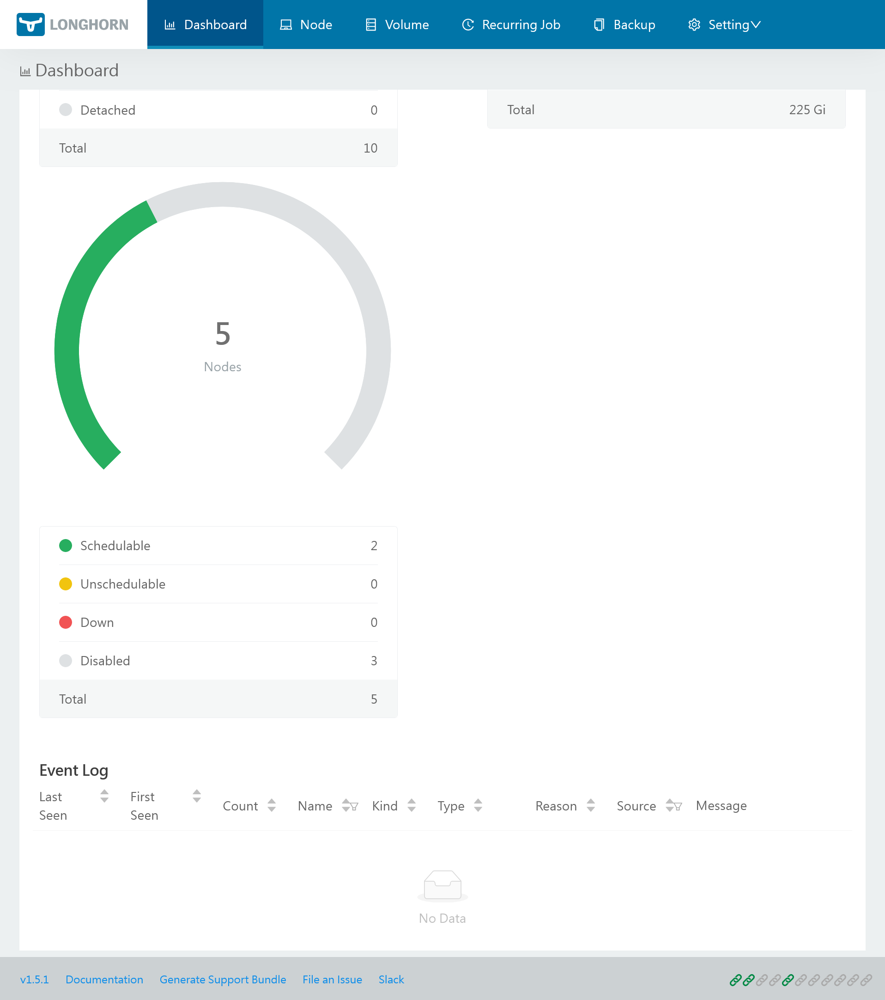


Be free from AWS/Azure/GCP by building a production grade On-Premise Kubernetes cluster on cheap VPS provider, fully GitOps managed, and with complete CI/CD tools 🎉


This is the **Part IV** of more global topic tutorial. [Back to first part]() for intro.

## Resilient storage with Longhorn

In Kubernetes world, the most difficult while essential part is probably the storage. It's not easy to find a solution that combine resiliency, scalability and performance.


If you are not familiar with Kubernetes storage, you must at least be aware of pros and cons of `RWO` and `RWX` volumes when creating `PVC`.  
In general `RWO` is more performant, but only one pod can mount it, while `RWX` is slower, but allow sharing between multiple pods.  
`RWO` is a single node volume, and `RWX` is a shared volume between multiple nodes.


`K3s` come with a built-in `local-path` provisioner, which is the most performant `RWO` solution by directly using local NVMe SSD. But it's not resilient neither scalable. I think it's a good solution for what you consider at no critical data.

A dedicated NFS server is a good `RWX` solution, by using [this provisioner](https://github.com/kubernetes-sigs/nfs-subdir-external-provisioner). It allows scalability and resiliency with [GlusterFS](https://www.gluster.org/). But it stays a single point of failure in case of network problems, and give of course low IOPS. It's also a separate server to maintain.

For Hetzner, the easiest `RWO` solution is to use the [official CSI](https://github.com/hetznercloud/csi-driver) for automatic block volumes mounting. It's far more performant than NFS (but still less than local SSD), but there is no resiliency neither scalability. It's really easy to go with and very resource efficient for the cluster, note that multiple pods can [reference same volume](https://github.com/hetznercloud/csi-driver/issues/146) which allow reusability without wasting 10 GB each time.

As a more advanced solution storage, [Longhorn](https://longhorn.io/) seems to get some traction by combining most requirements with nice UI, with the price of high resource usage inside cluster. Moreover, it offers integrated backup solution with snapshots and remote S3, which avoid us to have to manage a dedicated backup solution like [velero](https://velero.io/) and some annotations for each pod volumes to be backup.

### Storage node pool

When it comes storage management, it's generally recommended having a dedicated node pool for it for better scalability.


flowchart TB
subgraph worker-01
  app-01([My App replica 1])
end
subgraph worker-02
  app-02([My App replica 2])
end
subgraph worker-03
  app-03([My App replica 3])
end
overlay(Overlay network)
worker-01 --> overlay
worker-02 --> overlay
worker-03 --> overlay
overlay --> storage-01
overlay --> storage-02
subgraph storage-01
  longhorn-01[(Longhorn<br>volume)]
end
subgraph storage-02
  longhorn-02[(Longhorn<br>volume)]
end
streaming(Data replication)
storage-01 --> streaming
storage-02 --> streaming


Let's get back to our 1st Hcloud Terraform Project, and add a new node pool for storage:



```tf
module "hcloud_kube" {
  //...

  agent_nodepools = [
    //...
    {
      name              = "storage"
      server_type       = "cx21"
      location          = "nbg1"
      count             = 2
      private_interface = "ens10"
      labels = [
        "node.kubernetes.io/server-usage=storage"
      ]
      taints = [
        "node-role.kubernetes.io/storage:NoSchedule"
      ]
    }
  ]
}
```



Be sure to have labels and taints correctly set, as we'll use them later for Longhorn installation. This node pool will be dedicated for storage, so the tainted label will prevent any other pod workload to be scheduled on it.

After `terraform apply`, check that new storage nodes are ready with `kgno`. Now we'll also apply a configurable dedicated block volume on each node for more flexible space management.



```tf
module "hcloud_kube" {
  //...

  agent_nodepools = [
    //...
    {
      name        = "storage"
      //...
      volume_size = 10
    }
  ]
}
```



SSH to both storage nodes to check if a 20GB volume is correctly mounted by `df -h` command. It should be like :

```txt
Filesystem      Size  Used Avail Use% Mounted on
/dev/sda1        38G  4,2G   32G  12% /
...
/dev/sdb         20G   24K 19,5G   1% /mnt/HC_Volume_XXXXXXXX
```

The volume is of course automatically mounted on each node reboot, it's done via `fstab`.


Note as if you set volume in same time as node pool creation, Hetzner doesn't seem to automatically mount the volume. So it's preferable to create the node pool first, then add the volume as soon as the node in ready state. You can always delete and recreate volume by commenting then uncommenting `volume_size` variable, which will force a remount properly.


### Longhorn installation

Return to the 2nd Kubernetes terraform project, and add Longhorn installation:



```tf
resource "kubernetes_namespace_v1" "longhorn" {
  metadata {
    name = "longhorn-system"
  }
}

resource "helm_release" "longhorn" {
  chart      = "longhorn"
  version    = "1.5.1"
  repository = "https://charts.longhorn.io"

  name      = "longhorn"
  namespace = kubernetes_namespace_v1.longhorn.metadata[0].name

  set {
    name  = "persistence.defaultClass"
    value = "false"
  }

  set {
    name  = "persistence.defaultClassReplicaCount"
    value = "2"
  }

  set {
    name  = "defaultSettings.defaultReplicaCount"
    value = "2"
  }

  set {
    name  = "defaultSettings.taintToleration"
    value = "node-role.kubernetes.io/storage:NoSchedule"
  }

  set {
    name  = "longhornManager.tolerations[0].key"
    value = "node-role.kubernetes.io/storage"
  }

  set {
    name  = "longhornManager.tolerations[0].effect"
    value = "NoSchedule"
  }
}
```




Set both `persistence.defaultClassReplicaCount` (used for Kubernetes configuration in longhorn storage class) and `defaultSettings.defaultReplicaCount` (for volumes created from the UI) to 2 as we have 2 storage nodes.  
The toleration is required to allow Longhorn pods (managers and drivers) to be scheduled on storage nodes in addition to workers.  
Note as we need to have longhorn deployed on workers too, otherwise pods scheduled on these nodes can't be attached to longhorn volumes.


Use `kgpo -n longhorn-system -o wide` to check that Longhorn pods are correctly running on storage nodes as well as worker nodes. You should have `instance-manager` deployed on each node.

### Monitoring

Longhorn Helm doesn't include Prometheus integration yet, in this case all we have to do is to deploy a `ServiceMonitor` which allow metrics scraping to Longhorn pods.



```tf
resource "kubernetes_manifest" "longhorn_service_monitor" {
  manifest = {
    apiVersion = "monitoring.coreos.com/v1"
    kind       = "ServiceMonitor"
    metadata = {
      name      = "metrics"
      namespace = kubernetes_namespace_v1.longhorn.metadata[0].name
    }
    spec = {
      endpoints = [
        {
          port = "manager"
        }
      ]
      selector = {
        matchLabels = {
          app = "longhorn-manager"
        }
      }
    }
  }
}
```



Monitoring will have dedicated post later.

### Ingress

Now we only have to expose Longhorn UI to the world. We'll use `IngressRoute` provided by Traefik.



```tf
resource "kubernetes_manifest" "longhorn_ingress" {
  manifest = {
    apiVersion = "traefik.io/v1alpha1"
    kind       = "IngressRoute"
    metadata = {
      name      = "longhorn"
      namespace = kubernetes_namespace_v1.longhorn.metadata[0].name
    }
    spec = {
      entryPoints = ["websecure"]
      routes = [
        {
          match = "Host(`longhorn.${var.domain}`)"
          kind  = "Rule"
          middlewares = [
            {
              namespace = "traefik"
              name      = "middleware-ip"
            },
            {
              namespace = "traefik"
              name      = "middleware-auth"
            }
          ]
          services = [
            {
              name = "longhorn-frontend"
              port = 80
            }
          ]
        }
      ]
    }
  }
}
```




It's vital that you have at least IP and AUTH middlewares with a strong password for Longhorn UI access, as its concern the most critical part of cluster.  
Of course, you can skip this ingress and directly use `kpf svc/longhorn-frontend -n longhorn-system 8000:80` to access Longhorn UI securely.


### Configuration

Longhorn is now installed and accessible, but we still have to configure it. Let's disable volume scheduling on worker nodes, as we want to use only storage nodes for it. All can be done via Longhorn UI but let's do more automatable way.

```sh
k patch nodes.longhorn.io kube-worker-01 kube-worker-02 kube-worker-03 -n longhorn-system --type=merge --patch '{"spec": {"allowScheduling": false}}'
```

By default, Longhorn use local disk for storage, which is great for high IOPS critical workloads as databases, but we want also use our expandable dedicated block volume as default for large dataset.

Type this commands for both storage nodes or use Longhorn UI from **Node** tab:

```sh
# patch main disk as fast storage, set default-disk-xxx accordingly
k patch nodes.longhorn.io kube-storage-0x -n longhorn-system --type=merge --patch '{"spec": {"disks": {"default-disk-xxx": {"tags": ["fast"]}}}}'
# add a new schedulable disk, set HC_Volume_XXXXXXXX accordingly to mounted volume
k patch nodes.longhorn.io kube-storage-0x -n longhorn-system --type=merge --patch '{"spec": {"disks": {"disk-mnt": {"allowScheduling": true, "evictionRequested": false, "path": "/mnt/HC_Volume_XXXXXXXX/", "storageReserved": 0}}}}'
```

Longhorn is now ready for volumes creation.

[](longhorn-ui.png)

## PostgreSQL with replication

## Redis cluster

## Backups (dumps + longhorn snapshots)

## 3th check ✅

Persistence is now insured by Longhorn as a resilient storage and a DB replicated cluster. It's now time to test some [real world apps]() with a proper CD solution.
