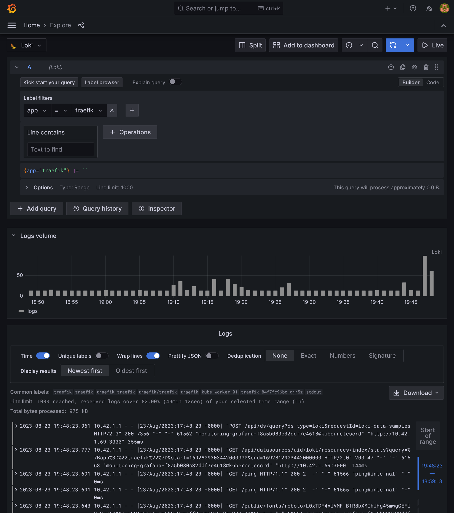


Use GitOps workflow for building a production grade on-premise Kubernetes cluster on cheap VPS provider, with complete CI/CD 🎉


This is the **Part V** of more global topic tutorial. [Back to guide summary]() for intro.

## Monitoring

Monitoring is a critical part of any production grade platform. It allows you to be proactive and react before your users are impacted. It also helps get a quick visualization of cluster architecture and current usage.

### Monitoring node pool

As well as storage pool, creating a dedicated node pool for monitoring stack is a good practice in order to scale it separately from the apps.

You now have a good understanding of how to create a node pool, so apply next configuration from our 1st Terraform project:



```tf
module "hcloud_kube" {
  //...

  agent_nodepools = [
    //...
    {
      name              = "monitor"
      server_type       = "cx21"
      location          = "nbg1"
      count             = 1
      private_interface = "ens10"
      labels = [
        "node.kubernetes.io/server-usage=monitor"
      ]
      taints = [
        "node-role.kubernetes.io/monitor:NoSchedule"
      ]
    }
  ]
}
```



### Prometheus Stack

When using k8s, the standard de facto is to install [Prometheus stack](https://artifacthub.io/packages/helm/prometheus-community/kube-prometheus-stack). It includes all necessary CRDs and element for a proper monitoring stack.

You have 2 choices to install it, are we using Flux or Terraform ? Flux include a full documentation of [how to install it with](https://fluxcd.io/flux/guides/monitoring/).

But remember previous chapter with the house analogies. I personally consider monitoring as part of my infrastructure. And I prefer to keep all my infrastructure configuration in Terraform, and only use Flux for apps. Moreover, the Prometheus stack is a pretty big Helm chart, and upgrading it can be a bit tricky. So I prefer to have a full control of it with Terraform.

Go back to 2nd Terraform project and let's apply this pretty big boy:



```tf
resource "kubernetes_namespace_v1" "monitoring" {
  metadata {
    name = "monitoring"
  }
}

resource "helm_release" "kube_prometheus_stack" {
  chart      = "kube-prometheus-stack"
  version    = "49.0.0"
  repository = "https://prometheus-community.github.io/helm-charts"

  name      = "kube-prometheus-stack"
  namespace = kubernetes_namespace_v1.monitoring.metadata[0].name

  set {
    name  = "prometheus.prometheusSpec.retention"
    value = "15d"
  }

  set {
    name  = "prometheus.prometheusSpec.retentionSize"
    value = "5GB"
  }

  set {
    name  = "prometheus.prometheusSpec.serviceMonitorSelectorNilUsesHelmValues"
    value = "false"
  }

  set {
    name  = "prometheus.prometheusSpec.podMonitorSelectorNilUsesHelmValues"
    value = "false"
  }

  set {
    name  = "prometheus.prometheusSpec.enableRemoteWriteReceiver"
    value = "true"
  }

  set {
    name  = "prometheus.prometheusSpec.storageSpec.volumeClaimTemplate.spec.accessModes[0]"
    value = "ReadWriteOnce"
  }

  set {
    name  = "prometheus.prometheusSpec.storageSpec.volumeClaimTemplate.spec.resources.requests.storage"
    value = "8Gi"
  }

  set {
    name  = "prometheus.prometheusSpec.tolerations[0].key"
    value = "node-role.kubernetes.io/storage"
  }

  set {
    name  = "prometheus.prometheusSpec.tolerations[0].operator"
    value = "Exists"
  }

  set {
    name  = "prometheus.prometheusSpec.nodeSelector.node\\.kubernetes\\.io/server-usage"
    value = "monitor"
  }

  set {
    name  = "alertmanager.enabled"
    value = "false"
  }

  set {
    name  = "grafana.enabled"
    value = "false"
  }

  set {
    name  = "grafana.forceDeployDatasources"
    value = "true"
  }

  set {
    name  = "grafana.forceDeployDashboards"
    value = "true"
  }
}
```



The application is deployed in `monitoring` namespace. It can takes a few minutes to be fully up and running. You can check the status with `kgpo -n monitoring`.

Important notes:

* We set a retention of **15 days** and **5GB** of storage for Prometheus. Set this according to your needs.
* We allow `serviceMonitorSelector` and `podMonitorSelector` for scrapping monitor CRDs from all namespaces.
* We set `enableRemoteWriteReceiver` to allow remote write to databases for advanced specific usage, as by default Prometheus works with pull model on its own.
* As we don't set any storage class, the default one will be used, which is `local-path` when using K3s. If you want to use longhorn instead and benefit of automatic monitoring backup, you can set it with `...volumeClaimTemplate.spec.storageClassName`. But don't forget to deploy Longhorn manager by adding monitor toleration.
* As it's a huge chart, I want to minimize dependencies by disabling Grafana, as I prefer manage it separately. However, in this case we must set `grafana.forceDeployDatasources` and `grafana.forceDeployDashboards` to `true` in order to benefit of all included Kubernetes dashboards and automatic Prometheus datasource injection, and deploy them to config maps that can be used for next Grafana install by provisioning.

And finally the ingress for external access:



```tf
resource "kubernetes_manifest" "prometheus_ingress" {
  manifest = {
    apiVersion = "traefik.io/v1alpha1"
    kind       = "IngressRoute"
    metadata = {
      name      = "prometheus"
      namespace = kubernetes_namespace_v1.monitoring.metadata[0].name
    }
    spec = {
      entryPoints = ["websecure"]
      routes = [
        {
          match = "Host(`prometheus.${var.domain}`)"
          kind  = "Rule"
          middlewares = [
            {
              name      = "middleware-ip"
              namespace = "traefik"
            },
            {
              name      = "middleware-auth"
              namespace = "traefik"
            }
          ]
          services = [
            {
              name = "prometheus-operated"
              port = "http-web"
            }
          ]
        }
      ]
    }
  }
}
```



No go to `prometheus.kube.rocks`, after login you should access the Prometheus UI. Check under `/targets` that all targets are up and running. In previous chapters, because we have enabled monitoring for all our apps supporting metrics, you should see following available targets:

* 1 instance of Traefik
* 1 instance of cert-manager
* 1 instance of each PostgreSQL primary and read
* 2 instances of Redis
* 5 instances of Longhorn manager
* 1 instance of n8n

This is exactly how it works, the `ServiceMonitor` custom resource is responsible to discover and centralize all metrics for prometheus, allowing automatic discovery without touch the Prometheus config. Use `kg smon -A` to list them all.

### Monitoring Flux

There is one missing however, let's add monitoring for flux. Go back to flux project and push following manifests:



```yaml
---
apiVersion: source.toolkit.fluxcd.io/v1
kind: GitRepository
metadata:
  name: flux-monitoring
  namespace: flux-system
spec:
  interval: 30m0s
  ref:
    branch: main
  url: https://github.com/fluxcd/flux2-monitoring-example
---
apiVersion: kustomize.toolkit.fluxcd.io/v1
kind: Kustomization
metadata:
  name: monitoring-config
  namespace: flux-system
spec:
  interval: 1h0m0s
  path: ./monitoring/configs
  prune: true
  sourceRef:
    kind: GitRepository
    name: flux-monitoring
```



The `spec.path` under `Kustomization` tells Flux to scrape [remote monitoring manifests](https://github.com/fluxcd/flux2/tree/main/manifests/monitoring/monitoring-config), avoiding us to write all of them manually. It includes the `PodMonitor` as well as Grafana dashboards.

After some minutes, flux should be appearing in Prometheus targets.

[](prometheus-targets.png)

### Grafana

We have the basement of our monitoring stack, it's time to get a UI to visualize all these metrics. Grafana is the most popular tool for that, and it's also available as Helm chart. Prepare some variables:



```tf
variable "smtp_host" {
  sensitive = true
}

variable "smtp_port" {
  type = string
}

variable "smtp_user" {
  type      = string
  sensitive = true
}

variable "smtp_password" {
  type      = string
  sensitive = true
}

variable "grafana_db_password" {
  type      = string
  sensitive = true
}
```



Create `grafana` database through pgAdmin with same user and according `grafana_db_password`.



```tf
smtp_host            = "smtp.mailgun.org"
smtp_port            = "587"
smtp_user            = "xxx"
smtp_password        = "xxx"
```



Apply next configuration to Terraform project:



```tf
resource "helm_release" "grafana" {
  chart      = "grafana"
  version    = "6.58.9"
  repository = "https://grafana.github.io/helm-charts"

  name      = "grafana"
  namespace = kubernetes_namespace_v1.monitoring.metadata[0].name

  set {
    name  = "serviceMonitor.enabled"
    value = "true"
  }

  set {
    name  = "sidecar.datasources.enabled"
    value = "true"
  }

  set {
    name  = "sidecar.dashboards.enabled"
    value = "true"
  }

  set {
    name  = "env.GF_SERVER_DOMAIN"
    value = var.domain
  }

  set {
    name  = "env.GF_SERVER_ROOT_URL"
    value = "https://grafana.${var.domain}"
  }

  set {
    name  = "env.GF_SMTP_ENABLED"
    value = "true"
  }

  set {
    name  = "env.GF_SMTP_HOST"
    value = "${var.smtp_host}:${var.smtp_port}"
  }

  set {
    name  = "env.GF_SMTP_USER"
    value = var.smtp_user
  }

  set {
    name  = "env.GF_SMTP_PASSWORD"
    value = var.smtp_password
  }

  set {
    name  = "env.GF_SMTP_FROM_ADDRESS"
    value = "grafana@${var.domain}"
  }

  set {
    name  = "env.GF_DATABASE_TYPE"
    value = "postgres"
  }

  set {
    name  = "env.GF_DATABASE_HOST"
    value = "postgresql-primary.postgres"
  }

  set {
    name  = "env.GF_DATABASE_NAME"
    value = "grafana"
  }

  set {
    name  = "env.GF_DATABASE_USER"
    value = "grafana"
  }

  set {
    name  = "env.GF_DATABASE_PASSWORD"
    value = var.grafana_db_password
  }
}

resource "kubernetes_manifest" "grafana_ingress" {
  manifest = {
    apiVersion = "traefik.io/v1alpha1"
    kind       = "IngressRoute"
    metadata = {
      name      = "grafana"
      namespace = kubernetes_namespace_v1.monitoring.metadata[0].name
    }
    spec = {
      entryPoints = ["websecure"]
      routes = [
        {
          match = "Host(`grafana.${var.domain}`)"
          kind  = "Rule"
          services = [
            {
              name = "grafana"
              port = "service"
            }
          ]
        }
      ]
    }
  }
}
```



We enable both data source and dashboard sidecars by setting `sidecar.datasources.enabled` and `sidecar.dashboards.enabled`. These sidecars will automatically inject all dashboards and data sources from `ConfigMap`, like those provided by Prometheus stack and Flux. `serviceMonitor.enabled` will create a `ServiceMonitor` for Prometheus to scrape Grafana metrics.

Grafana should be deploying and migrate database successfully. Let's log in immediately after in `https://grafana.kube.rocks/login` with admin account. You can get the password with `kg secret -n monitoring grafana -o jsonpath='{.data.admin-password}' | base64 -d`.

### Native dashboards

If you go to `https://grafana.kube.rocks/dashboards`, you should see a many dashboards available that should already perfectly work, giving you a complete vision of:

* Some core components of K8s, like coredns, kube api server, all kubelets
* Detail of pods, namespace, workloads
* Nodes thanks to Node exporter
* Prometheus and Grafana itself stats
* Flux stats


Some other core components like etcd, scheduler, proxy, and controller manager need to have metrics enabled to be scraped. See K3s docs or [this issue](https://github.com/k3s-io/k3s/issues/3619)


#### Prometheus

[](dashboards-prometheus.png)

#### Nodes

[](dashboards-nodes.png)

#### Cluster

[](dashboards-cluster-compute.png)
[](dashboards-cluster-network.png)
[](dashboards-pods.png)

#### Kube components

[](dashboards-api-server.png)
[](dashboards-kubelets.png)
[](dashboards-coredns.png)

#### Flux

[](dashboards-flux.png)

### Additional dashboards

You can easily import some additional dashboards by importing them from Grafana marketplace or include them in `ConfigMap` for automatic provisioning.

#### Traefik

[Link](https://grafana.com/grafana/17346)

[](dashboards-traefik.png)

#### cert-manager

[Link](https://github.com/monitoring-mixins/website/blob/master/assets/cert-manager/dashboards/cert-manager.json)

[](dashboards-cert-manager.png)

#### Longhorn

[Link](https://grafana.com/grafana/16888)

[](dashboards-longhorn.png)

#### PostgreSQL

[Link](https://grafana.com/grafana/9628)

[](dashboards-postgresql.png)

#### Redis

[Link](https://grafana.com/grafana/dashboards/763)

[](dashboards-redis.png)

## Logging

Last but not least, we need to add a logging stack. The most popular one is [Elastic Stack](https://www.elastic.co/elastic-stack), but it's very resource intensive. A better option is to use [Loki](https://grafana.com/oss/loki/) which is a more lightweight solution, and also part of Grafana Labs.

In order to work on scalable mode, we need to have a S3 storage backend. We will reuse same S3 compatible storage as longhorn backup here, but it's recommended to use a separate bucket and credentials.

### Loki

Let's install it now:



```tf
resource "kubernetes_namespace_v1" "logging" {
  metadata {
    name = "logging"
  }
}

resource "helm_release" "loki" {
  chart      = "loki"
  version    = "5.15.0"
  repository = "https://grafana.github.io/helm-charts"

  name      = "loki"
  namespace = kubernetes_namespace_v1.logging.metadata[0].name

  set {
    name  = "loki.auth_enabled"
    value = "false"
  }

  set {
    name  = "loki.compactor.retention_enabled"
    value = "true"
  }

  set {
    name  = "loki.limits_config.retention_period"
    value = "24h"
  }

  set {
    name  = "loki.storage.bucketNames.chunks"
    value = var.s3_bucket
  }

  set {
    name  = "loki.storage.bucketNames.ruler"
    value = var.s3_bucket
  }

  set {
    name  = "loki.storage.bucketNames.admin"
    value = var.s3_bucket
  }

  set {
    name  = "loki.storage.s3.endpoint"
    value = var.s3_endpoint
  }

  set {
    name  = "loki.storage.s3.region"
    value = var.s3_region
  }

  set {
    name  = "loki.storage.s3.accessKeyId"
    value = var.s3_access_key
  }

  set {
    name  = "loki.storage.s3.secretAccessKey"
    value = var.s3_secret_key
  }

  set {
    name  = "read.replicas"
    value = "1"
  }

  set {
    name  = "backend.replicas"
    value = "1"
  }

  set {
    name  = "write.replicas"
    value = "2"
  }

  set {
    name  = "write.tolerations[0].key"
    value = "node-role.kubernetes.io/storage"
  }

  set {
    name  = "write.tolerations[0].effect"
    value = "NoSchedule"
  }

  set {
    name  = "write.nodeSelector.node-role\\.kubernetes\\.io/storage"
    type  = "string"
    value = "true"
  }

  set {
    name  = "monitoring.dashboards.namespace"
    value = kubernetes_namespace_v1.monitoring.metadata[0].name
  }

  set {
    name  = "monitoring.selfMonitoring.enabled"
    value = "false"
  }

  set {
    name  = "monitoring.selfMonitoring.grafanaAgent.installOperator"
    value = "false"
  }

  set {
    name  = "monitoring.lokiCanary.enabled"
    value = "false"
  }

  set {
    name  = "test.enabled"
    value = "false"
  }
}
```



Use `loki.limits_config.retention_period` to set a maximum period retention. You need to set at least **2** for `write.replicas` or you'll get this 500 API error "*too many unhealthy instances in the ring*". As we force them to be deployed on storage nodes, be sure to have 2 storage nodes.

### Promtail

Okay so Loki is running but not fed, for that we'll deploy [Promtail](https://grafana.com/docs/loki/latest/clients/promtail/), which is a log collector that will be deployed on each node and collect logs from all pods and send them to Loki.



```tf
resource "helm_release" "promtail" {
  chart      = "promtail"
  version    = "6.15.0"
  repository = "https://grafana.github.io/helm-charts"

  name      = "promtail"
  namespace = kubernetes_namespace_v1.logging.metadata[0].name

  set {
    name  = "tolerations[0].effect"
    value = "NoSchedule"
  }

  set {
    name  = "tolerations[0].operator"
    value = "Exists"
  }

  set {
    name  = "serviceMonitor.enabled"
    value = "true"
  }
}
```



Ha, finally a simple Helm chart ! Seems too good to be true. We just have to add generic `tolerations` in order to deploy Promtail `DaemonSet` on every node for proper log scrapping.

### Loki data source

Because we are GitOps, we want to have all Loki dashboards and data sources automatically configured. It's already done for dashboards, but we need to add a data source.

Let's apply next Terraform resource:



```tf
resource "kubernetes_config_map_v1" "loki_grafana_datasource" {
  metadata {
    name      = "loki-grafana-datasource"
    namespace = kubernetes_namespace_v1.monitoring.metadata[0].name
    labels = {
      grafana_datasource = "1"
    }
  }

  data = {
    "datasource.yaml" = <<EOF
apiVersion: 1
datasources:
- name: Loki
  type: loki
  uid: loki
  url: http://loki-gateway.logging/
  access: proxy
EOF
  }
}
```



Now go to `https://grafana.kube.rocks/connections/datasources/edit/loki` and ensure that Loki respond correctly by click on *Test*.

Go can now admire logs in Loki UI at `https://grafana.kube.rocks/explore` !

[](loki-explore.png)

### Loki dashboards

We have nothing more to do, all dashboards are already provided by Loki Helm chart.

[](dashboards-loki.png)

## Helm Exporter

We have installed many Helm Charts so far, but how we manage upgrading plans ? We may need to be aware of new versions and security fixes. For that, we can use Helm Exporter:



```tf
resource "helm_release" "helm_exporter" {
  chart      = "helm-exporter"
  version    = "1.2.5+1cbc9c5"
  repository = "https://shanestarcher.com/helm-charts"

  name      = "helm-exporter"
  namespace = kubernetes_namespace_v1.monitoring.metadata[0].name

  set {
    name  = "serviceMonitor.create"
    value = "true"
  }

  set {
    name  = "grafanaDashboard.enabled"
    value = "true"
  }

  set {
    name  = "grafanaDashboard.grafanaDashboard.namespace"
    value = kubernetes_namespace_v1.monitoring.metadata[0].name
  }

  values = [
    file("${path.module}/values/helm-exporter-values.yaml")
  ]
}
```



As the helm exporter config is a bit tedious, it's more straightforward to use a separate helm values file. Here is a sample configuration for Helm Exporter for scraping all charts that we'll need:



```yaml
config:
  helmRegistries:
    registryNames:
      - bitnami
    override:
      - registry:
          url: "https://concourse-charts.storage.googleapis.com"
        charts:
          - concourse
      - registry:
          url: "https://dl.gitea.io/charts"
        charts:
          - gitea
      - registry:
          url: "https://grafana.github.io/helm-charts"
        charts:
          - grafana
          - loki
          - promtail
          - tempo
      - registry:
          url: "https://charts.longhorn.io"
        charts:
          - longhorn
      - registry:
          url: "https://charts.jetstack.io"
        charts:
          - cert-manager
      - registry:
          url: "https://traefik.github.io/charts"
        charts:
          - traefik
      - registry:
          url: "https://bitnami-labs.github.io/sealed-secrets"
        charts:
          - sealed-secrets
      - registry:
          url: "https://prometheus-community.github.io/helm-charts"
        charts:
          - kube-prometheus-stack
      - registry:
          url: "https://SonarSource.github.io/helm-chart-sonarqube"
        charts:
          - sonarqube
      - registry:
          url: "https://kubereboot.github.io/charts"
        charts:
          - kured
      - registry:
          url: "https://shanestarcher.com/helm-charts"
        charts:
          - helm-exporter
```



You can easily start from provisioned dashboard and customize it for using `helm_chart_outdated` instead of `helm_chart_info` to list all outdated helms.

## 5th check ✅

We now have a full monitoring suite with performant logging collector ! What a pretty massive subject done. At this stage, you have a good starting point to run many apps on your cluster with high scalability and observability. We are done for the pure **operational** part. It's finally time to tackle the **building** part for a complete development stack. Go [next part]() to begin with continuous integration.
