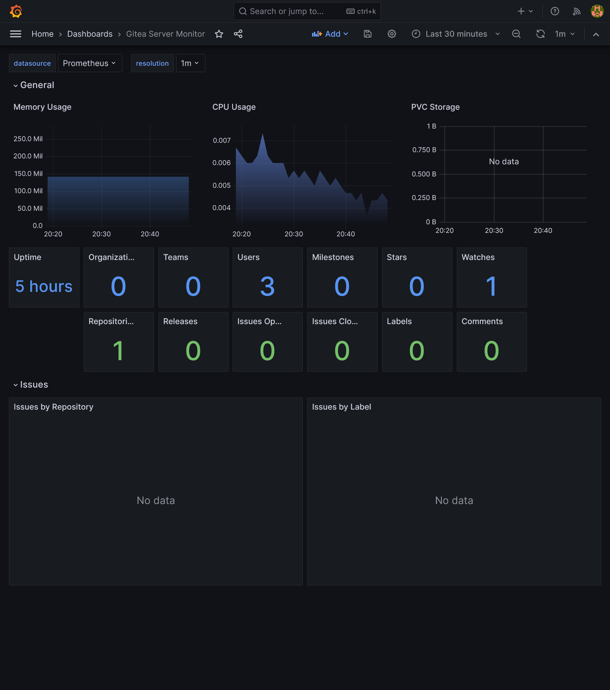


Use GitOps workflow for building a production grade on-premise Kubernetes cluster on cheap VPS provider, with complete CI/CD 🎉


This is the **Part VI** of more global topic tutorial. [Back to guide summary]() for intro.

## Self-hosted VCS

It's finally time to build our CI stack. Let's start with a self-hosted VCS. We'll use [Gitea](https://gitea.io/) as a lightweight GitHub clone, and far less resource intensive than GitLab. You can of course perfectly skip this entire chapter and stay with GitHub/GitLab if you prefer. But one of the goal of this tutorial is to maximize self-hosting, so let's go !

As I consider the CI as part of infrastructure, I'll use the dedicated Terraform project for Helms management. But again it's up to you if you prefer using Flux, it'll work too.

### Gitea

The Gitea Helm Chart is a bit tricky to configure properly. Let's begin with some additional required variables:



```tf
variable "gitea_admin_username" {
  type = string
}

variable "gitea_admin_password" {
  type      = string
  sensitive = true
}

variable "gitea_admin_email" {
  type = string
}

variable "gitea_db_password" {
  type      = string
  sensitive = true
}
```





```tf
gitea_admin_username = "kuberocks"
gitea_admin_password = "xxx"
gitea_admin_email    = "admin@kube.rocks"
gitea_db_password    = "xxx"
```



Then the Helm chart itself:



```tf
locals {
  redis_connection = "redis://:${urlencode(var.redis_password)}@redis-master.redis:6379/0"
}

resource "kubernetes_namespace_v1" "gitea" {
  metadata {
    name = "gitea"
  }
}

resource "helm_release" "gitea" {
  chart      = "gitea"
  version    = "9.2.0"
  repository = "https://dl.gitea.io/charts"

  name      = "gitea"
  namespace = kubernetes_namespace_v1.gitea.metadata[0].name

  set {
    name  = "gitea.admin.username"
    value = var.gitea_admin_username
  }

  set {
    name  = "gitea.admin.password"
    value = var.gitea_admin_password
  }

  set {
    name  = "gitea.admin.email"
    value = var.gitea_admin_email
  }

  set {
    name  = "strategy.type"
    value = "Recreate"
  }

  set {
    name  = "postgresql-ha.enabled"
    value = "false"
  }

  set {
    name  = "redis-cluster.enabled"
    value = "false"
  }

  set {
    name  = "persistence.storageClass"
    value = "longhorn"
  }

  set {
    name  = "persistence.size"
    value = "5Gi"
  }

  set {
    name  = "gitea.metrics.enabled"
    value = "true"
  }

  set {
    name  = "gitea.metrics.serviceMonitor.enabled"
    value = "true"
  }

  set {
    name  = "gitea.config.server.DOMAIN"
    value = "gitea.${var.domain}"
  }

  set {
    name  = "gitea.config.server.SSH_DOMAIN"
    value = "gitea.${var.domain}"
  }

  set {
    name  = "gitea.config.server.ROOT_URL"
    value = "https://gitea.${var.domain}"
  }

  set {
    name  = "gitea.config.database.DB_TYPE"
    value = "postgres"
  }

  set {
    name  = "gitea.config.database.HOST"
    value = "postgresql-primary.postgres"
  }

  set {
    name  = "gitea.config.database.NAME"
    value = "gitea"
  }

  set {
    name  = "gitea.config.database.USER"
    value = "gitea"
  }

  set {
    name  = "gitea.config.database.PASSWD"
    value = var.gitea_db_password
  }

  set {
    name  = "gitea.config.indexer.REPO_INDEXER_ENABLED"
    value = "true"
  }

  set {
    name  = "gitea.config.mailer.ENABLED"
    value = "true"
  }

  set {
    name  = "gitea.config.mailer.FROM"
    value = "gitea@${var.domain}"
  }

  set {
    name  = "gitea.config.mailer.SMTP_ADDR"
    value = var.smtp_host
  }

  set {
    name  = "gitea.config.mailer.SMTP_PORT"
    value = var.smtp_port
  }

  set {
    name  = "gitea.config.mailer.USER"
    value = var.smtp_user
  }

  set {
    name  = "gitea.config.mailer.PASSWD"
    value = var.smtp_password
  }

  set {
    name  = "gitea.config.cache.ADAPTER"
    value = "redis"
  }

  set {
    name  = "gitea.config.cache.HOST"
    value = local.redis_connection
  }

  set {
    name  = "gitea.config.session.PROVIDER"
    value = "redis"
  }

  set {
    name  = "gitea.config.session.PROVIDER_CONFIG"
    value = local.redis_connection
  }

  set {
    name  = "gitea.config.queue.TYPE"
    value = "redis"
  }

  set {
    name  = "gitea.config.queue.CONN_STR"
    value = local.redis_connection
  }

  set {
    name  = "gitea.config.service.DISABLE_REGISTRATION"
    value = "true"
  }

  set {
    name  = "gitea.config.repository.DEFAULT_BRANCH"
    value = "main"
  }

  set {
    name  = "gitea.config.metrics.ENABLED_ISSUE_BY_REPOSITORY"
    value = "true"
  }

  set {
    name  = "gitea.config.metrics.ENABLED_ISSUE_BY_LABEL"
    value = "true"
  }

  set {
    name  = "gitea.config.webhook.ALLOWED_HOST_LIST"
    value = "*"
  }
}
```



Note as we disable included Redis and PostgreSQL sub charts, because w'l reuse our existing ones. Also note the use of `urlencode` function for Redis password, as it can contain special characters.

The related ingress:



```tf
resource "kubernetes_manifest" "gitea_ingress" {
  manifest = {
    apiVersion = "traefik.io/v1alpha1"
    kind       = "IngressRoute"
    metadata = {
      name      = "gitea-http"
      namespace = kubernetes_namespace_v1.gitea.metadata[0].name
    }
    spec = {
      entryPoints = ["websecure"]
      routes = [
        {
          match = "Host(`gitea.${var.domain}`)"
          kind  = "Rule"
          services = [
            {
              name = "gitea-http"
              port = "http"
            }
          ]
        }
      ]
    }
  }
}
```



You should be able to log in `https://gitea.kube.rocks` with chosen admin credentials.

### Push a basic Web API project

Let's generate a basic .NET Web API project. Create a new dotnet project like following (you may install [last .NET SDK](https://dotnet.microsoft.com/en-us/download)):

```sh
mkdir kuberocks-demo
cd kuberocks-demo
dotnet new sln
dotnet new gitignore
dotnet new editorconfig
dotnet new webapi -o src/KubeRocks.WebApi
dotnet sln add src/KubeRocks.WebApi
git init
git add .
git commit -m "first commit"
```

Then create a new repo `kuberocks/demo` on Gitea, and follow the instructions of *existing repository* section to push your code.

[](gitea-repo.png)

All should work as expected when HTTPS, even the fuzzy repo search. But what if you prefer SSH ?

### Pushing via SSH

We'll use SSH to push our code to Gitea. Put your public SSH key in your Gitea profile and follow push instructions from the sample repo. Here the SSH remote is `git@gitea.kube.rocks:kuberocks/demo.git`.

When you'll try to pull, you'll get a connection timeout error. It's time to tackle SSH access to our cluster.

Firstly, we have to open SSH port to our load balancer. Go back to the 1st Hcloud Terraform project and create a new service for SSH:



```tf
resource "hcloud_load_balancer_service" "ssh_service" {
  load_balancer_id = module.hcloud_kube.lbs.worker.id
  protocol         = "tcp"
  listen_port      = 22
  destination_port = 22
}
```



SSH port is now opened, we have a new **connection refused** error. Let's configure SSH access from Traefik to Gitea pod.



```tf
resource "helm_release" "traefik" {
  //...

  set {
    name  = "ports.ssh.port"
    value = "2222"
  }

  set {
    name  = "ports.ssh.expose"
    value = "true"
  }

  set {
    name  = "ports.ssh.exposedPort"
    value = "22"
  }

  set {
    name  = "ports.ssh.protocol"
    value = "TCP"
  }
}
```



And finally, the route ingress:



```tf
resource "kubernetes_manifest" "gitea_ingress_ssh" {
  manifest = {
    apiVersion = "traefik.io/v1alpha1"
    kind       = "IngressRouteTCP"
    metadata = {
      name      = "gitea-ssh"
      namespace = kubernetes_namespace_v1.gitea.metadata[0].name
    }
    spec = {
      entryPoints = ["ssh"]
      routes = [
        {
          match = "HostSNI(`*`)"
          services = [
            {
              name = "gitea-ssh"
              port = "ssh"
            }
          ]
        }
      ]
    }
  }
}
```



Now retry pull again and it should work seamlessly !

### Gitea monitoring

[Link](https://grafana.com/grafana/dashboards/17802)

[](gitea-monitoring.png)

## CI

Now we have a working self-hosted VCS, let's add a CI tool. We'll use [Concourse CI](https://concourse-ci.org/), which is optimized for Kubernetes and have high scalability (and open source of course), with the price of some configuration and slight learning curve.


If you prefer to have CI directly included into your VCS, which simplify configuration drastically, although limited to same Gitea host, note that Gitea team is working on a built-in CI, see [Gitea Actions](https://docs.gitea.com/usage/actions/overview) (not production ready).  
I personally prefer to have a dedicated CI tool, as it's more flexible and can be used for any external VCS if needed.


### CI node pool

Concourse CI is composed of 2 main components:

* **Web UI**: the main UI, which is used to configure pipelines and visualize jobs, persisted in a PostgreSQL database
* **Worker**: the actual CI worker, which will execute jobs for any app building

It's obvious that the workers, which are the most resource intensive, should be scaled independently, without any impact on others critical components of our cluster. So, as you already guess, we'll use a dedicated pool for building. Let's apply this:



```tf
module "hcloud_kube" {
  //...

  agent_nodepools = [
    //...
    {
      name              = "runner"
      server_type       = "cx21"
      location          = "nbg1"
      count             = 1
      private_interface = "ens10"
      labels = [
        "node.kubernetes.io/server-usage=runner"
      ]
      taints = [
        "node-role.kubernetes.io/runner:NoSchedule"
      ]
    }
  ]
}
```



### Concourse CI

The variables:



```tf
variable "concourse_user" {
  type = string
}

variable "concourse_password" {
  type      = string
  sensitive = true
}

variable "concourse_db_password" {
  type      = string
  sensitive = true
}
```





```tf
concourse_user        = "kuberocks"
concourse_password    = "xxx"
concourse_db_password = "xxx"
```



Let's apply Concourse Helm Chart:



```tf
resource "kubernetes_namespace_v1" "concourse" {
  metadata {
    name = "concourse"
  }
}

resource "helm_release" "concourse" {
  chart      = "concourse"
  version    = "17.2.0"
  repository = "https://concourse-charts.storage.googleapis.com"

  name      = "concourse"
  namespace = kubernetes_namespace_v1.concourse.metadata[0].name

  set {
    name  = "concourse.web.externalUrl"
    value = "https://concourse.${var.domain}"
  }

  set {
    name  = "postgresql.enabled"
    value = "false"
  }

  set {
    name  = "secrets.postgresUser"
    value = "concourse"
  }

  set {
    name  = "secrets.postgresPassword"
    value = var.concourse_db_password
  }

  set {
    name  = "concourse.web.auth.mainTeam.localUser"
    value = var.concourse_user
  }

  set {
    name  = "secrets.localUsers"
    value = "${var.concourse_user}:${var.concourse_password}"
  }

  set {
    name  = "concourse.web.postgres.host"
    value = "postgresql-primary.postgres"
  }

  set {
    name  = "concourse.web.postgres.database"
    value = "concourse"
  }

  set {
    name  = "concourse.web.auth.cookieSecure"
    value = "true"
  }

  set {
    name  = "concourse.web.prometheus.enabled"
    value = "true"
  }

  set {
    name  = "concourse.web.prometheus.serviceMonitor.enabled"
    value = "true"
  }

  set {
    name  = "concourse.worker.runtime"
    value = "containerd"
  }

  set {
    name  = "worker.replicas"
    value = "1"
  }

  set {
    name  = "worker.minAvailable"
    value = "0"
  }

  set {
    name  = "worker.tolerations[0].key"
    value = "node-role.kubernetes.io/runner"
  }

  set {
    name  = "worker.tolerations[0].effect"
    value = "NoSchedule"
  }

  set {
    name  = "worker.nodeSelector.node\\.kubernetes\\.io/server-usage"
    value = "runner"
  }
}

resource "kubernetes_manifest" "concourse_ingress" {
  manifest = {
    apiVersion = "traefik.io/v1alpha1"
    kind       = "IngressRoute"
    metadata = {
      name      = "concourse"
      namespace = kubernetes_namespace_v1.concourse.metadata[0].name
    }
    spec = {
      entryPoints = ["websecure"]
      routes = [
        {
          match = "Host(`concourse.${var.domain}`)"
          kind  = "Rule"
          services = [
            {
              name = "concourse-web"
              port = "atc"
            }
          ]
        }
      ]
    }
  }
}
```



Be sure to disable the PostgreSQL sub chart via `postgresql.enabled`.

You may set `worker.replicas` as the number of nodes in your runner pool. As usual, note the use of `nodeSelector` and `tolerations` to ensure workers are deployed on runner nodes.

Then go to `https://concourse.kube.rocks` and log in with chosen credentials.

## 6th check ✅

We have everything we need for app building with automatic deployment ! Go [next part]() for creating a complete CI/CD workflow !
