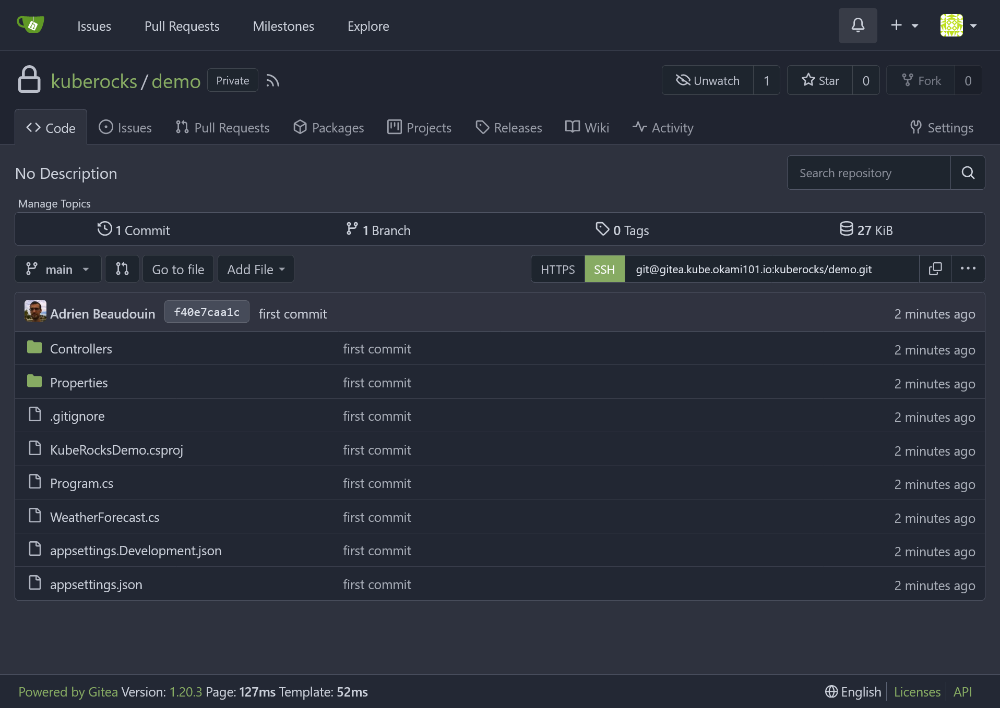


Be free from AWS/Azure/GCP by building a production grade On-Premise Kubernetes cluster on cheap VPS provider, fully GitOps managed, and with complete CI/CD tools 🎉


This is the **Part VII** of more global topic tutorial. [Back to first part]() for intro.

## Self-hosted VCS

It's finally time to build our CI stack. Let's start with a self-hosted VCS. We'll use [Gitea](https://gitea.io/) as a lightweight GitHub clone, and far less resource intensive than GitLab. You can of course perfectly skip this entire chapter and stay with GitHub/GitLab if you prefer. But one of the goal of this tutorial is to maximize self-hosting, so let's go !

As I consider the CI as part of infrastructure, I'll use the dedicated Terraform project for Helms management. But again it's up to you if you prefer using Flux, it'll work too.

### Gitea

The Gitea Helm Chart is a bit tricky to configure properly. Let's begin with some additional required variables:



```tf
variable "gitea_admin_username" {
  type = string
}

variable "gitea_admin_password" {
  type      = string
  sensitive = true
}

variable "gitea_admin_email" {
  type = string
}

variable "gitea_db_password" {
  type      = string
  sensitive = true
}
```





```tf
gitea_admin_username = "kuberocks"
gitea_admin_password = "xxx"
gitea_admin_email    = "admin@kube.rocks"
gitea_db_password    = "xxx"
```



Then the Helm chart itself:



```tf
locals {
  redis_connection = "redis://:${urlencode(var.redis_password)}@redis-master.redis:6379/0"
}

resource "kubernetes_namespace_v1" "gitea" {
  metadata {
    name = "gitea"
  }
}

resource "helm_release" "gitea" {
  chart      = "gitea"
  version    = "9.2.0"
  repository = "https://dl.gitea.io/charts"

  name      = "gitea"
  namespace = kubernetes_namespace_v1.gitea.metadata[0].name

  set {
    name  = "gitea.admin.username"
    value = var.gitea_admin_username
  }

  set {
    name  = "gitea.admin.password"
    value = var.gitea_admin_password
  }

  set {
    name  = "gitea.admin.email"
    value = var.gitea_admin_email
  }

  set {
    name  = "strategy.type"
    value = "Recreate"
  }

  set {
    name  = "postgresql-ha.enabled"
    value = "false"
  }

  set {
    name  = "redis-cluster.enabled"
    value = "false"
  }

  set {
    name  = "persistence.storageClass"
    value = "longhorn"
  }

  set {
    name  = "persistence.size"
    value = "5Gi"
  }

  set {
    name  = "gitea.metrics.enabled"
    value = "true"
  }

  set {
    name  = "gitea.metrics.serviceMonitor.enabled"
    value = "true"
  }

  set {
    name  = "gitea.config.server.DOMAIN"
    value = "gitea.${var.domain}"
  }

  set {
    name  = "gitea.config.server.SSH_DOMAIN"
    value = "gitea.${var.domain}"
  }

  set {
    name  = "gitea.config.server.ROOT_URL"
    value = "https://gitea.${var.domain}"
  }

  set {
    name  = "gitea.config.database.DB_TYPE"
    value = "postgres"
  }

  set {
    name  = "gitea.config.database.HOST"
    value = "postgresql-primary.postgres"
  }

  set {
    name  = "gitea.config.database.NAME"
    value = "gitea"
  }

  set {
    name  = "gitea.config.database.USER"
    value = "gitea"
  }

  set {
    name  = "gitea.config.database.PASSWD"
    value = var.gitea_db_password
  }

  set {
    name  = "gitea.config.indexer.REPO_INDEXER_ENABLED"
    value = "true"
  }

  set {
    name  = "gitea.config.mailer.ENABLED"
    value = "true"
  }

  set {
    name  = "gitea.config.mailer.FROM"
    value = "gitea@${var.domain}"
  }

  set {
    name  = "gitea.config.mailer.SMTP_ADDR"
    value = var.smtp_host
  }

  set {
    name  = "gitea.config.mailer.SMTP_PORT"
    value = var.smtp_port
  }

  set {
    name  = "gitea.config.mailer.USER"
    value = var.smtp_user
  }

  set {
    name  = "gitea.config.mailer.PASSWD"
    value = var.smtp_password
  }

  set {
    name  = "gitea.config.cache.ADAPTER"
    value = "redis"
  }

  set {
    name  = "gitea.config.cache.HOST"
    value = local.redis_connection
  }

  set {
    name  = "gitea.config.session.PROVIDER"
    value = "redis"
  }

  set {
    name  = "gitea.config.session.PROVIDER_CONFIG"
    value = local.redis_connection
  }

  set {
    name  = "gitea.config.queue.TYPE"
    value = "redis"
  }

  set {
    name  = "gitea.config.queue.CONN_STR"
    value = local.redis_connection
  }

  set {
    name  = "gitea.config.service.DISABLE_REGISTRATION"
    value = "true"
  }

  set {
    name  = "gitea.config.repository.DEFAULT_BRANCH"
    value = "main"
  }

  set {
    name  = "gitea.config.metrics.ENABLED_ISSUE_BY_REPOSITORY"
    value = "true"
  }

  set {
    name  = "gitea.config.metrics.ENABLED_ISSUE_BY_LABEL"
    value = "true"
  }

  set {
    name  = "gitea.config.webhook.ALLOWED_HOST_LIST"
    value = "*"
  }
}
```



Note as we disable included Redis and PostgreSQL sub charts, because w'l reuse our existing ones. Also note the use of `urlencode` function for Redis password, as it can contain special characters.

The related ingress:



```tf
resource "kubernetes_manifest" "gitea_ingress" {
  manifest = {
    apiVersion = "traefik.io/v1alpha1"
    kind       = "IngressRoute"
    metadata = {
      name      = "gitea-http"
      namespace = kubernetes_namespace_v1.gitea.metadata[0].name
    }
    spec = {
      entryPoints = ["websecure"]
      routes = [
        {
          match = "Host(`gitea.${var.domain}`)"
          kind  = "Rule"
          services = [
            {
              name = "gitea-http"
              port = "http"
            }
          ]
        }
      ]
    }
  }
}
```



You should be able to log in `https://gitea.kube.rocks` with chosen admin credentials.

### Push a basic Web API project

Let's generate a basic .NET Web API project. Create a new dotnet project like following (you may install [last .NET SDK](https://dotnet.microsoft.com/en-us/download)):

```sh
mkdir kuberocks-demo
cd kuberocks-demo
dotnet new sln
dotnet new gitignore
dotnet new webapi -o src/KubeRocks.WebApi
dotnet sln add src/KubeRocks.WebApi
git init
git add .
git commit -m "first commit"
```

Then create a new repo `kuberocks/demo` on Gitea, and follow the instructions of *existing repository* section to push your code.

[](gitea-repo.png)

All should work as expected when HTTPS, even the fuzzy repo search. But what if you prefer SSH ?

### Pushing via SSH

We'll use SSH to push our code to Gitea. Put your public SSH key in your Gitea profile and follow push instructions from the sample repo. Here the SSH remote is `git@gitea.kube.rocks:kuberocks/demo.git`.

When you'll try to pull, you'll get a connection timeout error. It's time to tackle SSH access to our cluster.

Firstly, we have to open SSH port to our load balancer. Go back to the 1st Hcloud Terraform project and create a new service for SSH:



```tf
resource "hcloud_load_balancer_service" "ssh_service" {
  load_balancer_id = module.hcloud_kube.lbs.worker.id
  protocol         = "tcp"
  listen_port      = 22
  destination_port = 22
}
```



SSH port is now opened, we have a new **connection refused** error. Let's configure SSH access from Traefik to Gitea pod.



```tf
resource "helm_release" "traefik" {
  //...

  set {
    name  = "ports.ssh.port"
    value = "2222"
  }

  set {
    name  = "ports.ssh.expose"
    value = "true"
  }

  set {
    name  = "ports.ssh.exposedPort"
    value = "22"
  }

  set {
    name  = "ports.ssh.protocol"
    value = "TCP"
  }
}
```



And finally, the route ingress :



```tf
resource "kubernetes_manifest" "gitea_ingress_ssh" {
  manifest = {
    apiVersion = "traefik.io/v1alpha1"
    kind       = "IngressRouteTCP"
    metadata = {
      name      = "gitea-ssh"
      namespace = kubernetes_namespace_v1.gitea.metadata[0].name
    }
    spec = {
      entryPoints = ["ssh"]
      routes = [
        {
          match = "HostSNI(`*`)"
          services = [
            {
              name = "gitea-ssh"
              port = "ssh"
            }
          ]
        }
      ]
    }
  }
}
```



Now retry pull again and it should work seamlessly !

### Gitea monitoring

[Link](https://grafana.com/grafana/dashboards/17802)

[](gitea-monitoring.png)

## CI

Now we have a working self-hosted VCS, let's add a CI tool. We'll use [Concourse CI](https://concourse-ci.org/), which is optimized for Kubernetes and have high scalability (and open source of course), with the price of some configuration and slight learning curve.


If you prefer to have CI directly included into your VCS, which simplify configuration drastically, although limited to same Gitea host, note that Gitea team is working on a built-in CI, see [Gitea Actions](https://docs.gitea.com/usage/actions/overview) (not production ready).  
I personally prefer to have a dedicated CI tool, as it's more flexible and can be used for any external VCS if needed.


### CI node pool

Concourse CI is composed of 2 main components:

* **Web UI**: the main UI, which is used to configure pipelines and visualize jobs, persisted in a PostgreSQL database
* **Worker**: the actual CI worker, which will execute jobs for any app building

It's obvious that the workers, which are the most resource intensive, should be scaled independently, without any impact on others critical components of our cluster. So, as you already guess, we'll use a dedicated pool for building. Let's apply this:



```tf
module "hcloud_kube" {
  //...

  agent_nodepools = [
    //...
    {
      name              = "runner"
      server_type       = "cx21"
      location          = "nbg1"
      count             = 1
      private_interface = "ens10"
      labels = [
        "node.kubernetes.io/server-usage=runner"
      ]
      taints = [
        "node-role.kubernetes.io/runner:NoSchedule"
      ]
    }
  ]
}
```



### Concourse CI

The variables:



```tf
variable "concourse_user" {
  type = string
}

variable "concourse_password" {
  type      = string
  sensitive = true
}

variable "concourse_db_password" {
  type      = string
  sensitive = true
}
```





```tf
concourse_user        = "kuberocks"
concourse_password    = "xxx"
concourse_db_password = "xxx"
```



Let's apply Concourse Helm Chart:



```tf
resource "kubernetes_namespace_v1" "concourse" {
  metadata {
    name = "concourse"
  }
}

resource "helm_release" "concourse" {
  chart      = "concourse"
  version    = "17.2.0"
  repository = "https://concourse-charts.storage.googleapis.com"

  name      = "concourse"
  namespace = kubernetes_namespace_v1.concourse.metadata[0].name

  set {
    name  = "concourse.web.externalUrl"
    value = "https://concourse.${var.domain}"
  }

  set {
    name  = "postgresql.enabled"
    value = "false"
  }

  set {
    name  = "secrets.postgresUser"
    value = "concourse"
  }

  set {
    name  = "secrets.postgresPassword"
    value = var.concourse_db_password
  }

  set {
    name  = "concourse.web.auth.mainTeam.localUser"
    value = var.concourse_user
  }

  set {
    name  = "secrets.localUsers"
    value = "${var.concourse_user}:${var.concourse_password}"
  }

  set {
    name  = "concourse.web.postgres.host"
    value = "postgresql-primary.postgres"
  }

  set {
    name  = "concourse.web.postgres.database"
    value = "concourse"
  }

  set {
    name  = "concourse.web.auth.cookieSecure"
    value = "true"
  }

  set {
    name  = "concourse.web.prometheus.enabled"
    value = "true"
  }

  set {
    name  = "concourse.web.prometheus.serviceMonitor.enabled"
    value = "true"
  }

  set {
    name  = "concourse.worker.runtime"
    value = "containerd"
  }

  set {
    name  = "worker.replicas"
    value = "1"
  }

  set {
    name  = "worker.minAvailable"
    value = "0"
  }

  set {
    name  = "worker.tolerations[0].key"
    value = "node-role.kubernetes.io/runner"
  }

  set {
    name  = "worker.tolerations[0].effect"
    value = "NoSchedule"
  }

  set {
    name  = "worker.nodeSelector.node\\.kubernetes\\.io/server-usage"
    value = "runner"
  }
}

resource "kubernetes_manifest" "concourse_ingress" {
  manifest = {
    apiVersion = "traefik.io/v1alpha1"
    kind       = "IngressRoute"
    metadata = {
      name      = "concourse"
      namespace = kubernetes_namespace_v1.concourse.metadata[0].name
    }
    spec = {
      entryPoints = ["websecure"]
      routes = [
        {
          match = "Host(`concourse.${var.domain}`)"
          kind  = "Rule"
          services = [
            {
              name = "concourse-web"
              port = "atc"
            }
          ]
        }
      ]
    }
  }
}
```



Be sure to disable the PostgreSQL sub chart via `postgresql.enabled`.

You may set `worker.replicas` as the number of nodes in your runner pool. As usual, note the use of `nodeSelector` and `tolerations` to ensure workers are deployed on runner nodes.

Then go to `https://concourse.kube.rocks` and log in with chosen credentials.

## Workflow

It's now time to step back and think about how we'll use our CI. Our goal is to build our above dotnet Web API with Concourse CI as a container image, ready to deploy to our cluster through Flux. So we finish the complete CI/CD pipeline. To resume the scenario:

1. Concourse CI check the repo periodically (pull model) for new code pushed and trigger a build if applicable
2. When container image build passed, Concourse CI push the new image to our private registry, which is already take care by Gitea
3. Flux, which can perfectly be in a different cluster, check the registry periodically (pull model), if new image tag detected, it will deploy it automatically to our cluster


Although it's the most secured way and configuration less, instead of default pull model, which is generally a check every minute, it's possible secured WebHook instead in order to reduce time between code push and deployment.


The flow pipeline is pretty straightforward:


graph RL
  A[Concourse CI] -- check --> B[(Code repository)]
  A -- push --> C[/Container Registry/]
  F{Worker} -- build --> A
  I[Image Updater] -- check --> C
  I -- push --> J[(Flux repository)]
  D[Flux] -- check --> J
  D -- deploy --> E((Kube API))


### The credentials

We need to:

1. Give read/write access to our Gitea and registry for Concourse. Note as we need write access in code repository for concourse because we need to store the new image tag. We'll using [semver resource](https://github.com/concourse/semver-resource) for that.
2. Give read registry credentials to Flux for regular image tag checking as well as Kubernetes in order to allow image pulling from the private registry.

Let's create 2 new user `concourse` with admin acces and `container` as standard user on Gitea. Store these credentials on new variables:



```tf
variable "concourse_git_username" {
  type = string
}

variable "concourse_git_password" {
  type      = string
  sensitive = true
}

variable "container_registry_username" {
  type = string
}

variable "container_registry_password" {
  type      = string
  sensitive = true
}
```





```tf
concourse_git_username      = "concourse"
concourse_git_password      = "xxx"
container_registry_username = "container"
container_registry_password = "xxx"
```



Apply the credentials for Concourse:



```tf
resource "kubernetes_secret_v1" "concourse_registry" {
  metadata {
    name      = "registry"
    namespace = "concourse-main"
  }

  data = {
    name     = "gitea.${var.domain}"
    username = var.concourse_git_username
    password = var.concourse_git_password
  }

  depends_on = [
    helm_release.concourse
  ]
}

resource "kubernetes_secret_v1" "concourse_git" {
  metadata {
    name      = "git"
    namespace = "concourse-main"
  }

  data = {
    url            = "https://gitea.${var.domain}"
    username       = var.concourse_git_username
    password       = var.concourse_git_password
    git-user       = "Concourse CI <concourse@kube.rocks>"
    commit-message = "bump to %version% [ci skip]"
  }

  depends_on = [
    helm_release.concourse
  ]
}
```



Note as we use `concourse-main` namespace, already created by Concourse Helm installer, which is a dedicated namespace for the default team `main`. Because of that, we should keep `depends_on` to ensure the namespace is created before the secrets.


Don't forget the `[ci skip]` in commit message, which is the commit for version bumping, otherwise you'll have an infinite loop of builds !


Then same for Flux and the namespace that will receive the app:



```tf
resource "kubernetes_secret_v1" "image_pull_secrets" {
  for_each = toset(["flux-system", "kuberocks"])
  metadata {
    name      = "dockerconfigjson"
    namespace = each.value
  }

  type = "kubernetes.io/dockerconfigjson"

  data = {
    ".dockerconfigjson" = jsonencode({
      auths = {
        "gitea.${var.domain}" = {
          auth = base64encode("${var.container_registry_username}:${var.container_registry_password}")
        }
      }
    })
  }
}
```




Create the namespace `kuberocks` first by `k create namespace kuberocks`, or you'll get an error.


### Build and push the container image

Now that all required credentials are in place, we have to tell Concourse how to check our repo and build our container image. This is done through a pipeline, which is a specific Concourse YAML file.

#### The Dockerfile

Firstly create following files in root of your repo that we'll use for building a production ready container image:



```txt
**/bin/
**/obj/
```





```Dockerfile
FROM mcr.microsoft.com/dotnet/aspnet:7.0

WORKDIR /publish
COPY /publish .

EXPOSE 80
ENTRYPOINT ["dotnet", "KubeRocksDemo.dll"]
```



#### The pipeline

Let's reuse our flux repository and create a file `pipelines/demo.yaml` with following content:



```tf
resources:
  - name: version
    type: semver
    source:
      driver: git
      uri: ((git.url))/kuberocks/demo
      branch: main
      file: version
      username: ((git.username))
      password: ((git.password))
      git_user: ((git.git-user))
      commit_message: ((git.commit-message))
  - name: source-code
    type: git
    icon: coffee
    source:
      uri: ((git.url))/kuberocks/demo
      branch: main
      username: ((git.username))
      password: ((git.password))
  - name: docker-image
    type: registry-image
    icon: docker
    source:
      repository: ((registry.name))/kuberocks/demo
      tag: latest
      username: ((registry.username))
      password: ((registry.password))

jobs:
  - name: build
    plan:
      - get: source-code
        trigger: true

      - task: build-source
        config:
          platform: linux
          image_resource:
            type: registry-image
            source:
              repository: mcr.microsoft.com/dotnet/sdk
              tag: "7.0"
          inputs:
            - name: source-code
              path: .
          outputs:
            - name: binaries
              path: publish
          caches:
            - path: /root/.nuget/packages
          run:
            path: /bin/sh
            args:
              - -ec
              - |
                dotnet format --verify-no-changes
                dotnet build -c Release
                dotnet publish src/KubeRocks.WebApi -c Release -o publish --no-restore --no-build

      - task: build-image
        privileged: true
        config:
          platform: linux
          image_resource:
            type: registry-image
            source:
              repository: concourse/oci-build-task
          inputs:
            - name: source-code
              path: .
            - name: binaries
              path: publish
          outputs:
            - name: image
          run:
            path: build
      - put: version
        params: { bump: patch }

      - put: docker-image
        params:
          additional_tags: version/number
          image: image/image.tar
```



A bit verbose compared to other CI, but it gets the job done. The price of maximum flexibility. Now in order to apply it we may need to install `fly` CLI tool. Just a matter of `scoop install concourse-fly` on Windows. Then:

```sh
# login to your Concourse instance
fly -t kuberocks login -c https://concourse.kube.rocks

# create the pipeline and active it
fly -t kuberocks set-pipeline -p demo -c pipelines/demo.yaml
fly -t kuberocks unpause-pipeline -p demo
```

A build will be trigger immediately. You can follow it on Concourse UI.

[](concourse-pipeline.png)

If everything is ok, check in `https://gitea.kube.rocks/admin/packages`, you should see a new image tag on your registry ! A new file `version` is automatically pushed in code repo in order to keep tracking of the image tag version.

[](concourse-build.png)

### The deployment

If you followed the previous parts of this tutorial, you should have clue about how to deploy your app. Let's create deploy it with Flux:



```yaml
apiVersion: apps/v1
kind: Deployment
metadata:
  name: demo
  namespace: kuberocks
spec:
  replicas: 1
  selector:
    matchLabels:
      app: demo
  template:
    metadata:
      labels:
        app: demo
    spec:
      imagePullSecrets:
        - name: dockerconfigjson
      containers:
        - name: api
          image: gitea.kube.okami101.io/kuberocks/demo:latest
          ports:
            - containerPort: 80
---
apiVersion: v1
kind: Service
metadata:
  name: demo
  namespace: kuberocks
spec:
  selector:
    app: demo
  ports:
    - name: http
      port: 80
---
apiVersion: traefik.io/v1alpha1
kind: IngressRoute
metadata:
  name: demo
  namespace: kuberocks
spec:
  entryPoints:
    - websecure
  routes:
    - match: Host(`demo.kube.rocks`)
      kind: Rule
      services:
        - name: demo
          port: http
```



Note as we have set `imagePullSecrets` in order to use fetch previously created credentials for private registry access. The rest is pretty straightforward. Once pushed, after about 1 minute, you should see your app deployed in `https://demo.kube.rocks`. Check the API response on `https://demo.kube.rocks/WeatherForecast`.

However, one last thing missing: the automatic deployment.

#### Image automation

TODO

## 6th check ✅

We have everything we need for app building with automatic deployment ! Go [next part]() for advanced tracing / load testing !
