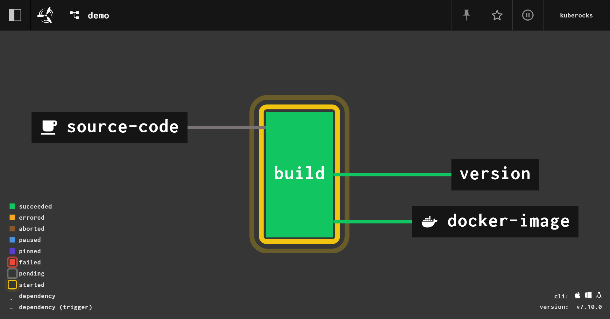
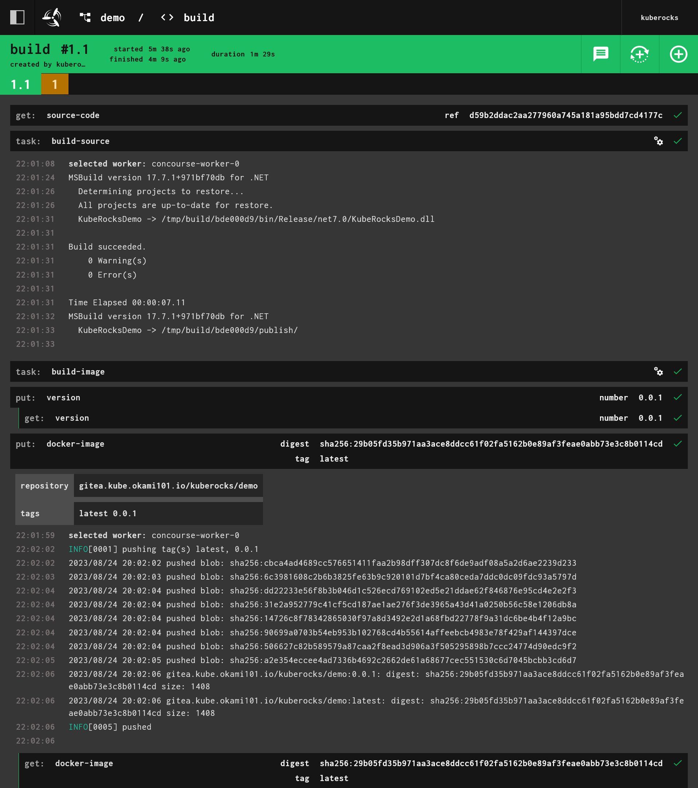


Use GitOps workflow for building a production grade on-premise Kubernetes cluster on cheap VPS provider, with complete CI/CD 🎉


This is the **Part VII** of more global topic tutorial. [Back to guide summary]() for intro.

## Workflow

It's now time to step back and think about how we'll use our CI. Our goal is to build our above dotnet Web API with Concourse CI as a container image, ready to deploy to our cluster through Flux. So we finish the complete CI/CD pipeline. To resume the scenario:

1. Concourse CI check the Gitea repo periodically (pull model) for any new code and trigger a build if applicable
2. When container image build passed, Concourse CI push the new image to our private registry, which is already included into Gitea
3. Image Automation, which is a component as part of Flux, check the registry periodically (pull model), if new image tag detected, it will write the last tag into Flux repository
4. Flux check the flux GitHub registry periodically (pull model), if any new or updated manifest detected, it will deploy it automatically to our cluster


Although it's the most secured way and configuration less, instead of default pull model, which is generally a check every minute, it's possible to use WebHook instead in order to reduce time between code push and deployment.


The flow pipeline is pretty straightforward:


graph RL
  subgraph R [Private registry]
    C[/Container Registry/]
  end
  S -- scan --> R
  S -- push --> J[(Flux repository)]
  subgraph CD
    D{Flux} -- check --> J
    D -- deploy --> E((Kube API))
  end
  subgraph S [Image Scanner]
    I[Image Reflector] -- trigger --> H[Image Automation]
  end
  subgraph CI
    A{Concourse} -- check --> B[(Code repository)]
    A -- push --> C
    F((Worker)) -- build --> A
  end


## CI part

### The credentials

We need to:

1. Give read/write access to our Gitea repo and container registry for Concourse. Note as we need write access in code repository for concourse because we need to store the new image tag. We'll using [semver resource](https://github.com/concourse/semver-resource) for that.
2. Give read registry credentials to Flux for regular image tag checking as well as Kubernetes in order to allow image pulling from the private registry.

Let's create 2 new user `concourse` with admin acces and `container` as standard user on Gitea. Store these credentials on new variables:



```tf
variable "concourse_git_username" {
  type = string
}

variable "concourse_git_password" {
  type      = string
  sensitive = true
}

variable "container_registry_username" {
  type = string
}

variable "container_registry_password" {
  type      = string
  sensitive = true
}
```





```tf
concourse_git_username      = "concourse"
concourse_git_password      = "xxx"
container_registry_username = "container"
container_registry_password = "xxx"
```



Apply the credentials for Concourse:



```tf
resource "kubernetes_secret_v1" "concourse_registry" {
  metadata {
    name      = "registry"
    namespace = "concourse-main"
  }

  data = {
    name     = "gitea.${var.domain}"
    username = var.concourse_git_username
    password = var.concourse_git_password
  }

  depends_on = [
    helm_release.concourse
  ]
}

resource "kubernetes_secret_v1" "concourse_git" {
  metadata {
    name      = "git"
    namespace = "concourse-main"
  }

  data = {
    url            = "https://gitea.${var.domain}"
    username       = var.concourse_git_username
    password       = var.concourse_git_password
    git-user       = "Concourse CI <concourse@kube.rocks>"
    commit-message = "bump to %version% [ci skip]"
  }

  depends_on = [
    helm_release.concourse
  ]
}
```



Note as we use `concourse-main` namespace, already created by Concourse Helm installer, which is a dedicated namespace for the default team `main`. Because of that, we should keep `depends_on` to ensure the namespace is created before the secrets.


Don't forget the `[ci skip]` in commit message, which is the commit for version bumping, otherwise you'll have an infinite build loop !


Then same for Flux and the namespace that will receive the app:



```tf
resource "kubernetes_secret_v1" "image_pull_secrets" {
  for_each = toset(["flux-system", "kuberocks"])
  metadata {
    name      = "dockerconfigjson"
    namespace = each.value
  }

  type = "kubernetes.io/dockerconfigjson"

  data = {
    ".dockerconfigjson" = jsonencode({
      auths = {
        "gitea.${var.domain}" = {
          auth = base64encode("${var.container_registry_username}:${var.container_registry_password}")
        }
      }
    })
  }
}
```




Create the namespace `kuberocks` first by `k create namespace kuberocks`, or you'll get an error.


### The Dockerfile

Now that all required credentials are in place, we have to tell Concourse how to check our repo and build our container image. This is done through a pipeline, which is a specific Concourse YAML file.

Firstly create following files in root of your repo that we'll use for building a production ready container image:



```txt
**/bin/
**/obj/
```





```Dockerfile
FROM mcr.microsoft.com/dotnet/aspnet:8.0

WORKDIR /publish
COPY /publish .

EXPOSE 80
ENTRYPOINT ["dotnet", "KubeRocks.WebApi.dll"]
```



### The pipeline

Let's reuse our flux repository and create a file `pipelines/demo.yaml` with following content:



```tf
resources:
  - name: version
    type: semver
    source:
      driver: git
      uri: ((git.url))/kuberocks/demo
      branch: main
      file: version
      username: ((git.username))
      password: ((git.password))
      git_user: ((git.git-user))
      commit_message: ((git.commit-message))
  - name: source-code
    type: git
    icon: coffee
    source:
      uri: ((git.url))/kuberocks/demo
      branch: main
      username: ((git.username))
      password: ((git.password))
  - name: docker-image
    type: registry-image
    icon: docker
    source:
      repository: ((registry.name))/kuberocks/demo
      tag: latest
      username: ((registry.username))
      password: ((registry.password))

jobs:
  - name: build
    plan:
      - get: source-code
        trigger: true

      - task: build-source
        config:
          platform: linux
          image_resource:
            type: registry-image
            source:
              repository: mcr.microsoft.com/dotnet/sdk
              tag: "8.0"
          inputs:
            - name: source-code
              path: .
          outputs:
            - name: binaries
              path: publish
          caches:
            - path: /root/.nuget/packages
          run:
            path: /bin/sh
            args:
              - -ec
              - |
                dotnet format --verify-no-changes
                dotnet build -c Release
                dotnet publish src/KubeRocks.WebApi -c Release -o publish --no-restore --no-build

      - task: build-image
        privileged: true
        config:
          platform: linux
          image_resource:
            type: registry-image
            source:
              repository: concourse/oci-build-task
          inputs:
            - name: source-code
              path: .
            - name: binaries
              path: publish
          outputs:
            - name: image
          run:
            path: build
      - put: version
        params: { bump: patch }

      - put: docker-image
        params:
          additional_tags: version/number
          image: image/image.tar
```



A bit verbose compared to other CI, but it gets the job done. The price of maximum flexibility. Now in order to apply it we may need to install `fly` CLI tool. Just a matter of `scoop install concourse-fly` on Windows. Then:

```sh
# login to your Concourse instance
fly -t kuberocks login -c https://concourse.kube.rocks

# create the pipeline and active it
fly -t kuberocks set-pipeline -p demo -c pipelines/demo.yaml
fly -t kuberocks unpause-pipeline -p demo
```

A build will be trigger immediately. You can follow it on Concourse UI.

[](concourse-pipeline.png)

If everything is ok, check in `https://gitea.kube.rocks/admin/packages`, you should see a new image appear on the list ! A new file `version` is automatically pushed in code repo in order to keep tracking of the image tag version.

[](concourse-build.png)

### Automatic pipeline update

If you don't want to use fly CLI every time for any pipeline update, you maybe interested in `set_pipeline` feature. Create following file:



```tf
resources:
  - name: ci
    type: git
    icon: git
    source:
      uri: https://github.com/kuberocks/demo-kube-flux

jobs:
  - name: configure-pipelines
    plan:
      - get: ci
        trigger: true
      - set_pipeline: demo
        file: ci/pipelines/demo.yaml
```



Then apply it:

```sh
fly -t kuberocks set-pipeline -p main -c pipelines/main.yaml
```

Now you can manually trigger the pipeline, or wait for the next check, and it will update the demo pipeline automatically. If you're using a private repo for your pipelines, you may need to add a new secret for the git credentials and set `username` and `password` accordingly.

You almost no need of fly CLI anymore, except for adding new pipelines ! You can even go further with `set_pipeline: self` which is always an experimental feature.

## CD part

### The deployment

If you followed the previous parts of this tutorial, you should have clue about how to deploy your app. Let's create deploy it with Flux:



```yaml
apiVersion: apps/v1
kind: Deployment
metadata:
  name: demo
  namespace: kuberocks
spec:
  replicas: 1
  selector:
    matchLabels:
      app: demo
  template:
    metadata:
      labels:
        app: demo
    spec:
      imagePullSecrets:
        - name: dockerconfigjson
      containers:
        - name: api
          image: gitea.kube.rocks/kuberocks/demo:latest
          ports:
            - containerPort: 80
---
apiVersion: v1
kind: Service
metadata:
  name: demo
  namespace: kuberocks
  labels:
    app: demo
spec:
  selector:
    app: demo
  ports:
    - name: http
      port: 80
---
apiVersion: traefik.io/v1alpha1
kind: IngressRoute
metadata:
  name: demo
  namespace: kuberocks
spec:
  entryPoints:
    - websecure
  routes:
    - match: Host(`demo.kube.rocks`)
      kind: Rule
      services:
        - name: demo
          port: http
```



Note as we have set `imagePullSecrets` in order to use fetch previously created credentials for private registry access. The rest is pretty straightforward. Once pushed, after about 1 minute, you should see your app deployed in `https://demo.kube.rocks`. Check the API response on `https://demo.kube.rocks/WeatherForecast`.

However, one last thing is missing: the automatic deployment.

### Image automation

If you checked the above flowchart, you'll note that Image automation is a separate process from Flux that only scan the registry for new image tags and push any new tag to Flux repository. Then Flux will detect the new commit in Git repository, including the new tag, and automatically deploy it to K8s.

By default, if not any strategy is set, K8s will do a **rolling deployment**, i.e. creating new replica firstly before terminating the old one. This will prevent any downtime on the condition of you set as well **readiness probe** in your pod spec, which is a later topic.

Let's define the image update automation task for main Flux repository:



```yaml
apiVersion: image.toolkit.fluxcd.io/v1beta1
kind: ImageUpdateAutomation
metadata:
  name: flux-system
  namespace: flux-system
spec:
  interval: 1m0s
  sourceRef:
    kind: GitRepository
    name: flux-system
  git:
    checkout:
      ref:
        branch: main
    commit:
      author:
        email: fluxcdbot@kube.rocks
        name: fluxcdbot
      messageTemplate: "{{range .Updated.Images}}{{println .}}{{end}}"
    push:
      branch: main
  update:
    path: ./clusters/demo
    strategy: Setters
```



Now we need to tell Image Reflector how to scan the repository, as well as the attached policy for tag update:



```yaml
apiVersion: image.toolkit.fluxcd.io/v1beta1
kind: ImageRepository
metadata:
  name: demo
  namespace: flux-system
spec:
  image: gitea.kube.rocks/kuberocks/demo
  interval: 1m0s
  secretRef:
    name: dockerconfigjson
---
apiVersion: image.toolkit.fluxcd.io/v1beta1
kind: ImagePolicy
metadata:
  name: demo
  namespace: flux-system
spec:
  imageRepositoryRef:
    name: demo
    namespace: flux-system
  policy:
    semver:
      range: 0.0.x
```




As usual, don't forget `dockerconfigjson` for private registry access.


And finally edit the deployment to use the policy by adding a specific marker next to the image tag:



```yaml
# ...
      containers:
        - name: api
          image: gitea.kube.rocks/kuberocks/demo:latest # {"$imagepolicy": "flux-system:demo"}
# ...
```



It will tell to `Image Automation` where to update the tag in the Flux repository. The format is `{"$imagepolicy": "<policy-namespace>:<policy-name>"}`.

Push the changes and wait for about 1 minute then pull the flux repo. You should see a new commit coming and `latest` should be replaced by an explicit tag like so:



```yaml
# ...
      containers:
        - name: api
          image: gitea.kube.rocks/kuberocks/demo:0.0.1 # {"$imagepolicy": "flux-system:demo"}
# ...
```



Check if the pod as been correctly updated with `kgpo -n kuberocks`. Use `kd -n kuberocks deploy/demo` to check if the same tag is here and no `latest`.

```txt
Pod Template:
  Labels:  app=demo
  Containers:
   api:
    Image:        gitea.kube.rocks/kuberocks/demo:0.0.1
    Port:         80/TCP
```

### Retest all workflow

Damn, I think we're done 🎉 ! It's time retest the full process. Add new controller endpoint from our demo project and push the code:



```cs
//...
public class WeatherForecastController : ControllerBase
{
    //...

    [HttpGet("{id}", Name = "GetWeatherForecastById")]
    public WeatherForecast GetById(int id)
    {
        return new WeatherForecast
        {
            Date = DateOnly.FromDateTime(DateTime.Now.AddDays(id)),
            TemperatureC = Random.Shared.Next(-20, 55),
            Summary = Summaries[Random.Shared.Next(Summaries.Length)]
        };
    }
}
```



Wait the pod to be updated, then check the new endpoint `https://demo.kube.rocks/WeatherForecast/1`. The API should return a new unique random weather forecast with the tomorrow date.

## 7th check ✅

We have done for the set-up of our automated CI/CD workflow process. Go [next part]() for going further with a real DB app that handle automatic migrations.
