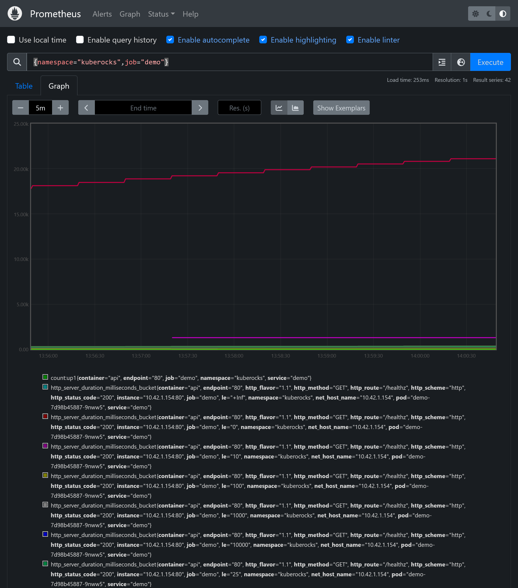
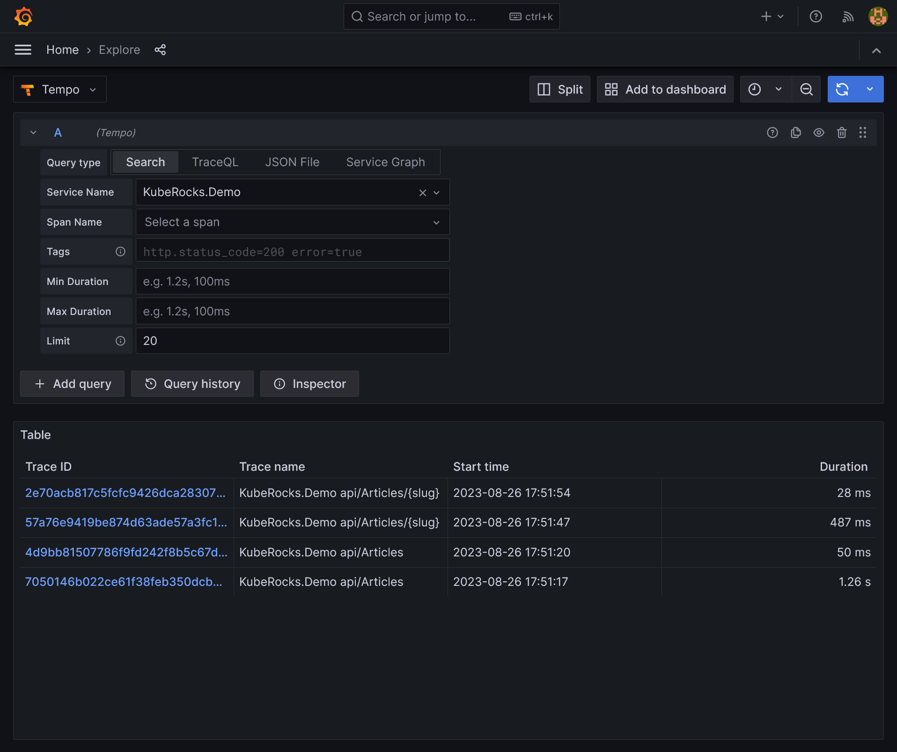
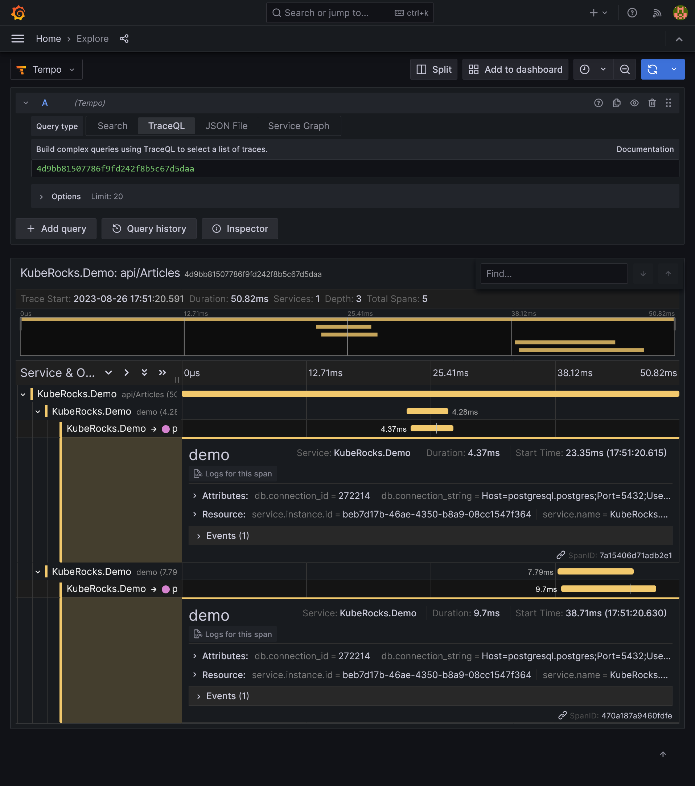
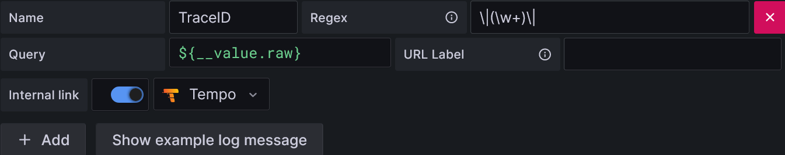


Be free from AWS/Azure/GCP by building a production grade On-Premise Kubernetes cluster on cheap VPS provider, fully GitOps managed, and with complete CI/CD tools 🎉


This is the **Part VIII** of more global topic tutorial. [Back to first part]() for intro.

## Real DB App sample

Before go any further, let's add some DB usage to our sample app. We'll use the classical `Articles<->Authors<->Comments` relationships. First create `docker-compose.yml` file in root of demo project:



```yaml
version: "3"

services:
  db:
    image: postgres:15
    environment:
      POSTGRES_USER: main
      POSTGRES_PASSWORD: main
      POSTGRES_DB: main
    ports:
      - 5432:5432
```



Launch it with `docker compose up -d` and check database running with `docker ps`.

Time to create basic code that list plenty of articles from an API endpoint. Go back to `kuberocks-demo` and create a new separate project dedicated to app logic:

```sh
dotnet new classlib -o src/KubeRocks.Application
dotnet sln add src/KubeRocks.Application
dotnet add src/KubeRocks.WebApi reference src/KubeRocks.Application

dotnet add src/KubeRocks.Application package Microsoft.EntityFrameworkCore
dotnet add src/KubeRocks.Application package Npgsql.EntityFrameworkCore.PostgreSQL
dotnet add src/KubeRocks.WebApi package Microsoft.EntityFrameworkCore.Design
```


This is not a DDD course ! We will keep it simple and focus on Kubernetes part.


### Define the entities



```cs
using System.ComponentModel.DataAnnotations;

namespace KubeRocks.Application.Entities;

public class Article
{
    public int Id { get; set; }

    public required User Author { get; set; }

    [MaxLength(255)]
    public required string Title { get; set; }
    [MaxLength(255)]
    public required string Slug { get; set; }
    public required string Description { get; set; }
    public required string Body { get; set; }

    public DateTime CreatedAt { get; set; } = DateTime.UtcNow;
    public DateTime UpdatedAt { get; set; } = DateTime.UtcNow;

    public ICollection<Comment> Comments { get; } = new List<Comment>();
}
```





```cs
namespace KubeRocks.Application.Entities;

public class Comment
{
    public int Id { get; set; }

    public required Article Article { get; set; }
    public required User Author { get; set; }

    public required string Body { get; set; }

    public DateTime CreatedAt { get; set; } = DateTime.UtcNow;
}
```





```cs
using System.ComponentModel.DataAnnotations;

namespace KubeRocks.Application.Entities;

public class User
{
    public int Id { get; set; }

    [MaxLength(255)]
    public required string Name { get; set; }

    [MaxLength(255)]
    public required string Email { get; set; }

    public ICollection<Article> Articles { get; } = new List<Article>();
    public ICollection<Comment> Comments { get; } = new List<Comment>();
}
```





```cs
namespace KubeRocks.Application.Contexts;

using KubeRocks.Application.Entities;
using Microsoft.EntityFrameworkCore;

public class AppDbContext : DbContext
{
    public DbSet<User> Users => Set<User>();
    public DbSet<Article> Articles => Set<Article>();
    public DbSet<Comment> Comments => Set<Comment>();

    public AppDbContext(DbContextOptions<AppDbContext> options) : base(options)
    {
    }

    protected override void OnModelCreating(ModelBuilder modelBuilder)
    {
        base.OnModelCreating(modelBuilder);

        modelBuilder.Entity<User>()
            .HasIndex(u => u.Email).IsUnique()
        ;

        modelBuilder.Entity<Article>()
            .HasIndex(u => u.Slug).IsUnique()
        ;
    }
}
```





```cs
using KubeRocks.Application.Contexts;
using Microsoft.EntityFrameworkCore;
using Microsoft.Extensions.Configuration;
using Microsoft.Extensions.DependencyInjection;

namespace KubeRocks.Application.Extensions;

public static class ServiceExtensions
{
    public static IServiceCollection AddKubeRocksServices(this IServiceCollection services, IConfiguration configuration)
    {
        return services.AddDbContext<AppDbContext>((options) =>
        {
            options.UseNpgsql(configuration.GetConnectionString("DefaultConnection"));
        });
    }
}
```





```cs
using KubeRocks.Application.Extensions;

//...

// Add services to the container.
builder.Services.AddKubeRocksServices(builder.Configuration);

//...
```





```json
{
  //...
  "ConnectionStrings": {
    "DefaultConnection": "Host=localhost;Username=main;Password=main;Database=main;"
  }
}
```



Now as all models are created, we can generate migrations and update database accordingly:

```sh
dotnet new tool-manifest
dotnet tool install dotnet-ef

dotnet dotnet-ef -p src/KubeRocks.Application -s src/KubeRocks.WebApi migrations add InitialCreate
dotnet dotnet-ef -p src/KubeRocks.Application -s src/KubeRocks.WebApi database update
```

### Inject some dummy data

We'll use Bogus on a separate console project:

```sh
dotnet new console -o src/KubeRocks.Console
dotnet sln add src/KubeRocks.Console
dotnet add src/KubeRocks.WebApi reference src/KubeRocks.Application
dotnet add src/KubeRocks.Console package Bogus
dotnet add src/KubeRocks.Console package ConsoleAppFramework
dotnet add src/KubeRocks.Console package Respawn
```



```json
{
  "ConnectionStrings": {
    "DefaultConnection": "Host=localhost;Username=main;Password=main;Database=main;"
  }
}
```





```xml
<Project Sdk="Microsoft.NET.Sdk">

    <!-- ... -->

  <PropertyGroup>
    <!-- ... -->
    <RunWorkingDirectory>$(MSBuildProjectDirectory)</RunWorkingDirectory>
  </PropertyGroup>

  <ItemGroup>
    <None Update="appsettings.json">
      <CopyToOutputDirectory>PreserveNewest</CopyToOutputDirectory>
    </None>
  </ItemGroup>

</Project>
```





```cs
using Bogus;
using KubeRocks.Application.Contexts;
using KubeRocks.Application.Entities;
using Microsoft.EntityFrameworkCore;
using Npgsql;
using Respawn;
using Respawn.Graph;

namespace KubeRocks.Console.Commands;

[Command("db")]
public class DbCommand : ConsoleAppBase
{
    private readonly AppDbContext _context;

    public DbCommand(AppDbContext context)
    {
        _context = context;
    }

    [Command("migrate", "Migrate database")]
    public async Task Migrate()
    {
        await _context.Database.MigrateAsync();
    }

    [Command("fresh", "Wipe data")]
    public async Task FreshData()
    {
        await Migrate();

        using var conn = new NpgsqlConnection(_context.Database.GetConnectionString());

        await conn.OpenAsync();

        var respawner = await Respawner.CreateAsync(conn, new RespawnerOptions
        {
            TablesToIgnore = new Table[] { "__EFMigrationsHistory" },
            DbAdapter = DbAdapter.Postgres
        });

        await respawner.ResetAsync(conn);
    }

    [Command("seed", "Fake data")]
    public async Task SeedData()
    {
        await Migrate();
        await FreshData();

        var users = new Faker<User>()
            .RuleFor(m => m.Name, f => f.Person.FullName)
            .RuleFor(m => m.Email, f => f.Person.Email)
            .Generate(50);

        await _context.Users.AddRangeAsync(users);
        await _context.SaveChangesAsync();

        var articles = new Faker<Article>()
            .RuleFor(a => a.Title, f => f.Lorem.Sentence().TrimEnd('.'))
            .RuleFor(a => a.Description, f => f.Lorem.Paragraphs(1))
            .RuleFor(a => a.Body, f => f.Lorem.Paragraphs(5))
            .RuleFor(a => a.Author, f => f.PickRandom(users))
            .RuleFor(a => a.CreatedAt, f => f.Date.Recent(90).ToUniversalTime())
            .RuleFor(a => a.Slug, (f, a) => a.Title.Replace(" ", "-").ToLowerInvariant())
            .Generate(500)
            .Select(a =>
            {
                new Faker<Comment>()
                    .RuleFor(a => a.Body, f => f.Lorem.Paragraphs(2))
                    .RuleFor(a => a.Author, f => f.PickRandom(users))
                    .RuleFor(a => a.CreatedAt, f => f.Date.Recent(7).ToUniversalTime())
                    .Generate(new Faker().Random.Number(10))
                    .ForEach(c => a.Comments.Add(c));

                return a;
            });

        await _context.Articles.AddRangeAsync(articles);
        await _context.SaveChangesAsync();
    }
}
```





```cs
using KubeRocks.Application.Extensions;
using KubeRocks.Console.Commands;

var builder = ConsoleApp.CreateBuilder(args);

builder.ConfigureServices((ctx, services) =>
{
    services.AddKubeRocksServices(ctx.Configuration);
});

var app = builder.Build();

app.AddSubCommands<DbCommand>();

app.Run();
```



Then launch the command:

```sh
dotnet run --project src/KubeRocks.Console db seed
```

Ensure with your favorite DB client that data is correctly inserted.

### Define endpoint access

All that's left is to create the endpoint. Let's define all DTO first:

```sh
dotnet add src/KubeRocks.WebApi package Mapster
```



```cs
namespace KubeRocks.WebApi.Models;

public class ArticleListDto
{
    public required string Title { get; set; }

    public required string Slug { get; set; }

    public required string Description { get; set; }

    public required string Body { get; set; }

    public DateTime CreatedAt { get; set; }

    public DateTime UpdatedAt { get; set; }

    public required AuthorDto Author { get; set; }
}
```





```cs
namespace KubeRocks.WebApi.Models;

public class ArticleDto : ArticleListDto
{
    public List<CommentDto> Comments { get; set; } = new();
}
```





```cs
namespace KubeRocks.WebApi.Models;

public class AuthorDto
{
    public required string Name { get; set; }
}
```





```cs
namespace KubeRocks.WebApi.Models;

public class CommentDto
{
    public required string Body { get; set; }

    public DateTime CreatedAt { get; set; }

    public required AuthorDto Author { get; set; }
}
```



And finally the controller:



```cs
using KubeRocks.Application.Contexts;
using KubeRocks.WebApi.Models;
using Mapster;
using Microsoft.AspNetCore.Mvc;
using Microsoft.EntityFrameworkCore;

namespace KubeRocks.WebApi.Controllers;

[ApiController]
[Route("[controller]")]
public class ArticlesController
{
    private readonly AppDbContext _context;

    public record ArticlesResponse(IEnumerable<ArticleListDto> Articles, int ArticlesCount);

    public ArticlesController(AppDbContext context)
    {
        _context = context;
    }

    [HttpGet(Name = "GetArticles")]
    public async Task<ArticlesResponse> Get([FromQuery] int page = 1, [FromQuery] int size = 10)
    {
        var articles = await _context.Articles
            .OrderByDescending(a => a.Id)
            .Skip((page - 1) * size)
            .Take(size)
            .ProjectToType<ArticleListDto>()
            .ToListAsync();

        var articlesCount = await _context.Articles.CountAsync();

        return new ArticlesResponse(articles, articlesCount);
    }

    [HttpGet("{slug}", Name = "GetArticleBySlug")]
    public async Task<ActionResult<ArticleDto>> GetBySlug(string slug)
    {
        var article = await _context.Articles
            .Include(a => a.Author)
            .Include(a => a.Comments.OrderByDescending(c => c.Id))
            .ThenInclude(c => c.Author)
            .FirstOrDefaultAsync(a => a.Slug == slug);

        if (article is null)
        {
            return new NotFoundResult();
        }

        return article.Adapt<ArticleDto>();
    }
}
```



Launch the app and check that `/Articles` and `/Articles/{slug}` endpoints are working as expected.

## Production grade deployment

### Database connection

It's time to connect our app to the production database. Create a demo DB & user through pgAdmin and create the appropriate secret:



```yaml
apiVersion: v1
kind: Secret
metadata:
  name: demo-db
type: Opaque
data:
  password: ZGVtbw==
```



Generate the according sealed secret like previously chapters with `kubeseal` under `sealed-secret-demo-db.yaml` file and delete `secret-demo-db.yaml`.

```sh
cat clusters/demo/kuberocks/secret-demo.yaml | kubeseal --format=yaml --cert=pub-sealed-secrets.pem > clusters/demo/kuberocks/sealed-secret-demo.yaml
rm clusters/demo/kuberocks/secret-demo.yaml
```

Let's inject the appropriate connection string as environment variable:



```yaml
# ...
spec:
  # ...
  template:
    # ...
    spec:
      # ...
      containers:
        - name: api
          # ...
          env:
            - name: DB_PASSWORD
              valueFrom:
                secretKeyRef:
                  name: demo-db
                  key: password
            - name: ConnectionStrings__DefaultConnection
              value: Host=postgresql-primary.postgres;Username=demo;Password='$(DB_PASSWORD)';Database=demo;
#...
```



### Database migration

The DB connection should be done, but the database isn't migrated yet, the easiest is to add a migration step directly in startup app:



```cs
// ...
var app = builder.Build();

using var scope = app.Services.CreateScope();
await using var dbContext = scope.ServiceProvider.GetRequiredService<AppDbContext>();
await dbContext.Database.MigrateAsync();

// ...
```



The database should be migrated on first app launch on next deploy. Go to `https://demo.kube.rocks/Articles` to confirm all is ok. It should return next empty response:

```json
{
  articles: []
  articlesCount: 0
}
```


Don't hesitate to abuse of `klo -n kuberocks deploy/demo` to debug any troubleshooting when pod is on error state.


### Database seeding

We'll try to seed the database directly from local. Change temporarily the connection string in `appsettings.json` to point to the production database:



```json
{
  "ConnectionStrings": {
    "DefaultConnection": "Host=localhost:54321;Username=demo;Password='xxx';Database=demo;"
  }
}
```



Then:

```sh
# forward the production database port to local
kpf svc/postgresql -n postgres 54321:tcp-postgresql
# launch the seeding command
dotnet run --project src/KubeRocks.Console db seed
```


We may obviously never do this on real production database, but as it's only for seeding, it will never concern them.


Return to `https://demo.kube.rocks/Articles` to confirm articles are correctly returned.

### Better logging with Serilog

Default ASP.NET logging are not very standard, let's add Serilog for real requests logging with duration and status code:

```sh
dotnet add src/KubeRocks.WebApi package Serilog.AspNetCore
```



```cs
// ...

builder.Host.UseSerilog((ctx, cfg) => cfg
    .ReadFrom.Configuration(ctx.Configuration)
    .WriteTo.Console()
);

var app = builder.Build();

app.UseSerilogRequestLogging();

// ...
```



Then filtering through Loki stack should by far better.

### Liveness & readiness

All real production app should have liveness & readiness probes. It generally consists on particular URL which return the current health app status. We'll also include the DB access health. Let's add the standard `/healthz` endpoint, which is dead simple in ASP.NET Core:

```sh
dotnet add src/KubeRocks.WebApi package Microsoft.Extensions.Diagnostics.HealthChecks.EntityFrameworkCore
```



```cs
// ...

builder.Services
    .AddHealthChecks()
    .AddDbContextCheck<AppDbContext>();

var app = builder.Build();

// ...

app.MapControllers();
app.MapHealthChecks("/healthz");

app.Run();
```



And you're done ! Go to `https://demo.kube.rocks/healthz` to confirm it's working. Try to stop the database with `docker compose stop` and check the healthz endpoint again, it should return `503` status code.


The `Microsoft.Extensions.Diagnostics.HealthChecks` package is very extensible and you can add any custom check to enrich the health app status.


And finally the probes:



```yaml
# ...
spec:
  # ...
  template:
    # ...
    spec:
      # ...
      containers:
        - name: api
          # ...
          livenessProbe:
            httpGet:
              path: /healthz
              port: 80
            initialDelaySeconds: 10
            periodSeconds: 10
          readinessProbe:
            httpGet:
              path: /healthz
              port: 80
            initialDelaySeconds: 10
            periodSeconds: 10
```




Be aware of difference between `liveness` and `readiness` probes. The first one is used to restart the pod if it's not responding, the second one is used to tell the pod is not ready to receive traffic, which is vital for preventing any downtime.  
When **Rolling Update** strategy is used (the default), the old pod is not killed until the new one is ready (aka healthy).


## Telemetry

The last step but not least missing for a total integration with our monitored Kubernetes cluster is to add some telemetry to our app. We'll use `OpenTelemetry` for that, which becomes the standard library for metrics and tracing, by providing good integration to many languages.

### Application metrics

Install minimal ASP.NET Core metrics is really a no-brainer:

```sh
dotnet add src/KubeRocks.WebApi package OpenTelemetry.AutoInstrumentation --prerelease
dotnet add src/KubeRocks.WebApi package OpenTelemetry.Extensions.Hosting --prerelease
dotnet add src/KubeRocks.WebApi package OpenTelemetry.Exporter.Prometheus.AspNetCore --prerelease
```



```cs
//...

builder.Services.AddOpenTelemetry()
    .WithMetrics(b =>
    {
        b
            .AddAspNetCoreInstrumentation()
            .AddPrometheusExporter();
    });

var app = builder.Build();

app.UseOpenTelemetryPrometheusScrapingEndpoint();

//...
```



Relaunch app and go to `https://demo.kube.rocks/metrics` to confirm it's working. It should show metrics after each endpoint call, simply try `https://demo.kube.rocks/Articles`.


.NET metrics are currently pretty basic, but the next .NET 8 version will provide far better metrics from internal components allowing some [useful dashboard](https://github.com/JamesNK/aspnetcore-grafana).


#### Hide internal endpoints

After push, you should see `/metrics` live. Let's step back and exclude this internal path from external public access. We have 2 options:

* Force on the app side to listen only on private network on `/metrics` and `/healthz` endpoints
* Push all the app logic under `/api` path and let Traefik to include only this path

Let's do the option 2. Add the `api/` prefix to controllers to expose:



```cs
//...
[ApiController]
[Route("api/[controller]")]
public class ArticlesController {
    //...
}
```



Let's move Swagger UI under `/api` path too:



```cs
//...

if (app.Environment.IsDevelopment())
{
    app.UseSwagger(c =>
    {
        c.RouteTemplate = "/api/{documentName}/swagger.json";
    });
    app.UseSwaggerUI(c =>
    {
        c.SwaggerEndpoint("v1/swagger.json", "KubeRocks v1");
        c.RoutePrefix = "api";
    });
}

//...
```




You may use ASP.NET API versioning, which work the same way with [versioning URL path](https://github.com/dotnet/aspnet-api-versioning/wiki/Versioning-via-the-URL-Path).


All is left is to include only the endpoints under `/api` prefix on Traefik IngressRoute:



```yaml
#...
apiVersion: traefik.io/v1alpha1
kind: IngressRoute
#...
spec:
  #...
  routes:
    - match: Host(`demo.kube.rocks`) && PathPrefix(`/api`)
      #...
```



Now the new URL is `https://demo.kube.rocks/api/Articles`. Any path different from `api` will return the Traefik 404 page, and internal paths as `https://demo.kube.rocks/metrics` is not accessible anymore. An other additional advantage of this config, it's simple to put a separated frontend project under `/` path, which can use the under API without any CORS problem natively.

#### Prometheus integration

It's only a matter of new ServiceMonitor config:



```yaml
---
apiVersion: monitoring.coreos.com/v1
kind: ServiceMonitor
metadata:
  name: demo
  namespace: kuberocks
spec:
  endpoints:
    - targetPort: 80
  selector:
    matchLabels:
      app: demo
```



After some time, You can finally use the Prometheus dashboard to query your app metrics. Use `{namespace="kuberocks",job="demo"}` PromQL query to list all available metrics:

[](prometheus-graph.png)

### Application tracing

A more useful case for OpenTelemetry is to integrate it to a tracing backend. [Tempo](https://grafana.com/oss/tempo/) is a good candidate, which is a free open-source alternative to Jaeger, simpler to install by requiring a simple s3 as storage, and compatible to many protocols as Jaeger, OTLP, Zipkin.

#### Installing Tempo

It's another Helm Chart to install as well as the related grafana datasource:



```tf
resource "kubernetes_namespace_v1" "tracing" {
  metadata {
    name = "tracing"
  }
}

resource "helm_release" "tempo" {
  chart      = "tempo"
  version    = "1.5.1"
  repository = "https://grafana.github.io/helm-charts"

  name      = "tempo"
  namespace = kubernetes_namespace_v1.tracing.metadata[0].name

  set {
    name  = "tempo.storage.trace.backend"
    value = "s3"
  }

  set {
    name  = "tempo.storage.trace.s3.bucket"
    value = var.s3_bucket
  }

  set {
    name  = "tempo.storage.trace.s3.endpoint"
    value = var.s3_endpoint
  }

  set {
    name  = "tempo.storage.trace.s3.region"
    value = var.s3_region
  }

  set {
    name  = "tempo.storage.trace.s3.access_key"
    value = var.s3_access_key
  }

  set {
    name  = "tempo.storage.trace.s3.secret_key"
    value = var.s3_secret_key
  }

  set {
    name  = "serviceMonitor.enabled"
    value = "true"
  }
}

resource "kubernetes_config_map_v1" "tempo_grafana_datasource" {
  metadata {
    name      = "tempo-grafana-datasource"
    namespace = kubernetes_namespace_v1.monitoring.metadata[0].name
    labels = {
      grafana_datasource = "1"
    }
  }

  data = {
    "datasource.yaml" = <<EOF
apiVersion: 1
datasources:
- name: Tempo
  type: tempo
  uid: tempo
  url: http://tempo.tracing:3100/
  access: proxy
EOF
  }
}
```



#### OpenTelemetry

Let's firstly add another instrumentation package specialized for Npgsql driver used by EF Core to translate queries to PostgreSQL:

```sh
dotnet add src/KubeRocks.WebApi package Npgsql.OpenTelemetry
```

Then bridge all needed instrumentation as well as the OTLP exporter:



```cs
//...

builder.Services.AddOpenTelemetry()
    //...
    .WithTracing(b =>
    {
        b
            .SetResourceBuilder(ResourceBuilder
                .CreateDefault()
                .AddService("KubeRocks.Demo")
                .AddTelemetrySdk()
            )
            .AddAspNetCoreInstrumentation(b =>
            {
                b.Filter = ctx =>
                {
                    return ctx.Request.Path.StartsWithSegments("/api");
                };
            })
            .AddEntityFrameworkCoreInstrumentation()
            .AddNpgsql()
            .AddOtlpExporter();
    });

//...
```



Then add the exporter endpoint config in order to push traces to Tempo:



```yaml
#...
spec:
  #...
  template:
    #...
    spec:
      #...
      containers:
        - name: api
          #...
          env:
            #...
            - name: OTEL_EXPORTER_OTLP_ENDPOINT
              value: http://tempo.tracing:4317
```



Call some API URLs and get back to Grafana / Explore, select Tempo data source and search for query traces. You should see something like this:

[](tempo-search.png)

Click on one specific trace to get details. You can go through HTTP requests, EF Core time response, and even underline SQL queries thanks to Npgsql instrumentation:

[](tempo-trace.png)

#### Correlation with Loki

It would be nice to have directly access to trace from logs through Loki search, as it's clearly a more seamless way than searching inside Tempo.

For that we need to do 2 things :

* Add the `TraceId` to logs in order to correlate trace with log. In ASP.NET Core, a `TraceId` correspond to a unique request, allowing isolation analyze for each request.
* Create a link in Grafana from the generated `TraceId` inside log and the detail Tempo view trace.

So firstly, let's take care of the app part by attaching the OpenTelemetry TraceId to Serilog:

```sh
dotnet add src/KubeRocks.WebApi package Serilog.Enrichers.Span
```



```cs
//...

builder.Host.UseSerilog((ctx, cfg) => cfg
    .ReadFrom.Configuration(ctx.Configuration)
    .Enrich.WithSpan()
    .WriteTo.Console(
        outputTemplate: "[{Timestamp:HH:mm:ss} {Level:u3}] |{TraceId}| {Message:lj}{NewLine}{Exception}"
    )
);

//...
```



It should now generate that kind of logs:

```txt
[23:22:57 INF] |aa51c7254aaa10a3f679a511444a5da5| HTTP GET /api/Articles responded 200 in 301.7052 ms
```

Now Let's adapt the Loki datasource by creating a derived field inside `jsonData` property:



```tf
resource "kubernetes_config_map_v1" "loki_grafana_datasource" {
  #...

  data = {
    "datasource.yaml" = <<EOF
apiVersion: 1
datasources:
- name: Loki
  #...
  jsonData:
    derivedFields:
      - datasourceName: Tempo
        matcherRegex: "\\|(\\w+)\\|"
        name: TraceID
        url: "$$${__value.raw}"
        datasourceUid: tempo
EOF
  }
}
```



This where the magic happens. The `\|(\w+)\|` regex will match and extract the `TraceId` inside the log, which is inside pipes, and create a link to Tempo trace detail view.

[](loki-derived-fields.png)

This will give us the nice link button as soon as you you click a log detail:

[](loki-tempo-link.png)

## 7th check ✅

We have done for the basic functional telemetry ! There are infinite things to cover in this subject, but it's enough for this endless guide. Go [next part]() for the final part with testing, code metrics, code coverage, and load testing !
