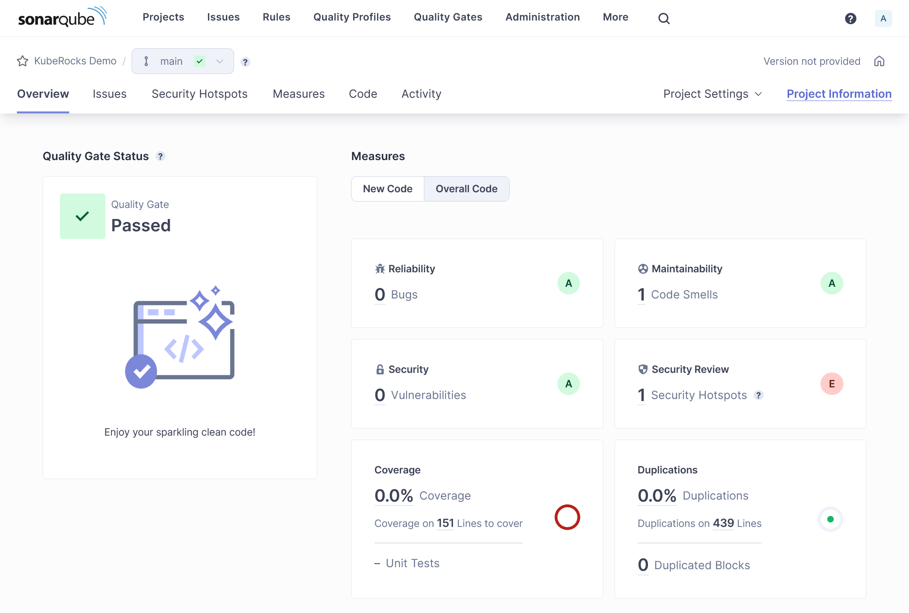
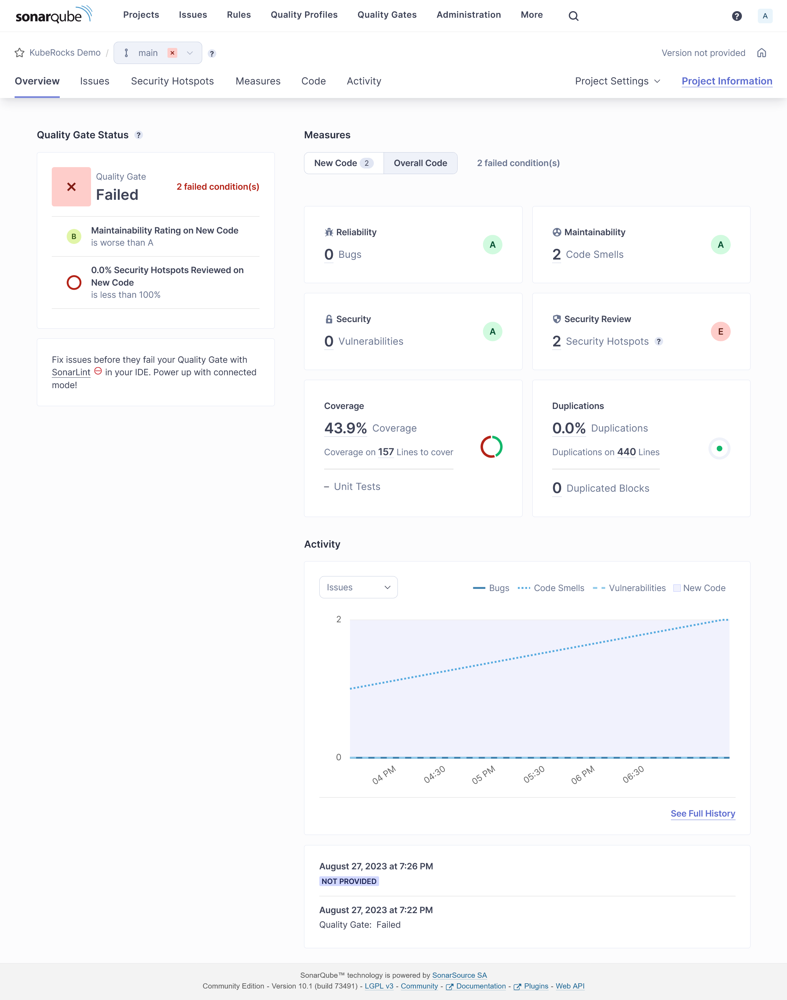
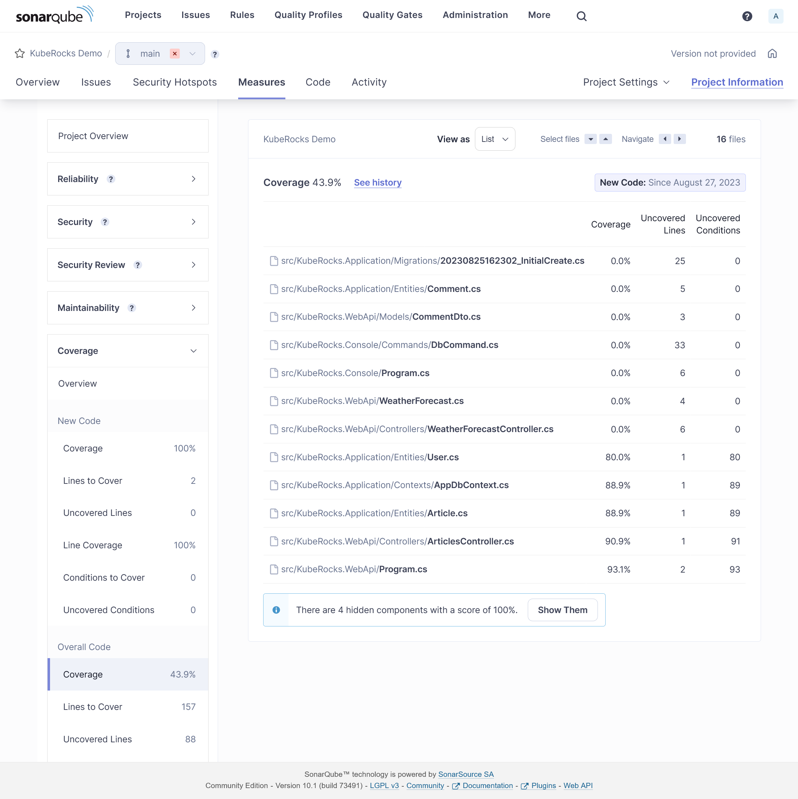
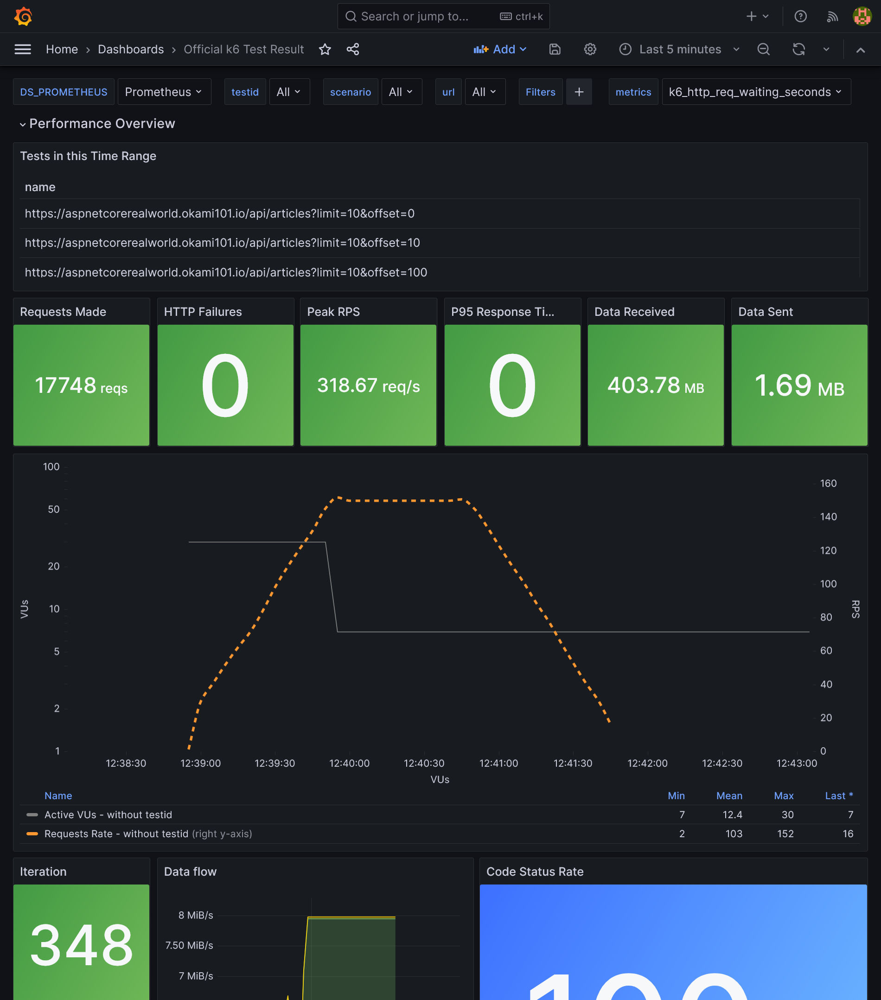
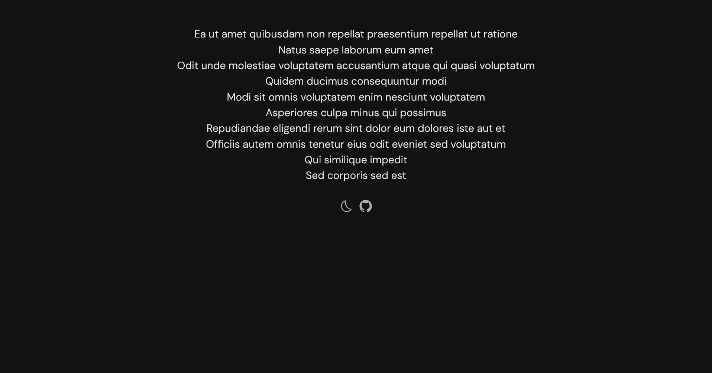


Be free from AWS/Azure/GCP by building a production grade On-Premise Kubernetes cluster on cheap VPS provider, fully GitOps managed, and with complete CI/CD tools 🎉


This is the **Part IX** of more global topic tutorial. [Back to first part]() for intro.

## Code Metrics

SonarQube is leading the code metrics industry for a long time, embracing full Open Core model, and the community edition it's completely free of charge even for commercial use. It covers advanced code analysis, code coverage, code duplication, code smells, security vulnerabilities, etc. It ensures high quality code and help to keep it that way.

### SonarQube installation

SonarQube as its dedicated Helm chart which perfect for us. However, it's the most resource hungry component of our development stack so far (because Java project ? End of troll), so be sure to deploy it on almost empty free node, maybe a dedicated one. In fact, it's the last Helm chart for this tutorial, I promise!

Create dedicated database for SonarQube same as usual.



```tf
variable "sonarqube_db_password" {
  type      = string
  sensitive = true
}
```





```tf
sonarqube_db_password = "xxx"
```





```tf
resource "kubernetes_namespace_v1" "sonarqube" {
  metadata {
    name = "sonarqube"
  }
}

resource "helm_release" "sonarqube" {
  chart      = "sonarqube"
  version    = "10.1.0+628"
  repository = "https://SonarSource.github.io/helm-chart-sonarqube"

  name      = "sonarqube"
  namespace = kubernetes_namespace_v1.sonarqube.metadata[0].name

  set {
    name  = "prometheusMonitoring.podMonitor.enabled"
    value = "true"
  }

  set {
    name  = "postgresql.enabled"
    value = "false"
  }

  set {
    name  = "jdbcOverwrite.enabled"
    value = "true"
  }

  set {
    name  = "jdbcOverwrite.jdbcUrl"
    value = "jdbc:postgresql://postgresql-primary.postgres/sonarqube"
  }

  set {
    name  = "jdbcOverwrite.jdbcUsername"
    value = "sonarqube"
  }

  set {
    name  = "jdbcOverwrite.jdbcPassword"
    value = var.sonarqube_db_password
  }
}

resource "kubernetes_manifest" "sonarqube_ingress" {
  manifest = {
    apiVersion = "traefik.io/v1alpha1"
    kind       = "IngressRoute"
    metadata = {
      name      = "sonarqube"
      namespace = kubernetes_namespace_v1.sonarqube.metadata[0].name
    }
    spec = {
      entryPoints = ["websecure"]
      routes = [
        {
          match = "Host(`sonarqube.${var.domain}`)"
          kind  = "Rule"
          services = [
            {
              name = "sonarqube-sonarqube"
              port = "http"
            }
          ]
        }
      ]
    }
  }
}
```



Be sure to disable the PostgreSQL sub chart and use our self-hosted cluster with both `postgresql.enabled` and `jdbcOverwrite.enabled`. If needed, set proper `tolerations` and `nodeSelector` for deploying on a dedicated node.

The installation take many minutes, be patient. Once done, you can access SonarQube on `https://sonarqube.kube.rocks` and login with `admin` / `admin`.

### Project configuration

Firstly create a new project and retain the project key which is his identifier. Then create a **global analysis token** named `Concourse CI` that will be used for CI integration from your user account under `/account/security`.

Now we need to create a Kubernetes secret which contains this token value for Concourse CI, for usage inside the pipeline. The token is the one generated above.

Add a new concourse terraform variable for the token:



```tf
variable "concourse_analysis_token" {
  type      = string
  sensitive = true
}
```





```tf
concourse_analysis_token = "xxx"
```



The secret:



```tf
resource "kubernetes_secret_v1" "concourse_sonarqube" {
  metadata {
    name      = "sonarqube"
    namespace = "concourse-main"
  }

  data = {
    url            = "https://sonarqube.${var.domain}"
    analysis-token = var.concourse_analysis_token
  }

  depends_on = [
    helm_release.concourse
  ]
}
```



We are ready to tackle the pipeline for integration.

### SonarScanner for .NET

As we use a dotnet project, we will use the official SonarQube scanner for .net. But sadly, as it's only a .NET CLI wrapper, it requires a java runtime to run and there is no official SonarQube docker image which contains both .NET SDK and Java runtime. But we have a CI now, so we can build our own QA image on our own private registry.

Create a new Gitea repo dedicated for any custom docker images with this one single Dockerfile:



```Dockerfile
FROM mcr.microsoft.com/dotnet/sdk:7.0

RUN apt-get update && apt-get install -y ca-certificates-java && apt-get install -y \
    openjdk-17-jre-headless \
    unzip \
    && rm -rf /var/lib/apt/lists/*

RUN dotnet tool install --global dotnet-sonarscanner
RUN dotnet tool install --global dotnet-coverage

ENV PATH="${PATH}:/root/.dotnet/tools"
```



Note as we add the `dotnet-sonarscanner` tool to the path, we can use it directly in the pipeline without any extra step. I'll also add `dotnet-coverage` global tool for code coverage generation that we'll use later.

Then the pipeline:



```yml
resources:
  - name: docker-images-git
    type: git
    icon: coffee
    source:
      uri: https://gitea.kube.rocks/kuberocks/docker-images
      branch: main
  - name: dotnet-qa-image
    type: registry-image
    icon: docker
    source:
      repository: ((registry.name))/kuberocks/dotnet-qa
      tag: "7.0"
      username: ((registry.username))
      password: ((registry.password))

jobs:
  - name: dotnet-qa
    plan:
      - get: docker-images-git
      - task: build-image
        privileged: true
        config:
          platform: linux
          image_resource:
            type: registry-image
            source:
              repository: concourse/oci-build-task
          inputs:
            - name: docker-images-git
          outputs:
            - name: image
          params:
            DOCKERFILE: docker-images-git/dotnet-qa.dockerfile
          run:
            path: build
      - put: dotnet-qa-image
        params:
          image: image/image.tar
```



Update the `main.yaml` pipeline to add the new job, then trigger it manually from Concourse UI to add the new above pipeline:



```tf
#...

jobs:
  - name: configure-pipelines
    plan:
      #...
      - set_pipeline: images
        file: ci/pipelines/images.yaml
```



The pipeline should now start and build the image, trigger it manually if needed on Concourse UI. Once done, you can check it on your Gitea container packages that the new image `gitea.kube.rocks/kuberocks/dotnet-qa` is here.

### Concourse pipeline integration

It's finally time to reuse this QA image in our Concourse demo project pipeline. Update it accordingly:



```yml
#...

jobs:
  - name: build
    plan:
      - get: source-code
        trigger: true

      - task: build-source
        config:
          platform: linux
          image_resource:
            type: registry-image
            source:
              repository: ((registry.name))/kuberocks/dotnet-qa
              tag: "7.0"
              username: ((registry.username))
              password: ((registry.password))
          #...
          run:
            path: /bin/sh
            args:
              - -ec
              - |
                dotnet format --verify-no-changes

                dotnet sonarscanner begin /k:"KubeRocks-Demo" /d:sonar.host.url="((sonarqube.url))"  /d:sonar.token="((sonarqube.analysis-token))"
                dotnet build -c Release
                dotnet sonarscanner end /d:sonar.token="((sonarqube.analysis-token))"

                dotnet publish src/KubeRocks.WebApi -c Release -o publish --no-restore --no-build

      #...
```



Note as we now use the `dotnet-qa` image and surround the build step by `dotnet sonarscanner begin` and `dotnet sonarscanner end` commands with appropriate credentials allowing Sonar CLI to send report to our SonarQube instance. Trigger the pipeline manually, all should pass, and the result will be pushed to SonarQube.

[](sonarqube-dashboard.png)

## Feature testing

Let's cover the feature testing by calling the API against a real database. This is the opportunity to cover the code coverage as well.

### xUnit

First add a dedicated database for test in the docker compose file as we won't interfere with the development database:



```yaml
version: "3"

services:
  #...

  db_test:
    image: postgres:15
    environment:
      POSTGRES_USER: main
      POSTGRES_PASSWORD: main
      POSTGRES_DB: main
    ports:
      - 54320:5432
```



Expose the startup service of minimal API:



```cs
//...

public partial class Program
{
    protected Program() { }
}
```



Then add a testing JSON environment file for accessing our database `db_test` from the docker-compose.yml:



```json
{
  "ConnectionStrings": {
    "DefaultConnection": "Host=localhost:54320;Username=main;Password=main;Database=main;"
  }
}
```



Now the test project:

```sh
dotnet new xunit -o tests/KubeRocks.FeatureTests
dotnet sln add tests/KubeRocks.FeatureTests
dotnet add tests/KubeRocks.FeatureTests reference src/KubeRocks.WebApi
dotnet add tests/KubeRocks.FeatureTests package Microsoft.AspNetCore.Mvc.Testing
dotnet add tests/KubeRocks.FeatureTests package Respawn
dotnet add tests/KubeRocks.FeatureTests package FluentAssertions
```

The `WebApplicationFactory` that will use our testing environment:



```cs
using Microsoft.AspNetCore.Mvc.Testing;
using Microsoft.Extensions.Hosting;

namespace KubeRocks.FeatureTests;

public class KubeRocksApiFactory : WebApplicationFactory<Program>
{
    protected override IHost CreateHost(IHostBuilder builder)
    {
        builder.UseEnvironment("Testing");

        return base.CreateHost(builder);
    }
}
```



The base test class for all test classes that manages database cleanup thanks to `Respawn`:



```cs
using KubeRocks.Application.Contexts;

using Microsoft.EntityFrameworkCore;
using Microsoft.Extensions.DependencyInjection;

using Npgsql;

using Respawn;
using Respawn.Graph;

namespace KubeRocks.FeatureTests;

[Collection("Sequencial")]
public class TestBase : IClassFixture<KubeRocksApiFactory>, IAsyncLifetime
{
    protected KubeRocksApiFactory Factory { get; private set; }

    protected TestBase(KubeRocksApiFactory factory)
    {
        Factory = factory;
    }

    public async Task RefreshDatabase()
    {
        using var scope = Factory.Services.CreateScope();

        using var conn = new NpgsqlConnection(
            scope.ServiceProvider.GetRequiredService<AppDbContext>().Database.GetConnectionString()
        );

        await conn.OpenAsync();

        var respawner = await Respawner.CreateAsync(conn, new RespawnerOptions
        {
            TablesToIgnore = new Table[] { "__EFMigrationsHistory" },
            DbAdapter = DbAdapter.Postgres
        });

        await respawner.ResetAsync(conn);
    }

    public Task InitializeAsync()
    {
        return RefreshDatabase();
    }

    public Task DisposeAsync()
    {
        return Task.CompletedTask;
    }
}
```



Note the `Collection` attribute that will force the test classes to run sequentially, required as we will use the same database for all tests.

Finally, the tests for the 2 endpoints of our articles controller:



```cs
using System.Net.Http.Json;

using FluentAssertions;

using KubeRocks.Application.Contexts;
using KubeRocks.Application.Entities;
using KubeRocks.WebApi.Models;

using Microsoft.Extensions.DependencyInjection;

using static KubeRocks.WebApi.Controllers.ArticlesController;

namespace KubeRocks.FeatureTests.Articles;

public class ArticlesListTests : TestBase
{
    public ArticlesListTests(KubeRocksApiFactory factory) : base(factory) { }

    [Fact]
    public async Task Can_Paginate_Articles()
    {
        using (var scope = Factory.Services.CreateScope())
        {
            var db = scope.ServiceProvider.GetRequiredService<AppDbContext>();

            var user = db.Users.Add(new User
            {
                Name = "John Doe",
                Email = "john.doe@email.com"
            });

            db.Articles.AddRange(Enumerable.Range(1, 50).Select(i => new Article
            {
                Title = $"Test Title {i}",
                Slug = $"test-title-{i}",
                Description = "Test Description",
                Body = "Test Body",
                Author = user.Entity,
            }));

            await db.SaveChangesAsync();
        }

        var response = await Factory.CreateClient().GetAsync("/api/Articles?page=1&size=20");

        response.EnsureSuccessStatusCode();

        var body = (await response.Content.ReadFromJsonAsync<ArticlesResponse>())!;

        body.Articles.Count().Should().Be(20);
        body.ArticlesCount.Should().Be(50);

        body.Articles.First().Should().BeEquivalentTo(new
        {
            Title = "Test Title 50",
            Description = "Test Description",
            Body = "Test Body",
            Author = new
            {
                Name = "John Doe"
            },
        });
    }

    [Fact]
    public async Task Can_Get_Article()
    {
        using (var scope = Factory.Services.CreateScope())
        {
            var db = scope.ServiceProvider.GetRequiredService<AppDbContext>();

            db.Articles.Add(new Article
            {
                Title = $"Test Title",
                Slug = $"test-title",
                Description = "Test Description",
                Body = "Test Body",
                Author = new User
                {
                    Name = "John Doe",
                    Email = "john.doe@email.com"
                }
            });

            await db.SaveChangesAsync();
        }

        var response = await Factory.CreateClient().GetAsync($"/api/Articles/test-title");

        response.EnsureSuccessStatusCode();

        var body = (await response.Content.ReadFromJsonAsync<ArticleDto>())!;

        body.Should().BeEquivalentTo(new
        {
            Title = "Test Title",
            Description = "Test Description",
            Body = "Test Body",
            Author = new
            {
                Name = "John Doe"
            },
        });
    }
}
```



Ensure all tests passes with `dotnet test`.

### CI tests & code coverage

Now we need to integrate the tests in our CI pipeline. As we testing with a real database, create a new `demo_test` database through pgAdmin with basic `test` / `test` credentials.


In real world scenario, you should use a dedicated database for testing, and not the same as production.


Let's edit the pipeline accordingly for tests:



```yml
#...

jobs:
  - name: build
    plan:
      #...

      - task: build-source
        config:
          #...
          params:
            ConnectionStrings__DefaultConnection: "Host=postgres-primary.postgres;Username=test;Password=test;Database=demo_test"
          run:
            path: /bin/sh
            args:
              - -ec
              - |
                dotnet format --verify-no-changes

                dotnet sonarscanner begin /k:"KubeRocks-Demo" /d:sonar.host.url="((sonarqube.url))"  /d:sonar.token="((sonarqube.analysis-token))" /d:sonar.cs.vscoveragexml.reportsPaths=coverage.xml
                dotnet build -c Release
                dotnet-coverage collect 'dotnet test -c Release --no-restore --no-build --verbosity=normal' -f xml -o 'coverage.xml'
                dotnet sonarscanner end /d:sonar.token="((sonarqube.analysis-token))"

                dotnet publish src/KubeRocks.WebApi -c Release -o publish --no-restore --no-build

#...
```



Note as we already include code coverage by using `dotnet-coverage` tool. Don't forget to precise the path of `coverage.xml` to `sonarscanner` CLI too. It's time to push our code with tests or trigger the pipeline manually to test our integration tests.

If all goes well, you should see the tests results on SonarQube with some coverage done:

[](sonarqube-tests.png)

Coverage detail:

[](sonarqube-cc.png)

You may exclude some files from analysis by adding some project properties:



```xml
<Project Sdk="Microsoft.NET.Sdk">
  <!-- ... -->

  <ItemGroup>
    <SonarQubeSetting Include="sonar.exclusions">
      <Value>appsettings.Testing.json</Value>
    </SonarQubeSetting>
  </ItemGroup>
</Project>
```



Same for coverage:



```xml
<Project Sdk="Microsoft.NET.Sdk">
  <!-- ... -->

  <ItemGroup>
    <SonarQubeSetting Include="sonar.coverage.exclusions">
      <Value>Migrations/**/*</Value>
    </SonarQubeSetting>
  </ItemGroup>
</Project>
```



### Sonar Analyzer

You can enforce many default sonar rules by using [Sonar Analyzer](https://github.com/SonarSource/sonar-dotnet) directly locally before any code push.

Create this file at the root of your solution for enabling Sonar Analyzer globally:



```xml
<Project>
  <PropertyGroup>
    <AnalysisLevel>latest-Recommended</AnalysisLevel>
    <TreatWarningsAsErrors>true</TreatWarningsAsErrors>
    <CodeAnalysisTreatWarningsAsErrors>true</CodeAnalysisTreatWarningsAsErrors>
  </PropertyGroup>
  <ItemGroup>
    <PackageReference
      Include="SonarAnalyzer.CSharp"
      Version="9.8.0.76515"
      PrivateAssets="all"
      Condition="$(MSBuildProjectExtension) == '.csproj'"
    />
  </ItemGroup>
</Project>
```



Any rule violation is treated as error at project building, which block the CI before execution of tests. Use `latest-All` as `AnalysisLevel` for psychopath mode.

At this stage as soon this file is added, you should see some errors at building. If you use VSCode with correct C# extension, these errors will be highlighted directly in the editor. Here are some fixes:



```cs
#...

builder.Host.UseSerilog((ctx, cfg) => cfg
    .ReadFrom.Configuration(ctx.Configuration)
    .Enrich.WithSpan()
    .WriteTo.Console(
        outputTemplate: "[{Timestamp:HH:mm:ss} {Level:u3}] |{TraceId}| {Message:lj}{NewLine}{Exception}",
        // Enforce culture
        formatProvider: CultureInfo.InvariantCulture
    )
);

#...
```



Delete `WeatherForecastController.cs`.



```xml
<Project Sdk="Microsoft.NET.Sdk">

  <PropertyGroup>
    <!-- ... -->

    <NoWarn>CA1707</NoWarn>
  </PropertyGroup>

  <!-- ... -->
</Project>
```



## Load testing

When it comes load testing, k6 is a perfect tool for this job and integrate with many real time series database integration like Prometheus or InfluxDB. As we already have Prometheus, let's use it and avoid us a separate InfluxDB installation. First be sure to allow remote write by enable `enableRemoteWriteReceiver` in the Prometheus Helm chart. It should be already done if you follow this tutorial.

### K6

We'll reuse our flux repo and add some manifests for defining the load testing scenario. Firstly describe the scenario inside `ConfigMap` that scrape all articles and then each article:



```yml
apiVersion: v1
kind: ConfigMap
metadata:
  name: scenario
  namespace: kuberocks
data:
  script.js: |
    import http from "k6/http";
    import { check } from "k6";

    export default function () {
      const size = 10;
      let page = 1;

      let articles = []

      do {
        const res = http.get(`${__ENV.API_URL}/Articles?page=${page}&size=${size}`);
        check(res, {
          "status is 200": (r) => r.status == 200,
        });

        articles = res.json().articles;
        page++;

        articles.forEach((article) => {
          const res = http.get(`${__ENV.API_URL}/Articles/${article.slug}`);
          check(res, {
            "status is 200": (r) => r.status == 200,
          });
        });
      }
      while (articles.length > 0);
    }
```



And add the k6 `Job` in the same file and configure it for Prometheus usage and mounting above scenario:



```yml
#...
---
apiVersion: batch/v1
kind: Job
metadata:
  name: k6
  namespace: kuberocks
spec:
  ttlSecondsAfterFinished: 0
  template:
    spec:
      restartPolicy: Never
      containers:
        - name: run
          image: grafana/k6
          env:
            - name: API_URL
              value: https://demo.kube.rocks/api
            - name: K6_VUS
              value: "30"
            - name: K6_DURATION
              value: 1m
            - name: K6_PROMETHEUS_RW_SERVER_URL
              value: http://prometheus-operated.monitoring:9090/api/v1/write
          command:
            ["k6", "run", "-o", "experimental-prometheus-rw", "script.js"]
          volumeMounts:
            - name: scenario
              mountPath: /home/k6
      tolerations:
        - key: node-role.kubernetes.io/runner
          operator: Exists
          effect: NoSchedule
      nodeSelector:
        node-role.kubernetes.io/runner: "true"
      volumes:
        - name: scenario
          configMap:
            name: scenario
```



Use appropriate `tolerations` and `nodeSelector` for running the load testing in a node which have free CPU resource. You can play with `K6_VUS` and `K6_DURATION` environment variables in order to change the level of load testing.

Then you can launch the job with `ka jobs/demo-k6.yaml`. Check quickly that the job is running via `klo -n kuberocks job/k6`:

```txt

        /\      |‾‾| /‾‾/   /‾‾/
   /\  /  \     |  |/  /   /  /
  /  \/    \    |     (   /   ‾‾\
 /          \   |  |\  \ |  (‾)  |
/ __________ \  |__| \__\ \_____/ .io

execution: local
   script: script.js
   output: Prometheus remote write (http://prometheus-operated.monitoring:9090/api/v1/write)

scenarios: (100.00%) 1 scenario, 30 max VUs, 1m30s max duration (incl. graceful stop):
         * default: 30 looping VUs for 1m0s (gracefulStop: 30s)
```

After 1 minute of run, job should finish and show some raw result:

```txt
✓ status is 200

checks.........................: 100.00% ✓ 17748     ✗ 0
data_received..................: 404 MB  6.3 MB/s
data_sent......................: 1.7 MB  26 kB/s
http_req_blocked...............: avg=242.43µs min=223ns   med=728ns   max=191.27ms p(90)=1.39µs   p(95)=1.62µs
http_req_connecting............: avg=13.13µs  min=0s      med=0s      max=9.48ms   p(90)=0s       p(95)=0s
http_req_duration..............: avg=104.22ms min=28.9ms  med=93.45ms max=609.86ms p(90)=162.04ms p(95)=198.93ms
  { expected_response:true }...: avg=104.22ms min=28.9ms  med=93.45ms max=609.86ms p(90)=162.04ms p(95)=198.93ms
http_req_failed................: 0.00%   ✓ 0         ✗ 17748
http_req_receiving.............: avg=13.76ms  min=32.71µs med=6.49ms  max=353.13ms p(90)=36.04ms  p(95)=51.36ms
http_req_sending...............: avg=230.04µs min=29.79µs med=93.16µs max=25.75ms  p(90)=201.92µs p(95)=353.61µs
http_req_tls_handshaking.......: avg=200.57µs min=0s      med=0s      max=166.91ms p(90)=0s       p(95)=0s
http_req_waiting...............: avg=90.22ms  min=14.91ms med=80.76ms max=609.39ms p(90)=138.3ms  p(95)=169.24ms
http_reqs......................: 17748   276.81409/s
iteration_duration.............: avg=5.39s    min=3.97s   med=5.35s   max=7.44s    p(90)=5.94s    p(95)=6.84s
iterations.....................: 348     5.427727/s
vus............................: 7       min=7       max=30
vus_max........................: 30      min=30      max=30
```

As we use Prometheus for outputting the result, we can visualize it easily with Grafana. You just have to import [this dashboard](https://grafana.com/grafana/dashboards/18030-official-k6-test-result/):

[](grafana-k6.png)

As we use Kubernetes, increase the loading performance horizontally is dead easy. Go to the deployment configuration of demo app for increasing replicas count, as well as Traefik, and compare the results.

### Load balancing database

So far, we only load balanced the stateless API, but what about the database part ? We have set up a replicated PostgreSQL cluster, however we have no use of the replica that stay sadly idle. But for that we have to distinguish write queries from scalable read queries.

We can make use of the Bitnami [PostgreSQL HA](https://artifacthub.io/packages/helm/bitnami/postgresql-ha) instead of simple one. It adds the new component [Pgpool-II](https://pgpool.net/mediawiki/index.php/Main_Page) as main load balancer and detect failover. It's able to separate in real time write queries from read queries and send them to the master or the replica. The advantage: works natively for all apps without any changes. The cons: it consumes far more resources and add a new component to maintain.

A 2nd solution is to separate query typologies from where it counts: the application. It requires some code changes, but it's clearly a far more efficient solution. Let's do this way.

As Npgsql support load balancing [natively](https://www.npgsql.org/doc/failover-and-load-balancing.html), we don't need to add any Kubernetes service. We just have to create a clear distinction between read and write queries. One simple way is to create a separate RO `DbContext`.



```cs
namespace KubeRocks.Application.Contexts;

using KubeRocks.Application.Entities;

using Microsoft.EntityFrameworkCore;

public class AppRoDbContext : DbContext
{
    public DbSet<User> Users => Set<User>();
    public DbSet<Article> Articles => Set<Article>();
    public DbSet<Comment> Comments => Set<Comment>();

    public AppRoDbContext(DbContextOptions<AppRoDbContext> options) : base(options)
    {
    }
}
```



Register it in DI:



```cs
public static class ServiceExtensions
{
    public static IServiceCollection AddKubeRocksServices(this IServiceCollection services, IConfiguration configuration)
    {
        return services
            //...
            .AddDbContext<AppRoDbContext>((options) =>
            {
                options.UseNpgsql(
                    configuration.GetConnectionString("DefaultRoConnection")
                    ??
                    configuration.GetConnectionString("DefaultConnection")
                );
            });
    }
}
```



We fall back to the RW connection string if the RO one is not defined. Then use it in the `ArticlesController` which as only read endpoints:



```cs
//...

public class ArticlesController
{
    private readonly AppRoDbContext _context;

    //...

    public ArticlesController(AppRoDbContext context)
    {
        _context = context;
    }

    //...
}
```



Push and let it pass the CI. In the meantime, add the new RO connection:



```yaml
# ...
spec:
  # ...
  template:
    # ...
    spec:
      # ...
      containers:
        - name: api
          # ...
          env:
            - name: DB_PASSWORD
              valueFrom:
                secretKeyRef:
                  name: demo-db
                  key: password
            - name: ConnectionStrings__DefaultConnection
              value: Host=postgresql-primary.postgres;Username=demo;Password='$(DB_PASSWORD)';Database=demo;
            - name: ConnectionStrings__DefaultRoConnection
              value: Host=postgresql-primary.postgres,postgresql-read.postgres;Username=demo;Password='$(DB_PASSWORD)';Database=demo;Load Balance Hosts=true;
#...
```



We simply have to add multiple host like `postgresql-primary.postgres,postgresql-read.postgres` for the RO connection string and enable LB mode with `Load Balance Hosts=true`.

Once deployed, relaunch a load test with K6 and admire the DB load balancing in action on both storage servers with `htop` or directly compute pods by namespace in Grafana.

[](grafana-db-lb.png)

## Frontend

Let's finish this guide by a quick view of SPA frontend development as a separate project from backend.

### Vue TS

Create a new Vue.js project:

```sh
npx degit antfu/vitesse-lite kuberocks-demo-ui
cd kuberocks-demo-ui
git init
git add .
git commit -m "Initial commit"
# using pnpm, scoop install pnpm
pnpm i
pnpm dev
```

Should launch app in `http://localhost:3333/`. Create a new `kuberocks-demo-ui` Gitea repo and push this code into it. Now lets quick and done for API calls.

### Get around CORS and HTTPS with YARP

As always when frontend is separated from backend, we have to deal with CORS. But I prefer to have one single URL for frontend + backend and get rid of CORS problem by simply call under `/api` path. Moreover, it'll be production ready without need to manage any `Vite` variable for API URL and we'll get HTTPS provided by dotnet. Back to API project.

```sh
dotnet add src/KubeRocks.WebApi package Yarp.ReverseProxy
```



```cs
//...

var builder = WebApplication.CreateBuilder(args);

builder.Services.AddReverseProxy()
    .LoadFromConfig(builder.Configuration.GetSection("ReverseProxy"));

//...

var app = builder.Build();

app.MapReverseProxy();

//...

app.UseRouting();

//...
```



Note as we must add `app.UseRouting();` too in order to get Swagger UI working.

The proxy configuration (only for development):



```json
{
  //...
  "ReverseProxy": {
    "Routes": {
      "ServerRouteApi": {
        "ClusterId": "Server",
        "Match": {
          "Path": "/api/{**catch-all}"
        },
        "Transforms": [
          {
            "PathRemovePrefix": "/api"
          }
        ]
      },
      "ClientRoute": {
        "ClusterId": "Client",
        "Match": {
          "Path": "{**catch-all}"
        }
      }
    },
    "Clusters": {
      "Client": {
        "Destinations": {
          "Client1": {
            "Address": "http://localhost:3333"
          }
        }
      },
      "Server": {
        "Destinations": {
          "Server1": {
            "Address": "https://localhost:7159"
          }
        }
      }
    }
  }
}
```



Now your frontend app should appear under `https://localhost:7159`, and API calls under `https://localhost:7159/api`. We now benefit from HTTPS for all app. Push API code.

### Typescript API generator

As we use OpenAPI, it's possible to generate typescript client for API calls. Add this package:

```sh
pnpm add openapi-typescript -D
pnpm add openapi-typescript-fetch
```

Before generate the client model, go back to backend for fixing default nullable reference from `Swashbuckle.AspNetCore`:



```cs
using Microsoft.OpenApi.Models;

using Swashbuckle.AspNetCore.SwaggerGen;

namespace KubeRocks.WebApi.Filters;

public class RequiredNotNullableSchemaFilter : ISchemaFilter
{
    public void Apply(OpenApiSchema schema, SchemaFilterContext context)
    {
        if (schema.Properties is null)
        {
            return;
        }

        var notNullableProperties = schema
            .Properties
            .Where(x => !x.Value.Nullable && !schema.Required.Contains(x.Key))
            .ToList();

        foreach (var property in notNullableProperties)
        {
            schema.Required.Add(property.Key);
        }
    }
}
```





```cs
//...

builder.Services.AddSwaggerGen(o =>
{
    o.SupportNonNullableReferenceTypes();
    o.SchemaFilter<RequiredNotNullableSchemaFilter>();
});

//...
```



Sadly, without this boring step, many attributes will be nullable in the generated model, which must not be the case. Now generate the model:



```json
{
  //...
  "scripts": {
    //...
    "openapi": "openapi-typescript http://localhost:5123/api/v1/swagger.json --output src/api/openapi.ts"
  },
  //...
}
```



Use the HTTP version of swagger as you'll get a self certificate error. The use `pnpm openapi` to generate full TS model. Finally, describe API fetchers like so:



```ts
import { Fetcher } from 'openapi-typescript-fetch'

import type { components, paths } from './openapi'

const fetcher = Fetcher.for<paths>()

type ArticleList = components['schemas']['ArticleListDto']
type Article = components['schemas']['ArticleDto']

const getArticles = fetcher.path('/api/Articles').method('get').create()
const getArticleBySlug = fetcher.path('/api/Articles/{slug}').method('get').create()

export type { Article, ArticleList }
export {
  getArticles,
  getArticleBySlug,
}
```



We are now fully typed compliant with the API.

### Call the API

Let's create a pretty basic list + detail vue pages:



```vue
<script lang="ts" setup>
import { getArticles } from '~/api'
import type { ArticleList } from '~/api'

const articles = ref<ArticleList[]>([])

async function loadArticles() {
  const { data } = await getArticles({
    page: 1,
    size: 10,
  })

  articles.value = data.articles
}

loadArticles()
</script>

<template>
  <RouterLink
    v-for="(article, i) in articles"
    :key="i"
    :to="`/articles/${article.slug}`"
  >
    <h3>{{ article.title }}</h3>
  </RouterLink>
</template>
```





```vue
<script lang="ts" setup>
import { getArticleBySlug } from '~/api'
import type { Article } from '~/api'

const props = defineProps<{ slug: string }>()

const article = ref<Article>()

const router = useRouter()

async function getArticle() {
  const { data } = await getArticleBySlug({ slug: props.slug })

  article.value = data
}

getArticle()
</script>

<template>
  <div v-if="article">
    <h1>{{ article.title }}</h1>
    <p>{{ article.description }}</p>
    <div>{{ article.body }}</div>
    <div>
      <button m-3 mt-8 text-sm btn @click="router.back()">
        Back
      </button>
    </div>
  </div>
</template>
```



It should work flawlessly.

### Frontend CI/CD

The CI frontend is far simpler than backend. Create a new `demo-ui` pipeline:



```yml
resources:
  - name: version
    type: semver
    source:
      driver: git
      uri: ((git.url))/kuberocks/demo-ui
      branch: main
      file: version
      username: ((git.username))
      password: ((git.password))
      git_user: ((git.git-user))
      commit_message: ((git.commit-message))
  - name: source-code
    type: git
    icon: coffee
    source:
      uri: ((git.url))/kuberocks/demo-ui
      branch: main
      username: ((git.username))
      password: ((git.password))
  - name: docker-image
    type: registry-image
    icon: docker
    source:
      repository: ((registry.name))/kuberocks/demo-ui
      tag: latest
      username: ((registry.username))
      password: ((registry.password))

jobs:
  - name: build
    plan:
      - get: source-code
        trigger: true

      - task: build-source
        config:
          platform: linux
          image_resource:
            type: registry-image
            source:
              repository: node
              tag: 18-buster
          inputs:
            - name: source-code
              path: .
          outputs:
            - name: dist
              path: dist
          caches:
            - path: .pnpm-store
          run:
            path: /bin/sh
            args:
              - -ec
              - |
                corepack enable
                corepack prepare pnpm@latest-8 --activate
                pnpm config set store-dir .pnpm-store
                pnpm i
                pnpm lint
                pnpm build

      - task: build-image
        privileged: true
        config:
          platform: linux
          image_resource:
            type: registry-image
            source:
              repository: concourse/oci-build-task
          inputs:
            - name: source-code
              path: .
            - name: dist
              path: dist
          outputs:
            - name: image
          run:
            path: build
      - put: version
        params: { bump: patch }
      - put: docker-image
        params:
          additional_tags: version/number
          image: image/image.tar
```





```tf
#...

jobs:
  - name: configure-pipelines
    plan:
      #...
      - set_pipeline: demo-ui
        file: ci/pipelines/demo-ui.yaml
```



Apply it and put this nginx `Dockerfile` on frontend root project:



```Dockerfile
FROM nginx:alpine

COPY docker/nginx.conf /etc/nginx/conf.d/default.conf
COPY dist /usr/share/nginx/html
```



After push all CI should build correctly. Then the image policy for auto update:



```yml
apiVersion: image.toolkit.fluxcd.io/v1beta1
kind: ImageRepository
metadata:
  name: demo-ui
  namespace: flux-system
spec:
  image: gitea.kube.rocks/kuberocks/demo-ui
  interval: 1m0s
  secretRef:
    name: dockerconfigjson
---
apiVersion: image.toolkit.fluxcd.io/v1beta1
kind: ImagePolicy
metadata:
  name: demo-ui
  namespace: flux-system
spec:
  imageRepositoryRef:
    name: demo-ui
    namespace: flux-system
  policy:
    semver:
      range: 0.0.x
```



The deployment:



```yml
apiVersion: apps/v1
kind: Deployment
metadata:
  name: demo-ui
  namespace: kuberocks
spec:
  replicas: 2
  selector:
    matchLabels:
      app: demo-ui
  template:
    metadata:
      labels:
        app: demo-ui
    spec:
      imagePullSecrets:
        - name: dockerconfigjson
      containers:
        - name: front
          image: gitea.okami101.io/kuberocks/demo-ui:latest # {"$imagepolicy": "flux-system:image-demo-ui"}
          ports:
            - containerPort: 80
---
apiVersion: v1
kind: Service
metadata:
  name: demo-ui
  namespace: kuberocks
spec:
  selector:
    app: demo-ui
  ports:
    - name: http
      port: 80
```



After push, the demo UI container should be deployed. The very last step is to add a new route to existing `IngressRoute` for frontend:



```yaml
#...
apiVersion: traefik.io/v1alpha1
kind: IngressRoute
#...
spec:
  #...
  routes:
    - match: Host(`demo.kube.rocks`)
      kind: Rule
      services:
        - name: demo-ui
          port: http
    - match: Host(`demo.kube.rocks`) && PathPrefix(`/api`)
      #....
```



Go to `https://demo.kube.rocks` to confirm if both app front & back are correctly connected !

[](frontend.png)

## Final check 🎊🏁🎊

Congratulation if you're getting that far !!!

We have made an enough complete tour of Kubernetes cluster building on full GitOps mode.
