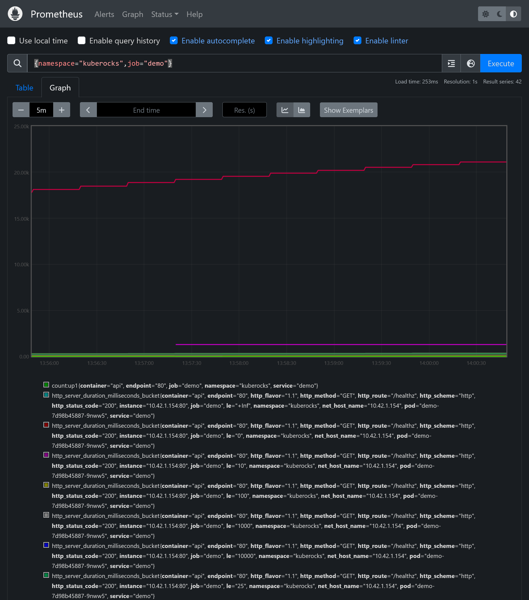
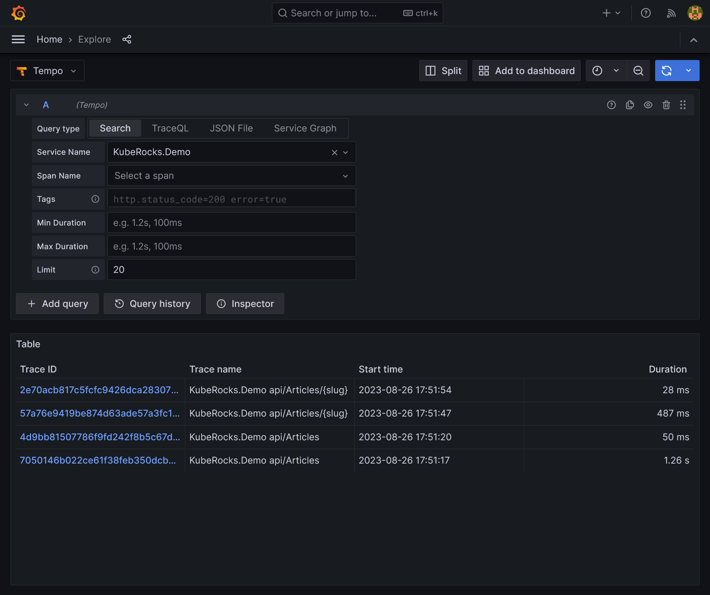
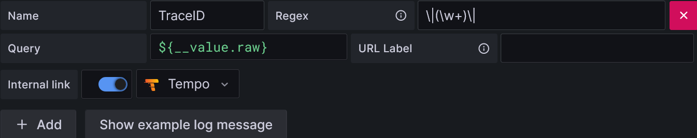
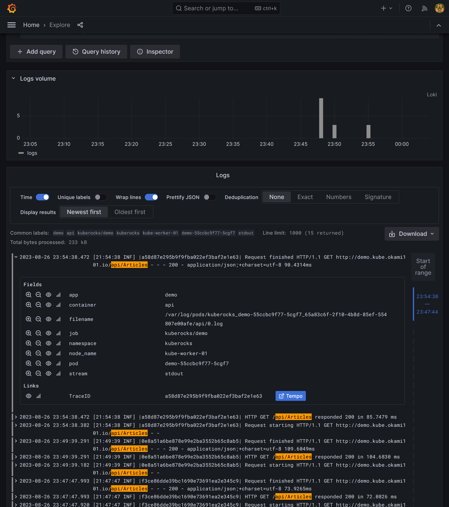


Use GitOps workflow for building a production grade on-premise Kubernetes cluster on cheap VPS provider, with complete CI/CD 🎉


This is the **Part IX** of more global topic tutorial. [Back to guide summary]() for intro.

## Better logging

Default ASP.NET logging are not very standard, let's add Serilog for real requests logging with duration and status code:

```sh
dotnet add src/KubeRocks.WebApi package Serilog.AspNetCore
```



```cs
// ...

builder.Host.UseSerilog((ctx, cfg) => cfg
    .ReadFrom.Configuration(ctx.Configuration)
    .WriteTo.Console()
);

var app = builder.Build();

app.UseSerilogRequestLogging();

// ...
```



Logs through Loki explorer stack should be far more readable.

## Zero-downtime deployment

All real production app should have liveness & readiness probes. It generally consists on particular URL which return the current health app status. We'll also include the DB access health. Let's add the standard `/healthz` endpoint, which is dead simple in ASP.NET Core:

```sh
dotnet add src/KubeRocks.WebApi package Microsoft.Extensions.Diagnostics.HealthChecks.EntityFrameworkCore
```



```cs
// ...

builder.Services
    .AddHealthChecks()
    .AddDbContextCheck<AppDbContext>();

var app = builder.Build();

// ...

app.MapControllers();
app.MapHealthChecks("/healthz");

app.Run();
```



And you're done ! Go to `https://localhost:xxxx/healthz` to confirm it's working. Try to stop the database with `docker compose stop` and check the healthz endpoint again, it should return `503` status code. Then push the code.


The `Microsoft.Extensions.Diagnostics.HealthChecks` package is very extensible, you can add any custom check to enrich the health app status.


And finally the probes:



```yaml
# ...
spec:
  # ...
  template:
    # ...
    spec:
      # ...
      containers:
        - name: api
          # ...
          livenessProbe:
            httpGet:
              path: /healthz
              port: 80
            initialDelaySeconds: 10
            periodSeconds: 10
          readinessProbe:
            httpGet:
              path: /healthz
              port: 80
            initialDelaySeconds: 10
            periodSeconds: 10
```




Be aware of difference between `liveness` and `readiness` probes. The first one is used to restart the pod if it's not responding, the second one is used to tell the pod is not ready to receive traffic, which is vital for preventing any downtime.  
When **Rolling Update** strategy is used (the default), the old pod is not killed until the new one is ready (aka healthy).


## Telemetry

The last step but not least for a total integration with our monitored Kubernetes cluster is to add some telemetry to our app. We'll use `OpenTelemetry` for that, which becomes the standard library for metrics and tracing, by providing good integration to many languages.

### Application metrics

Install minimal ASP.NET Core metrics is really a no-brainer:

```sh
dotnet add src/KubeRocks.WebApi package OpenTelemetry.AutoInstrumentation --prerelease
dotnet add src/KubeRocks.WebApi package OpenTelemetry.Extensions.Hosting --prerelease
dotnet add src/KubeRocks.WebApi package OpenTelemetry.Exporter.Prometheus.AspNetCore --prerelease
```



```cs
//...

builder.Services.AddOpenTelemetry()
    .WithMetrics(b =>
    {
        b
            .AddAspNetCoreInstrumentation()
            .AddPrometheusExporter();
    });

var app = builder.Build();

app.UseOpenTelemetryPrometheusScrapingEndpoint();

//...
```



Relaunch app and go to `https://demo.kube.rocks/metrics` to confirm it's working. It should show metrics after each endpoint call, simply try `https://demo.kube.rocks/Articles`.


.NET metrics are currently pretty basic, but the next .NET 8 version will provide far better metrics from internal components allowing some [useful dashboard](https://github.com/JamesNK/aspnetcore-grafana).


#### Hide internal endpoints

After push, you should see `/metrics` live. Let's step back and exclude this internal path from external public access. We have 2 options:

* Force on the app side to listen only on private network on `/metrics` and `/healthz` endpoints
* Push all the app logic under `/api` path and let Traefik to include only this path

Let's do the option 2. Add the `api/` prefix to controllers to expose:



```cs
//...
[ApiController]
[Route("api/[controller]")]
public class ArticlesController {
    //...
}
```



Let's move Swagger UI under `/api` path too:



```cs
//...

if (app.Environment.IsDevelopment())
{
    app.UseSwagger(c =>
    {
        c.RouteTemplate = "/api/{documentName}/swagger.json";
    });
    app.UseSwaggerUI(c =>
    {
        c.SwaggerEndpoint("v1/swagger.json", "KubeRocks v1");
        c.RoutePrefix = "api";
    });
}

//...
```




You may use ASP.NET API versioning, which work the same way with [versioning URL path](https://github.com/dotnet/aspnet-api-versioning/wiki/Versioning-via-the-URL-Path).


All is left is to include only the endpoints under `/api` prefix on Traefik IngressRoute:



```yaml
#...
apiVersion: traefik.io/v1alpha1
kind: IngressRoute
#...
spec:
  #...
  routes:
    - match: Host(`demo.kube.rocks`) && PathPrefix(`/api`)
      #...
```



Now the new URL is `https://demo.kube.rocks/api/Articles`. Any path different from `api` will return the Traefik 404 page, and internal paths as `https://demo.kube.rocks/metrics` is not accessible anymore. An other additional advantage of this config, it's simple to put a separated frontend project under `/` path (covered later), which can use the under API without any CORS problem natively.

#### Prometheus integration

It's only a matter of new ServiceMonitor config:



```yaml
---
apiVersion: monitoring.coreos.com/v1
kind: ServiceMonitor
metadata:
  name: demo
  namespace: kuberocks
spec:
  endpoints:
    - targetPort: 80
  selector:
    matchLabels:
      app: demo
```



After some time, You can finally use the Prometheus dashboard to query your app metrics. Use `{namespace="kuberocks",job="demo"}` PromQL query to list all available metrics:

[](prometheus-graph.png)

### Application tracing

A more useful case for OpenTelemetry is to integrate it to a tracing backend. [Tempo](https://grafana.com/oss/tempo/) is a good candidate, which is a free open-source alternative to Jaeger, simpler to install by requiring a simple s3 as storage, and compatible to many protocols as Jaeger, OTLP, Zipkin.

#### Installing Tempo

It's another Helm Chart to install as well as the related grafana datasource:



```tf
resource "kubernetes_namespace_v1" "tracing" {
  metadata {
    name = "tracing"
  }
}

resource "helm_release" "tempo" {
  chart      = "tempo"
  version    = "1.5.1"
  repository = "https://grafana.github.io/helm-charts"

  name      = "tempo"
  namespace = kubernetes_namespace_v1.tracing.metadata[0].name

  set {
    name  = "tempo.storage.trace.backend"
    value = "s3"
  }

  set {
    name  = "tempo.storage.trace.s3.bucket"
    value = var.s3_bucket
  }

  set {
    name  = "tempo.storage.trace.s3.endpoint"
    value = var.s3_endpoint
  }

  set {
    name  = "tempo.storage.trace.s3.region"
    value = var.s3_region
  }

  set {
    name  = "tempo.storage.trace.s3.access_key"
    value = var.s3_access_key
  }

  set {
    name  = "tempo.storage.trace.s3.secret_key"
    value = var.s3_secret_key
  }

  set {
    name  = "serviceMonitor.enabled"
    value = "true"
  }
}

resource "kubernetes_config_map_v1" "tempo_grafana_datasource" {
  metadata {
    name      = "tempo-grafana-datasource"
    namespace = kubernetes_namespace_v1.monitoring.metadata[0].name
    labels = {
      grafana_datasource = "1"
    }
  }

  data = {
    "datasource.yaml" = <<EOF
apiVersion: 1
datasources:
- name: Tempo
  type: tempo
  uid: tempo
  url: http://tempo.tracing:3100/
  access: proxy
EOF
  }
}
```



Use the *Test* button on `https://grafana.kube.rocks/connections/datasources/edit/tempo` to confirm it's working.

#### OpenTelemetry

Let's firstly add another instrumentation package specialized for Npgsql driver used by EF Core to translate queries to PostgreSQL:

```sh
dotnet add src/KubeRocks.WebApi package Npgsql.OpenTelemetry
```

Then bridge all needed instrumentation as well as the OTLP exporter:



```cs
//...

builder.Services.AddOpenTelemetry()
    //...
    .WithTracing(b =>
    {
        b
            .SetResourceBuilder(ResourceBuilder
                .CreateDefault()
                .AddService("KubeRocks.Demo")
                .AddTelemetrySdk()
            )
            .AddAspNetCoreInstrumentation(b =>
            {
                b.Filter = ctx =>
                {
                    return ctx.Request.Path.StartsWithSegments("/api");
                };
            })
            .AddEntityFrameworkCoreInstrumentation()
            .AddNpgsql()
            .AddOtlpExporter();
    });

//...
```



Then add the exporter endpoint config in order to push traces to Tempo:



```yaml
#...
spec:
  #...
  template:
    #...
    spec:
      #...
      containers:
        - name: api
          #...
          env:
            #...
            - name: OTEL_EXPORTER_OTLP_ENDPOINT
              value: http://tempo.tracing:4317
```



Call some API URLs and get back to Grafana / Explore, select Tempo data source and search for query traces. You should see something like this:

[](tempo-search.png)

Click on one specific trace to get details. You can go through HTTP requests, EF Core time response, and even underline SQL queries thanks to Npgsql instrumentation:

[](tempo-trace.png)

#### Correlation with Loki

It would be nice to have directly access to trace from logs through Loki search, as it's clearly a more seamless way than searching inside Tempo.

For that we need to do 2 things:

* Add the `TraceId` to logs in order to correlate trace with log. In ASP.NET Core, a `TraceId` correspond to a unique request, allowing isolation analyze for each request.
* Create a link in Grafana from the generated `TraceId` inside log and the detail Tempo view trace.

So firstly, let's take care of the app part by attaching the OpenTelemetry TraceId to Serilog:

```sh
dotnet add src/KubeRocks.WebApi package Serilog.Enrichers.Span
```



```cs
//...

builder.Host.UseSerilog((ctx, cfg) => cfg
    .ReadFrom.Configuration(ctx.Configuration)
    .Enrich.WithSpan()
    .WriteTo.Console(
        outputTemplate: "[{Timestamp:HH:mm:ss} {Level:u3}] |{TraceId}| {Message:lj}{NewLine}{Exception}"
    )
);

//...
```



It should now generate that kind of logs:

```txt
[23:22:57 INF] |aa51c7254aaa10a3f679a511444a5da5| HTTP GET /api/Articles responded 200 in 301.7052 ms
```

Now Let's adapt the Loki datasource by creating a derived field inside `jsonData` property:



```tf
resource "kubernetes_config_map_v1" "loki_grafana_datasource" {
  #...

  data = {
    "datasource.yaml" = <<EOF
apiVersion: 1
datasources:
- name: Loki
  #...
  jsonData:
    derivedFields:
      - datasourceName: Tempo
        matcherRegex: "\\|(\\w+)\\|"
        name: TraceID
        url: "$$${__value.raw}"
        datasourceUid: tempo
EOF
  }
}
```



This where the magic happens. The `\|(\w+)\|` regex will match and extract the `TraceId` inside the log, which is inside pipes, and create a link to Tempo trace detail view.

[](loki-derived-fields.png)

This will give us the nice link button as soon as you you click a log detail:

[](loki-tempo-link.png)

## 9th check ✅

We have done for the basic functional telemetry ! There are infinite things to cover in this subject, but it's enough for this endless guide. Go [next part](), we'll talk about feature testing, code metrics and code coverage.
