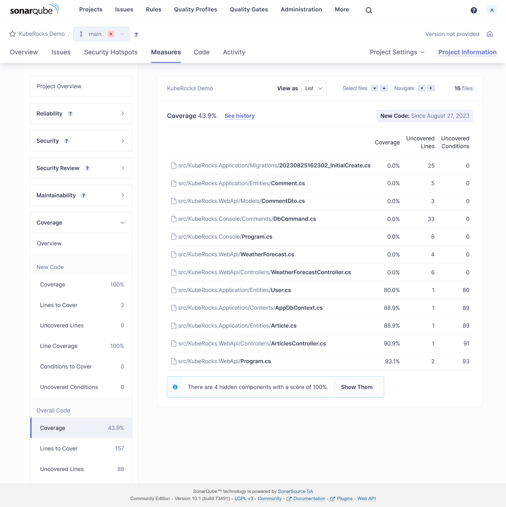


Use GitOps workflow for building a production grade on-premise Kubernetes cluster on cheap VPS provider, with complete CI/CD 🎉


This is the **Part X** of more global topic tutorial. [Back to guide summary]() for intro.

## Code Metrics

SonarQube is leading the code metrics industry for a long time, embracing full Open Core model, and the community edition it's completely free of charge even for commercial use. It covers advanced code analysis, code coverage, code duplication, code smells, security vulnerabilities, etc. It ensures high quality code and help to keep it that way.

### SonarQube installation

SonarQube has its dedicated Helm chart which is perfect for us. However, it's the most resource hungry component of our development stack so far (because built with Java ? End of troll), so be sure to deploy it on almost empty free node (which should be ok with 3 workers), maybe a dedicated one. In fact, it's the last Helm chart for this tutorial, I promise!

Create dedicated database for SonarQube same as usual, then we can use flux for deployment.



```yaml
apiVersion: apps/v1
kind: Namespace
metadata:
  name: sonarqube
---
apiVersion: source.toolkit.fluxcd.io/v1beta2
kind: HelmRepository
metadata:
  name: sonarqube
  namespace: sonarqube
spec:
  interval: 1h0m0s
  url: https://SonarSource.github.io/helm-chart-sonarqube
---
apiVersion: helm.toolkit.fluxcd.io/v2beta1
kind: HelmRelease
metadata:
  name: sonarqube
  namespace: sonarqube
spec:
  chart:
    spec:
      chart: sonarqube
      reconcileStrategy: ChartVersion
      sourceRef:
        kind: HelmRepository
        name: sonarqube
      version: ">=10.0.0"
  interval: 1m
  releaseName: sonarqube
  targetNamespace: sonarqube
  values:
    resources:
      limits:
        cpu: 1000m
        memory: 2Gi
      requests:
        cpu: 500m
        memory: 2Gi

    prometheusMonitoring:
      podMonitor:
        enabled: true
        namespace: sonarqube

    monitoringPasscode: null
    monitoringPasscodeSecretName: sonarqube-secret
    monitoringPasscodeSecretKey: monitoring-passcode

    jdbcOverwrite:
      enable: true
      jdbcUrl: jdbc:postgresql://postgresql-primary.postgres/sonarqube
      jdbcUsername: sonarqube
      jdbcSecretName: sonarqube-secret
      jdbcSecretPasswordKey: db-password

    postgresql:
      enabled: false
---
apiVersion: traefik.io/v1alpha1
kind: IngressRoute
metadata:
  name: sonarqube
  namespace: sonarqube
spec:
  entryPoints:
    - websecure
  routes:
    - match: Host(`sonarqube.kube.rocks`)
      kind: Rule
      services:
        - name: sonarqube-sonarqube
          port: http
```



Here are the secrets to adapt to your needs:



```yaml
apiVersion: v1
kind: Secret
metadata:
  name: sonarqube-secret
  namespace: sonarqube
type: Opaque
data:
  db-password: YWRtaW4=
  monitoring-passcode: YWRtaW4=
```



As seen in part 4 of this guide, seal these secrets with `kubeseal` under `sealed-secret-sonarqube.yaml` and delete original secret file.

Inside Helm values, be sure to disable the PostgreSQL sub chart and use our self-hosted cluster with both `postgresql.enabled` and `jdbcOverwrite.enabled`. If needed, set proper `tolerations` and `nodeSelector` for deploying on a dedicated node.

The installation take many minutes, be patient. Once done, you can access SonarQube on `https://sonarqube.kube.rocks` and login with `admin` / `admin`.

### Project configuration

Firstly create a new project through SonarQube UI and retain the project key which is his identifier. Then create a **global analysis token** named `Concourse CI` that will be used for CI integration from your user account under `/account/security`.

Now we need to create a Kubernetes secret which contains this token value for Concourse CI, for usage inside the pipeline. The token is the one generated above.

Add a new concourse terraform variable for the token:



```tf
variable "concourse_analysis_token" {
  type      = string
  sensitive = true
}
```





```tf
concourse_analysis_token = "xxx"
```



The secret:



```tf
resource "kubernetes_secret_v1" "concourse_sonarqube" {
  metadata {
    name      = "sonarqube"
    namespace = "concourse-main"
  }

  data = {
    url            = "https://sonarqube.${var.domain}"
    analysis-token = var.concourse_analysis_token
  }

  depends_on = [
    helm_release.concourse
  ]
}
```



We are ready to tackle the pipeline for integration.

### SonarScanner for .NET

As we use a dotnet project, we will use the official SonarQube scanner for .net. But sadly, as it's only a .NET CLI wrapper, it requires a java runtime to run and there is no official SonarQube docker image which contains both .NET SDK and Java runtime. But we have a CI now, so we can build our own QA image on our own private registry.

Create a new Gitea repo dedicated for any custom docker images with this one single Dockerfile:



```Dockerfile
FROM mcr.microsoft.com/dotnet/sdk:7.0

RUN apt-get update && apt-get install -y ca-certificates-java && apt-get install -y \
    openjdk-17-jre-headless \
    unzip \
    && rm -rf /var/lib/apt/lists/*

RUN dotnet tool install --global dotnet-sonarscanner
RUN dotnet tool install --global dotnet-coverage

ENV PATH="${PATH}:/root/.dotnet/tools"
```



Note as we add the `dotnet-sonarscanner` tool to the path, we can use it directly in the pipeline without any extra step. I'll also add `dotnet-coverage` global tool for code coverage generation that we'll use later.

Then the pipeline:



```yml
resources:
  - name: docker-images-git
    type: git
    icon: coffee
    source:
      uri: https://gitea.kube.rocks/kuberocks/docker-images
      branch: main
  - name: dotnet-qa-image
    type: registry-image
    icon: docker
    source:
      repository: ((registry.name))/kuberocks/dotnet-qa
      tag: "7.0"
      username: ((registry.username))
      password: ((registry.password))

jobs:
  - name: dotnet-qa
    plan:
      - get: docker-images-git
      - task: build-image
        privileged: true
        config:
          platform: linux
          image_resource:
            type: registry-image
            source:
              repository: concourse/oci-build-task
          inputs:
            - name: docker-images-git
          outputs:
            - name: image
          params:
            DOCKERFILE: docker-images-git/dotnet-qa.dockerfile
          run:
            path: build
      - put: dotnet-qa-image
        params:
          image: image/image.tar
```



Update the `main.yaml` pipeline to add the new job, then trigger it manually from Concourse UI to add the new above pipeline:



```tf
#...

jobs:
  - name: configure-pipelines
    plan:
      #...
      - set_pipeline: images
        file: ci/pipelines/images.yaml
```



The pipeline should now start and build the image, trigger it manually if needed on Concourse UI. Once done, you can check it on your Gitea container packages that the new image `gitea.kube.rocks/kuberocks/dotnet-qa` is here.

### Concourse pipeline integration

It's finally time to reuse this QA image in our Concourse demo project pipeline. Update it accordingly:



```yml
#...

jobs:
  - name: build
    plan:
      - get: source-code
        trigger: true

      - task: build-source
        config:
          platform: linux
          image_resource:
            type: registry-image
            source:
              repository: ((registry.name))/kuberocks/dotnet-qa
              tag: "7.0"
              username: ((registry.username))
              password: ((registry.password))
          #...
          run:
            path: /bin/sh
            args:
              - -ec
              - |
                dotnet format --verify-no-changes

                dotnet sonarscanner begin /k:"KubeRocks-Demo" /d:sonar.host.url="((sonarqube.url))"  /d:sonar.token="((sonarqube.analysis-token))"
                dotnet build -c Release
                dotnet sonarscanner end /d:sonar.token="((sonarqube.analysis-token))"

                dotnet publish src/KubeRocks.WebApi -c Release -o publish --no-restore --no-build

      #...
```



Note as we now use the `dotnet-qa` image and surround the build step by `dotnet sonarscanner begin` and `dotnet sonarscanner end` commands with appropriate credentials allowing Sonar CLI to send report to our SonarQube instance. Trigger the pipeline manually, all should pass, and the result will be pushed to SonarQube.

[](sonarqube-dashboard.png)

## Feature testing

Let's cover the feature testing by calling the API against a real database. This is the opportunity to tackle the code coverage as well.

### xUnit

First add a dedicated database for test in the docker compose file as we won't interfere with the development database:



```yaml
version: "3"

services:
  #...

  db_test:
    image: postgres:15
    environment:
      POSTGRES_USER: main
      POSTGRES_PASSWORD: main
      POSTGRES_DB: main
    ports:
      - 54320:5432
```



Expose the startup service of minimal API:



```cs
//...

public partial class Program
{
    protected Program() { }
}
```



Then add a testing JSON environment file for accessing our database `db_test` from the docker-compose.yml:



```json
{
  "ConnectionStrings": {
    "DefaultConnection": "Host=localhost:54320;Username=main;Password=main;Database=main;"
  }
}
```



Now the test project:

```sh
dotnet new xunit -o tests/KubeRocks.FeatureTests
dotnet sln add tests/KubeRocks.FeatureTests
dotnet add tests/KubeRocks.FeatureTests reference src/KubeRocks.WebApi
dotnet add tests/KubeRocks.FeatureTests package Microsoft.AspNetCore.Mvc.Testing
dotnet add tests/KubeRocks.FeatureTests package Respawn
dotnet add tests/KubeRocks.FeatureTests package FluentAssertions
```

The `WebApplicationFactory` that will use our testing environment:



```cs
using Microsoft.AspNetCore.Mvc.Testing;
using Microsoft.Extensions.Hosting;

namespace KubeRocks.FeatureTests;

public class KubeRocksApiFactory : WebApplicationFactory<Program>
{
    protected override IHost CreateHost(IHostBuilder builder)
    {
        builder.UseEnvironment("Testing");

        return base.CreateHost(builder);
    }
}
```



The base test class for all test classes that manages database cleanup thanks to `Respawn`:



```cs
using KubeRocks.Application.Contexts;

using Microsoft.EntityFrameworkCore;
using Microsoft.Extensions.DependencyInjection;

using Npgsql;

using Respawn;
using Respawn.Graph;

namespace KubeRocks.FeatureTests;

[Collection("Sequencial")]
public class TestBase : IClassFixture<KubeRocksApiFactory>, IAsyncLifetime
{
    protected KubeRocksApiFactory Factory { get; private set; }

    protected TestBase(KubeRocksApiFactory factory)
    {
        Factory = factory;
    }

    public async Task RefreshDatabase()
    {
        using var scope = Factory.Services.CreateScope();

        using var conn = new NpgsqlConnection(
            scope.ServiceProvider.GetRequiredService<AppDbContext>().Database.GetConnectionString()
        );

        await conn.OpenAsync();

        var respawner = await Respawner.CreateAsync(conn, new RespawnerOptions
        {
            TablesToIgnore = new Table[] { "__EFMigrationsHistory" },
            DbAdapter = DbAdapter.Postgres
        });

        await respawner.ResetAsync(conn);
    }

    public Task InitializeAsync()
    {
        return RefreshDatabase();
    }

    public Task DisposeAsync()
    {
        return Task.CompletedTask;
    }
}
```



Note the `Collection` attribute that will force the test classes to run sequentially, required as we will use the same database for all tests.

Finally, the tests for the 2 endpoints of our articles controller:



```cs
using System.Net.Http.Json;

using FluentAssertions;

using KubeRocks.Application.Contexts;
using KubeRocks.Application.Entities;
using KubeRocks.WebApi.Models;

using Microsoft.Extensions.DependencyInjection;

using static KubeRocks.WebApi.Controllers.ArticlesController;

namespace KubeRocks.FeatureTests.Articles;

public class ArticlesListTests : TestBase
{
    public ArticlesListTests(KubeRocksApiFactory factory) : base(factory) { }

    [Fact]
    public async Task Can_Paginate_Articles()
    {
        using (var scope = Factory.Services.CreateScope())
        {
            var db = scope.ServiceProvider.GetRequiredService<AppDbContext>();

            var user = db.Users.Add(new User
            {
                Name = "John Doe",
                Email = "john.doe@email.com"
            });

            db.Articles.AddRange(Enumerable.Range(1, 50).Select(i => new Article
            {
                Title = $"Test Title {i}",
                Slug = $"test-title-{i}",
                Description = "Test Description",
                Body = "Test Body",
                Author = user.Entity,
            }));

            await db.SaveChangesAsync();
        }

        var response = await Factory.CreateClient().GetAsync("/api/Articles?page=1&size=20");

        response.EnsureSuccessStatusCode();

        var body = (await response.Content.ReadFromJsonAsync<ArticlesResponse>())!;

        body.Articles.Count().Should().Be(20);
        body.ArticlesCount.Should().Be(50);

        body.Articles.First().Should().BeEquivalentTo(new
        {
            Title = "Test Title 50",
            Description = "Test Description",
            Body = "Test Body",
            Author = new
            {
                Name = "John Doe"
            },
        });
    }

    [Fact]
    public async Task Can_Get_Article()
    {
        using (var scope = Factory.Services.CreateScope())
        {
            var db = scope.ServiceProvider.GetRequiredService<AppDbContext>();

            db.Articles.Add(new Article
            {
                Title = $"Test Title",
                Slug = $"test-title",
                Description = "Test Description",
                Body = "Test Body",
                Author = new User
                {
                    Name = "John Doe",
                    Email = "john.doe@email.com"
                }
            });

            await db.SaveChangesAsync();
        }

        var response = await Factory.CreateClient().GetAsync($"/api/Articles/test-title");

        response.EnsureSuccessStatusCode();

        var body = (await response.Content.ReadFromJsonAsync<ArticleDto>())!;

        body.Should().BeEquivalentTo(new
        {
            Title = "Test Title",
            Description = "Test Description",
            Body = "Test Body",
            Author = new
            {
                Name = "John Doe"
            },
        });
    }
}
```



Ensure all tests passes with `dotnet test`.


You may be interested in [Testcontainers](https://testcontainers.com/) for native support of containers inside code, including parallelism.


### CI tests & code coverage

Now we need to integrate the tests in our CI pipeline. As we testing with a real database, create a new `demo_test` database through pgAdmin with basic `test` / `test` credentials.


In real world scenario, you should use a dedicated database for testing, and not the same as production.


Let's edit the pipeline accordingly for tests:



```yml
#...

jobs:
  - name: build
    plan:
      #...

      - task: build-source
        config:
          #...
          params:
            ConnectionStrings__DefaultConnection: "Host=postgres-primary.postgres;Username=test;Password=test;Database=demo_test"
          run:
            path: /bin/sh
            args:
              - -ec
              - |
                dotnet format --verify-no-changes

                dotnet sonarscanner begin /k:"KubeRocks-Demo" /d:sonar.host.url="((sonarqube.url))"  /d:sonar.token="((sonarqube.analysis-token))" /d:sonar.cs.vscoveragexml.reportsPaths=coverage.xml
                dotnet build -c Release
                dotnet-coverage collect 'dotnet test -c Release --no-restore --no-build --verbosity=normal' -f xml -o 'coverage.xml'
                dotnet sonarscanner end /d:sonar.token="((sonarqube.analysis-token))"

                dotnet publish src/KubeRocks.WebApi -c Release -o publish --no-restore --no-build

#...
```



Note as we already include code coverage by using `dotnet-coverage` tool. Don't forget to precise the path of `coverage.xml` to `sonarscanner` CLI too. It's time to push our code with tests or trigger the pipeline manually to test our integration tests.

If all goes well, you should see the tests results on SonarQube with some coverage done:

[](sonarqube-tests.png)

Coverage detail:

[](sonarqube-cc.png)

You may exclude some files from analysis by adding some project properties:



```xml
<Project Sdk="Microsoft.NET.Sdk">
  <!-- ... -->

  <ItemGroup>
    <SonarQubeSetting Include="sonar.exclusions">
      <Value>appsettings.Testing.json</Value>
    </SonarQubeSetting>
  </ItemGroup>
</Project>
```



Same for coverage:



```xml
<Project Sdk="Microsoft.NET.Sdk">
  <!-- ... -->

  <ItemGroup>
    <SonarQubeSetting Include="sonar.coverage.exclusions">
      <Value>Migrations/**/*</Value>
    </SonarQubeSetting>
  </ItemGroup>
</Project>
```



### Sonar Analyzer

You can enforce many default sonar rules by using [Sonar Analyzer](https://github.com/SonarSource/sonar-dotnet) directly locally before any code push.

Create this file at the root of your solution for enabling Sonar Analyzer globally:



```xml
<Project>
  <PropertyGroup>
    <AnalysisLevel>latest-Recommended</AnalysisLevel>
    <TreatWarningsAsErrors>true</TreatWarningsAsErrors>
    <CodeAnalysisTreatWarningsAsErrors>true</CodeAnalysisTreatWarningsAsErrors>
  </PropertyGroup>
  <ItemGroup>
    <PackageReference
      Include="SonarAnalyzer.CSharp"
      Version="9.8.0.76515"
      PrivateAssets="all"
      Condition="$(MSBuildProjectExtension) == '.csproj'"
    />
  </ItemGroup>
</Project>
```



Any rule violation is treated as error at project building, which block the CI before execution of tests. Use `latest-All` as `AnalysisLevel` for psychopath mode.

At this stage as soon this file is added, you should see some errors at building. If you use VSCode with correct C# extension, these errors will be highlighted directly in the editor. Here are some fixes:



```cs
#...

builder.Host.UseSerilog((ctx, cfg) => cfg
    .ReadFrom.Configuration(ctx.Configuration)
    .Enrich.WithSpan()
    .WriteTo.Console(
        outputTemplate: "[{Timestamp:HH:mm:ss} {Level:u3}] |{TraceId}| {Message:lj}{NewLine}{Exception}",
        // Enforce culture
        formatProvider: CultureInfo.InvariantCulture
    )
);

#...
```



Delete `WeatherForecastController.cs`.



```xml
<Project Sdk="Microsoft.NET.Sdk">

  <PropertyGroup>
    <!-- ... -->

    <NoWarn>CA1707</NoWarn>
  </PropertyGroup>

  <!-- ... -->
</Project>
```



## 10th check ✅

We have done for code quality process. Go to the [final part]() with load testing, and some frontend !
