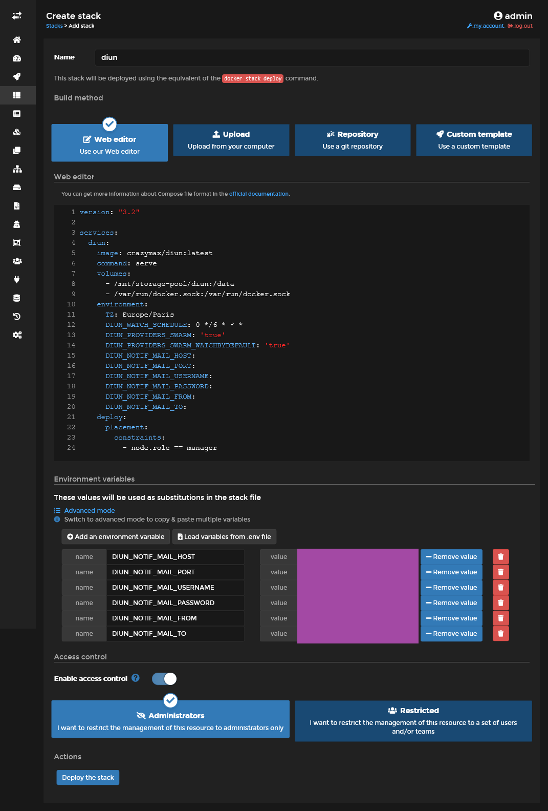
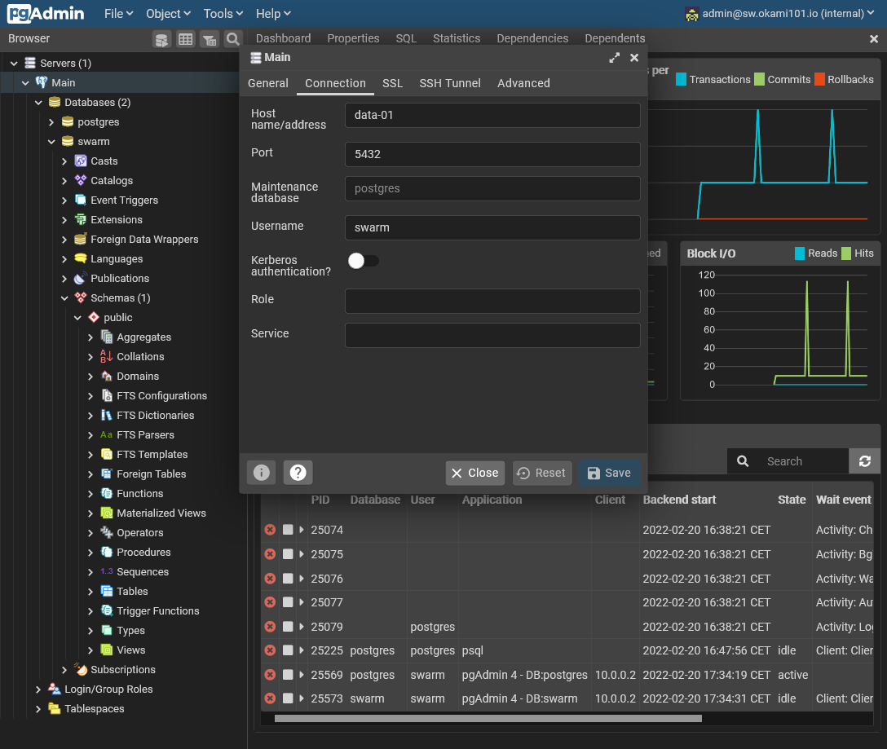
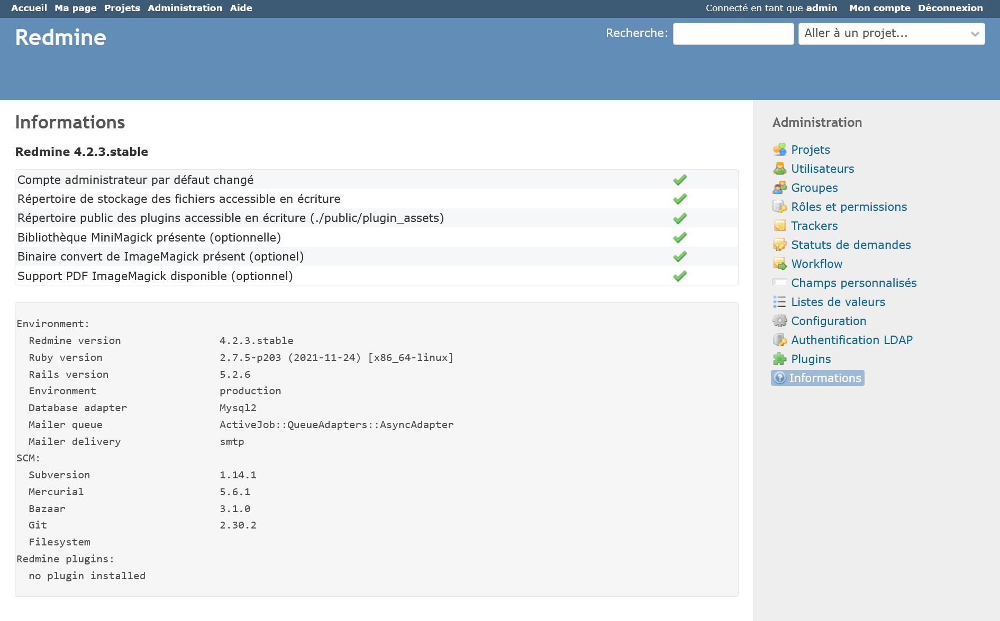
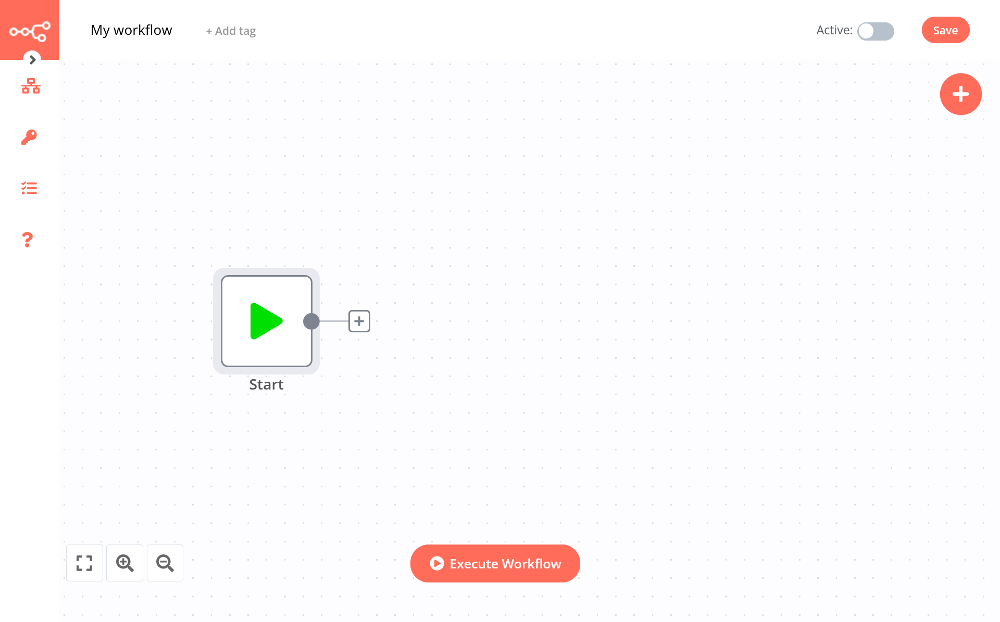


Build your own cheap while powerful self-hosted complete CI/CD solution by following this opinionated guide 🎉


This is the **Part III** of more global topic tutorial. [Back to first part]() to start from beginning.

## Keep the containers image up-to-date

It's finally time to test our new cluster environment by testing some images through the Portainer GUI. We'll start by installing [`Diun`](https://crazymax.dev/diun/), a nice tool for keeping our images up-to-date.

Create a new `diun` stack through Portainer and set following content :

```yml
version: "3.2"

services:
  diun:
    image: crazymax/diun:latest
    command: serve
    volumes:
      - /mnt/storage-pool/diun:/data
      - /var/run/docker.sock:/var/run/docker.sock
    environment:
      TZ: Europe/Paris
      DIUN_WATCH_SCHEDULE: 0 */6 * * *
      DIUN_PROVIDERS_SWARM: 'true'
      DIUN_PROVIDERS_SWARM_WATCHBYDEFAULT: 'true'
      DIUN_NOTIF_MAIL_HOST:
      DIUN_NOTIF_MAIL_PORT:
      DIUN_NOTIF_MAIL_USERNAME:
      DIUN_NOTIF_MAIL_PASSWORD:
      DIUN_NOTIF_MAIL_FROM:
      DIUN_NOTIF_MAIL_TO:
    deploy:
      placement:
        constraints:
          - node.role == manager
```




| name                     | description                                                                                                                                                                                                                                                 |
| ------------------------ | ----------------------------------------------------------------------------------------------------------------------------------------------------------------------------------------------------------------------------------------------------------- |
| `/mnt/storage-pool/diun` | It will be used for storage of Diun db location, Diun need it for storing detection of new images version and avoid notification spams. **Don't forget** to create a new dedicated folder in the GlusterFS volume with `sudo mkdir /mnt/storage-pool/diun`. |
| `/var/run/docker.sock`   | For proper current docker images used detection through Docker API                                                                                                                                                                                          |




| name                                  | description                                                                           |
| ------------------------------------- | ------------------------------------------------------------------------------------- |
| `TZ`                                  | Required for proper timezone schedule                                                 |
| `DIUN_WATCH_SCHEDULE`                 | The standard linux cron schedule                                                      |
| `DIUN_PROVIDERS_SWARM`                | Required for detecting all containers on all nodes                                    |
| `DIUN_PROVIDERS_SWARM_WATCHBYDEFAULT` | If `true`, no need of explicit docker label everywhere                                |
| `DIUN_NOTIF_MAIL_*`                   | Set all according to your own mail provider, or use any other supported notification. |


Use below section of Portainer for setting all personal environment variable. In all cases, all used environment variables must be declared inside YML.







Finally click on **Deploy the stack**, it's equivalent of precedent `docker stack deploy`, nothing magic here. At the difference that Portainer will store the YML inside his volume, allowing full control, contrary to limited Traefik and Portainer cases.

Diun should now be deployed and manager host and ready to scan images for any updates !

You can check the full service page which will allows manual scaling, on-fly volumes mounting, environment variable modification, and show current running tasks (aka containers).


You can check the service logs which consist of all tasks logs aggregate.


## Installation of databases

It's finally time to install some RDBS. The most commons are *MySQL* and *PostgreSQL*. I advise the last one nowadays, but I'll show you how to install both, web GUI managers included. Choose the best suited DB for your own needs.

We'll install this DB obviously on `data-01` as shown in [previous part II schema]().

### MySQL 8

```sh
# on ubuntu 20.04, it's just as simple as next
sudo apt install -y mysql-server

# do some secure setup
sudo mysql_secure_installation # let remote root access enabled
```

Now we need to allow remote root access to the DB from docker nodes in the private network. In MySQL it consists on create a new root user for external host.

First edit `/etc/mysql/mysql.conf.d/mysqld.cnf` file and comment `bind-address` line. Then `sudo service mysql restart` to apply it.

Next use `sudo mysql` then execute following SQL queries :

```sql
CREATE USER 'root'@'10.0.0.0/8' IDENTIFIED WITH caching_sha2_password BY 'myawesomepassword';
GRANT ALL PRIVILEGES ON *.* TO 'root'@'10.0.0.0/8' WITH GRANT OPTION;
FLUSH PRIVILEGES;
```

*10.0.0.0/8* correspond to the subnet mask of private network.

#### Testing remotely via mysql

It's now time to confirm remote root access working. Connect to the `manager-01` host :

```sh
# install the client
sudo apt install -y mysql-client

# you should correctly access to your DB after password prompt
mysql -hdata-01 -uroot -p

# save mysql credentials in local swarm account
mysql_config_editor set -hdata-01 -uroot -p
```

With last command, you now access the db directly from the manager by
`mysql` !

#### phpMyAdmin

We are now ready to go for installing phpMyAdmin as GUI DB manager. Thanks to our Docker Swarm cluster, it's super simple !

Create a new `phpmyadmin` stack with following :

```yml
version: '3.8'

services:
  app:
    image: phpmyadmin/phpmyadmin:5
    volumes:
      - /etc/hosts:/etc/hosts
    environment:
      MYSQL_ROOT_PASSWORD:
      PMA_HOST: data-01
      UPLOAD_LIMIT: 50M
    networks:
      - traefik_public
    deploy:
      labels:
        - traefik.enable=true
        - traefik.http.services.phpmyadmin.loadbalancer.server.port=80
        - traefik.http.routers.phpmyadmin.middlewares=admin-ip
      placement:
        constraints:
          - node.role == manager

networks:
  traefik_public:
    external: true
```

The important part is `/etc/hosts` in order to allow proper DNS resolving for `data-01` configured in `PMA_HOST` environment variable. This will avoid us from dragging the real IP of data server everywhere...

Deploy it, and you should access to <https://phpmyadmin.sw.okami101.io> after few seconds, with full admin access to your MySQL DB !


### PostgreSQL 14

```sh
sudo sh -c 'echo "deb http://apt.postgresql.org/pub/repos/apt $(lsb_release -cs)-pgdg main" > /etc/apt/sources.list.d/pgdg.list'
wget --quiet -O - https://www.postgresql.org/media/keys/ACCC4CF8.asc | sudo apt-key add -
sudo apt-get update
sudo apt-get -y install postgresql-14
```

Let's allow remote access by editing `/etc/postgresql/14/main/postgresql.conf` and setting `listen_addresses = '*'`

Next edit `/etc/postgresql/14/main/pg_hba.conf` and add following line :

```conf
host    all    all    10.0.0.0/8    scram-sha-256
```

Finally, apply these by `sudo service postgresql restart`.

Now create our dedicated super admin `swarm` user :

```sh
# create superadmin swarm user
sudo -u postgres createuser swarm -s

# create the user db
sudo -u postgres createdb swarm
```

Then set the password with `sudo -u postgres psql` and execute following SQL query :

```sql
alter user swarm with encrypted password 'myawesomepassword';
```

#### Testing remotely via psql

It's now time to confirm remote root access working. Connect to the `manager-01` host :

```sh
# install the client
sudo sh -c 'echo "deb http://apt.postgresql.org/pub/repos/apt $(lsb_release -cs)-pgdg main" > /etc/apt/sources.list.d/pgdg.list'
wget --quiet -O - https://www.postgresql.org/media/keys/ACCC4CF8.asc | sudo apt-key add -
sudo apt-get update
sudo apt-get -y install postgresql-client-14

# you should correctly access to your DB after password prompt
psql -hdata-01 -Uswarm
```

For credential storing, create a `.pgpass` file with chmod 600 with following content format : `data-01:5432:swarm:swarm:myawesomepassword`

With last command, you can now access the db directly from the manager by
`psql -hdata-01` !

#### pgAdmin

We are now ready to go for installing pgAdmin as GUI DB manager.

First create a pgadmin storage folder with proper permissions :

```sh
sudo mkdir /mnt/storage-pool/pgadmin
sudo chown -R 5050:5050 /mnt/storage-pool/pgadmin/
```

Finally, create a new `pgadmin` stack with following :

```yml
version: '3.8'

services:
  app:
    image: dpage/pgadmin4
    volumes:
      - /etc/hosts:/etc/hosts
      - /mnt/storage-pool/pgadmin:/var/lib/pgadmin
    environment:
      PGADMIN_DEFAULT_EMAIL:
      PGADMIN_DEFAULT_PASSWORD:
    networks:
      - traefik_public
    deploy:
      labels:
        - traefik.enable=true
        - traefik.http.services.pgadmin.loadbalancer.server.port=80
        - traefik.http.routers.pgadmin.middlewares=admin-ip
      placement:
        constraints:
          - node.role == manager

networks:
  traefik_public:
    external: true
```

You'll need both `PGADMIN_DEFAULT_EMAIL` and `PGADMIN_DEFAULT_PASSWORD` variable environment for proper initialization.

Deploy it, and you should access after few seconds to <https://pgadmin.sw.okami101.io> with the default logins just above.

Once logged, you need to add the previously configured PostgreSQL server address via *Add new server*. Just add relevant host informations in *Connection* tab. Host must stay `data-01` with swarm as superuser access.

Save it, and you have now full access to your PostgreSQL DB !



## Further cluster app testing

Let's now test our cluster with 2 app samples. We'll deploy them to the worker node.

### Redmine over MySQL

Redmine is a popular app for ticketing based on Ruby on Rails. With the docker based cluster, no more headache for installing !

We'll be starting by creating the `redmine` DB with dedicated user through above phpMyAdmin. For that simply create a new `redmine` account and always specify `10.0.0.0/8` inside host field. Don'forget to check *Create database with same name and grant all privileges*.


Use `Native MySQL authentication` as authentication plugin, as Redmine doesn't support sha2 yet.


Create dedicated storage folder :

```sh
sudo mkdir /mnt/storage-pool/redmine

# for config file
sudo mkdir /mnt/storage-pool/redmine/config

# for files upload
sudo mkdir /mnt/storage-pool/redmine/files

# for custom plugins
sudo mkdir /mnt/storage-pool/redmine/plugins

# for any custom themes
sudo mkdir /mnt/storage-pool/redmine/themes

# save default config locally
sudo wget https://raw.githubusercontent.com/redmine/redmine/master/config/configuration.yml.example
-O /mnt/storage-pool/redmine/config/configuration.yml

# generate a random key for REDMINE_SECRET_KEY_BASE
cat /dev/urandom | tr -dc 'a-z0-9' | fold -w 40 | head -n 1
```

Next create new following `redmine` stack :

```yml
version: '3.8'

services:
  app:
    image: redmine:4.2
    volumes:
      - /etc/hosts:/etc/hosts
      - ${ROOT_PATH}/config/configuration.yml:/usr/src/redmine/config/configuration.yml
      - ${ROOT_PATH}/files:/usr/src/redmine/files
      - ${ROOT_PATH}/plugins:/usr/src/redmine/plugins
      - ${ROOT_PATH}/themes:/usr/src/redmine/public/themes
    environment:
      REDMINE_DB_MYSQL:
      REDMINE_DB_DATABASE:
      REDMINE_DB_USERNAME:
      REDMINE_DB_PASSWORD:
      REDMINE_SECRET_KEY_BASE:
    networks:
      - traefik_public
    deploy:
      labels:
        - traefik.enable=true
        - traefik.http.services.redmine.loadbalancer.server.port=3000
      placement:
        constraints:
          - node.role == worker

networks:
  traefik_public:
    external: true
```

Configure `REDMINE_DB_*` with proper above created DB credential and set the random key to `REDMINE_SECRET_KEY_BASE`.


I use a dynamic `ROOT_PATH` here. So you must add this variable with `/mnt/storage-pool/redmine` value in the below *Environment variables* section of portainer.


After few seconds, <https://redmine.sw.okami101.io> should be accessible and ready to use, use admin / admin for admin connection !



### N8N over PostgreSQL

N8N is a popular No Code tool which can be self-hosted. Lets quick and done install with PostgreSQL.

First connect to pgAdmin and create new n8n user and database. Don't forget *Can login?* in *Privileges* tab, and set n8n as owner on database creation.

Create storage folder with `sudo mkdir /mnt/storage-pool/n8n` and create new following stack :

```yml
version: "3"

services:
  app:
    image: n8nio/n8n
    volumes:
      - /etc/hosts:/etc/hosts
      - /mnt/storage-pool/n8n:/home/node/.n8n
    environment:
      DB_TYPE:
      DB_POSTGRESDB_DATABASE:
      DB_POSTGRESDB_HOST:
      DB_POSTGRESDB_USER:
      DB_POSTGRESDB_PASSWORD:
    networks:
      - traefik_public
    deploy:
      labels:
        - traefik.enable=true
        - traefik.http.services.n8n.loadbalancer.server.port=5678
        - traefik.http.routers.n8n.middlewares=admin-auth
      placement:
        constraints:
          - node.role == worker

networks:
  traefik_public:
    external: true
```

And voilà, it's done, n8n will automatically migrate the database and <https://n8n.sw.okami101.io> should be soon accessible. Note as we use `admin-auth` middleware because n8n doesn't offer authentication. Use the same Traefik credentials.



## 3st conclusion 🏁

We've done the databases part with some more real case app containers samples.

In real world, we should have full monitoring suite, this will be [next part]().
