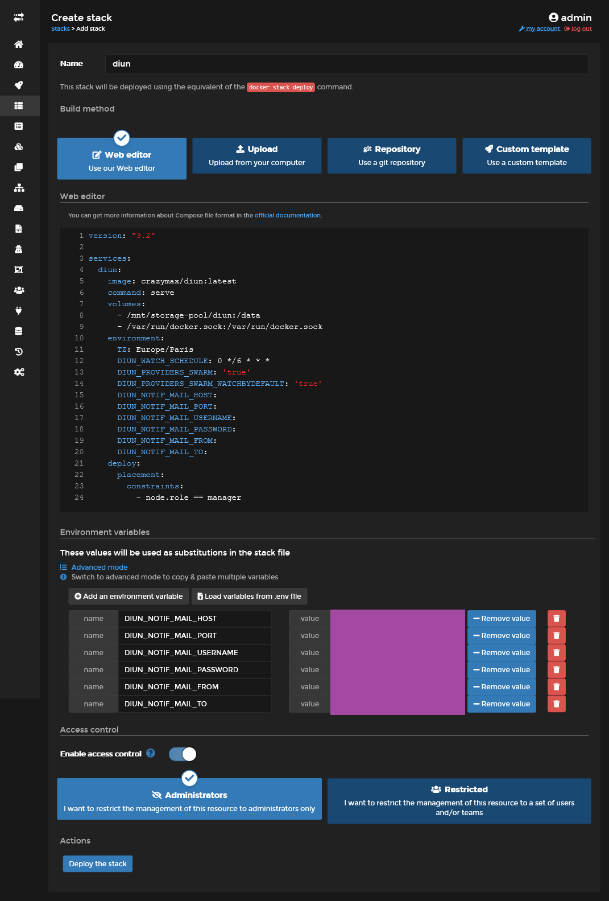
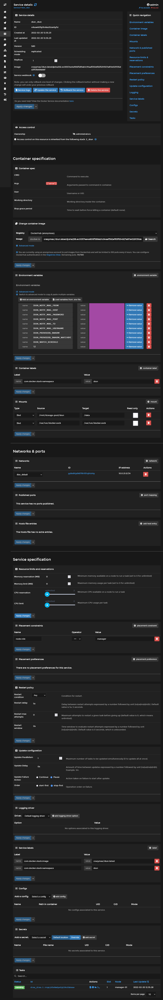
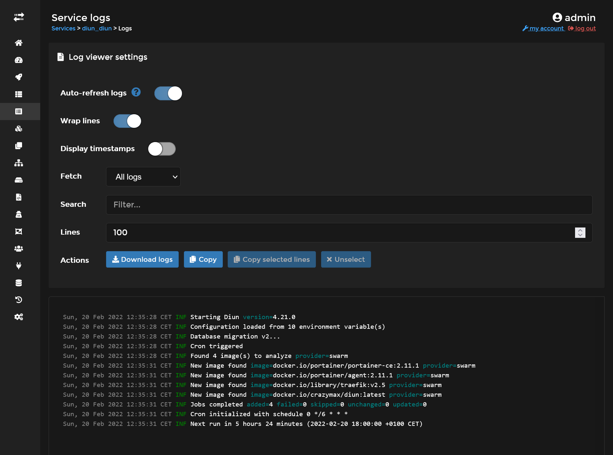


Build your own cheap while powerful self-hosted complete CI/CD solution by following this opinionated guide 🎉


This is the **Part III** of more global topic tutorial. [Back to first part]() to start from beginning.

## Keep the containers image up-to-date

It's finally time to test our new cluster environment by testing some images through the Portainer GUI. We'll start by installing [`Diun`](https://crazymax.dev/diun/), a nice tool for keeping our images up-to-date.

Create a new `diun` stack through Portainer and set following content :

```yml
version: "3.2"

services:
  diun:
    image: crazymax/diun:latest
    command: serve
    volumes:
      - /mnt/storage-pool/diun:/data
      - /var/run/docker.sock:/var/run/docker.sock
    environment:
      TZ: Europe/Paris
      DIUN_WATCH_SCHEDULE: 0 */6 * * *
      DIUN_PROVIDERS_SWARM: 'true'
      DIUN_PROVIDERS_SWARM_WATCHBYDEFAULT: 'true'
      DIUN_NOTIF_MAIL_HOST:
      DIUN_NOTIF_MAIL_PORT:
      DIUN_NOTIF_MAIL_USERNAME:
      DIUN_NOTIF_MAIL_PASSWORD:
      DIUN_NOTIF_MAIL_FROM:
      DIUN_NOTIF_MAIL_TO:
    deploy:
      placement:
        constraints:
          - node.role == manager
```




| name                     | description                                                                                                                                                                                                                                                 |
| ------------------------ | ----------------------------------------------------------------------------------------------------------------------------------------------------------------------------------------------------------------------------------------------------------- |
| `/mnt/storage-pool/diun` | It will be used for storage of Diun db location, Diun need it for storing detection of new images version and avoid notification spams. **Don't forget** to create a new dedicated folder in the GlusterFS volume with `sudo mkdir /mnt/storage-pool/diun`. |
| `/var/run/docker.sock`   | For proper current docker images used detection through Docker API                                                                                                                                                                                          |




| name                                  | description                                                                           |
| ------------------------------------- | ------------------------------------------------------------------------------------- |
| `TZ`                                  | Required for proper timezone schedule                                                 |
| `DIUN_WATCH_SCHEDULE`                 | The standard linux cron schedule                                                      |
| `DIUN_PROVIDERS_SWARM`                | Required for detecting all containers on all nodes                                    |
| `DIUN_PROVIDERS_SWARM_WATCHBYDEFAULT` | If `true`, no need of explicit docker label everywhere                                |
| `DIUN_NOTIF_MAIL_*`                   | Set all according to your own mail provider, or use any other supported notification. |


Use below section of Portainer for setting all personal environment variable. In all cases, all used environment variables must be declared inside YML.







Finally click on **Deploy the stack**, it's equivalent of precedent `docker stack deploy`, nothing magic here. At the difference that Portainer will store the YML inside his volume, allowing full control, contrary to limited Traefik and Portainer cases.

Diun should now be deployed and manager host and ready to scan images for any updates !

You can check the full service page which will allows manual scaling, on-fly volumes mounting, environment variable modification, and show current running tasks (aka containers).



You can check the service logs which consist of all tasks logs aggregate.



## Installation of databases

### MySQL

### PostgreSQL
