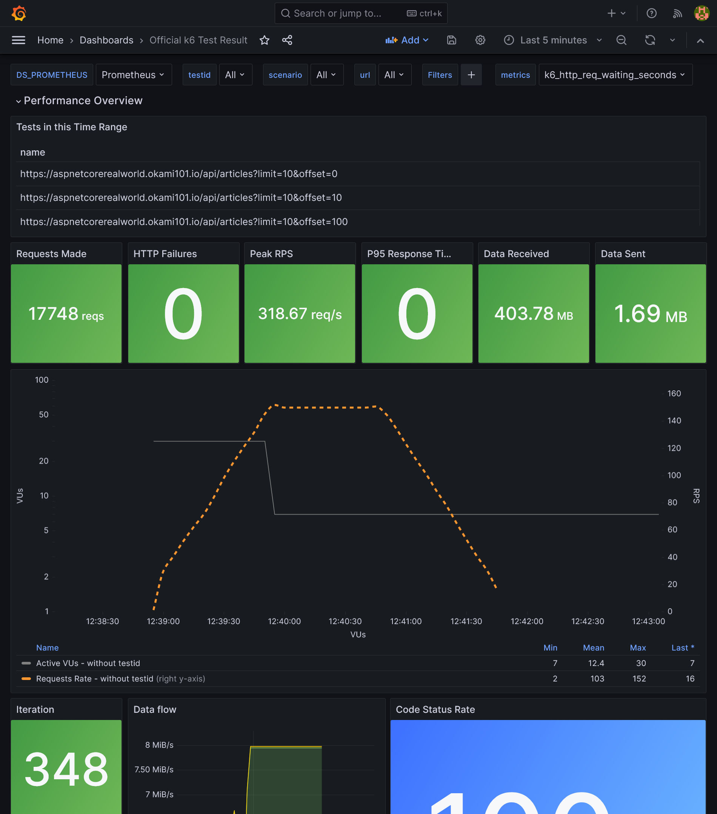
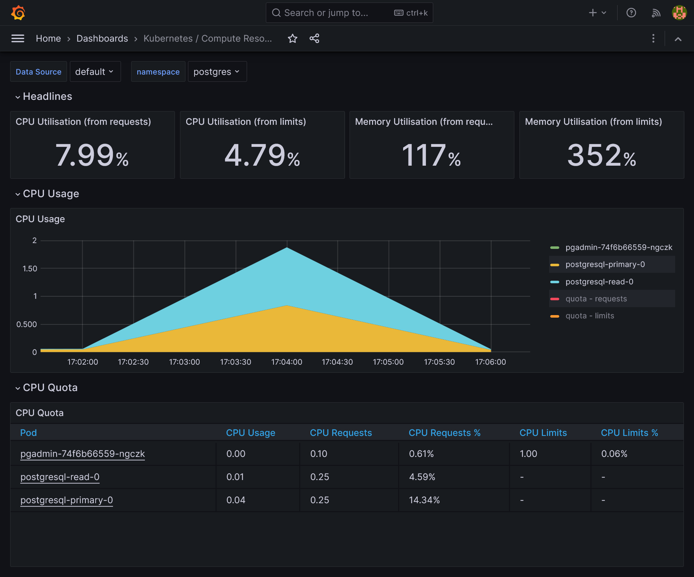
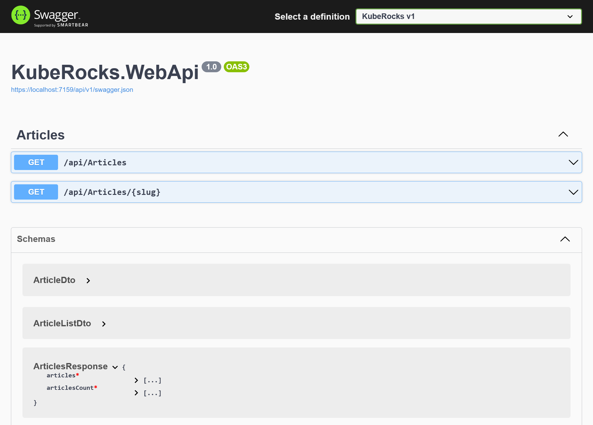
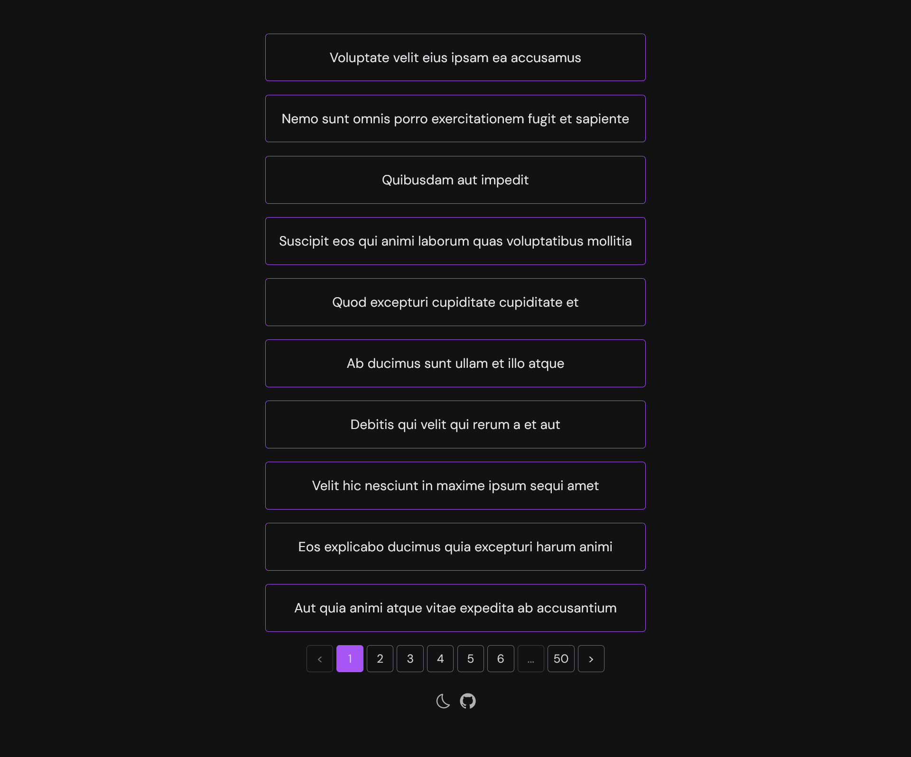


Use GitOps workflow for building a production grade on-premise Kubernetes cluster on cheap VPS provider, with complete CI/CD 🎉


This is the **Part XI** of more global topic tutorial. [Back to guide summary]() for intro.

## Load testing

When it comes load testing, k6 is a perfect tool for this job and integrate with many real time series database integration like Prometheus or InfluxDB. As we already have Prometheus, let's use it and avoid us a separate InfluxDB installation. First be sure to allow remote write by enable `enableRemoteWriteReceiver` in the Prometheus Helm chart. It should be already done if you follow this tutorial.

### K6

We'll reuse our flux repo and add some manifests for defining the load testing scenario. Firstly describe the scenario inside `ConfigMap` that scrape all articles and then each article:



```yml
apiVersion: v1
kind: ConfigMap
metadata:
  name: scenario
  namespace: kuberocks
data:
  script.js: |
    import http from "k6/http";
    import { check } from "k6";

    export default function () {
      const size = 10;
      let page = 1;

      let articles = []

      do {
        const res = http.get(`${__ENV.API_URL}/Articles?page=${page}&size=${size}`);
        check(res, {
          "status is 200": (r) => r.status == 200,
        });

        articles = res.json().articles;
        page++;

        articles.forEach((article) => {
          const res = http.get(`${__ENV.API_URL}/Articles/${article.slug}`);
          check(res, {
            "status is 200": (r) => r.status == 200,
          });
        });
      }
      while (articles.length > 0);
    }
```



Finally, add the k6 `Job` in the same file and configure it for Prometheus usage and mounting above scenario:



```yml
#...
---
apiVersion: batch/v1
kind: Job
metadata:
  name: k6
  namespace: kuberocks
spec:
  ttlSecondsAfterFinished: 0
  template:
    spec:
      restartPolicy: Never
      containers:
        - name: run
          image: grafana/k6
          env:
            - name: API_URL
              value: https://demo.kube.rocks/api
            - name: K6_VUS
              value: "30"
            - name: K6_DURATION
              value: 1m
            - name: K6_PROMETHEUS_RW_SERVER_URL
              value: http://prometheus-operated.monitoring:9090/api/v1/write
          command:
            ["k6", "run", "-o", "experimental-prometheus-rw", "script.js"]
          volumeMounts:
            - name: scenario
              mountPath: /home/k6
      tolerations:
        - key: node-role.kubernetes.io/runner
          operator: Exists
          effect: NoSchedule
      nodeSelector:
        node-role.kubernetes.io/runner: "true"
      volumes:
        - name: scenario
          configMap:
            name: scenario
```



Use appropriate `tolerations` and `nodeSelector` for running the load testing in a node which have free CPU resource. You can play with `K6_VUS` and `K6_DURATION` environment variables in order to change the level of load testing.

Then you can launch the job with `ka jobs/demo-k6.yaml`. Check quickly that the job is running via `klo -n kuberocks job/k6`:

```txt

        /\      |‾‾| /‾‾/   /‾‾/
   /\  /  \     |  |/  /   /  /
  /  \/    \    |     (   /   ‾‾\
 /          \   |  |\  \ |  (‾)  |
/ __________ \  |__| \__\ \_____/ .io

execution: local
   script: script.js
   output: Prometheus remote write (http://prometheus-operated.monitoring:9090/api/v1/write)

scenarios: (100.00%) 1 scenario, 30 max VUs, 1m30s max duration (incl. graceful stop):
         * default: 30 looping VUs for 1m0s (gracefulStop: 30s)
```

After 1 minute of run, job should finish and show some raw result:

```txt
✓ status is 200

checks.........................: 100.00% ✓ 17748     ✗ 0
data_received..................: 404 MB  6.3 MB/s
data_sent......................: 1.7 MB  26 kB/s
http_req_blocked...............: avg=242.43µs min=223ns   med=728ns   max=191.27ms p(90)=1.39µs   p(95)=1.62µs
http_req_connecting............: avg=13.13µs  min=0s      med=0s      max=9.48ms   p(90)=0s       p(95)=0s
http_req_duration..............: avg=104.22ms min=28.9ms  med=93.45ms max=609.86ms p(90)=162.04ms p(95)=198.93ms
  { expected_response:true }...: avg=104.22ms min=28.9ms  med=93.45ms max=609.86ms p(90)=162.04ms p(95)=198.93ms
http_req_failed................: 0.00%   ✓ 0         ✗ 17748
http_req_receiving.............: avg=13.76ms  min=32.71µs med=6.49ms  max=353.13ms p(90)=36.04ms  p(95)=51.36ms
http_req_sending...............: avg=230.04µs min=29.79µs med=93.16µs max=25.75ms  p(90)=201.92µs p(95)=353.61µs
http_req_tls_handshaking.......: avg=200.57µs min=0s      med=0s      max=166.91ms p(90)=0s       p(95)=0s
http_req_waiting...............: avg=90.22ms  min=14.91ms med=80.76ms max=609.39ms p(90)=138.3ms  p(95)=169.24ms
http_reqs......................: 17748   276.81409/s
iteration_duration.............: avg=5.39s    min=3.97s   med=5.35s   max=7.44s    p(90)=5.94s    p(95)=6.84s
iterations.....................: 348     5.427727/s
vus............................: 7       min=7       max=30
vus_max........................: 30      min=30      max=30
```

As we use Prometheus for outputting the result, we can visualize it easily with Grafana. You just have to import [this dashboard](https://grafana.com/grafana/dashboards/18030-official-k6-test-result/):

[](grafana-k6.png)

As we use Kubernetes, increase the loading performance horizontally is dead easy. Go to the deployment configuration of demo app for increasing replicas count, as well as Traefik, and compare the results.

### Load balancing database

So far, we only load balanced the stateless API, but what about the database part ? We have set up a replicated PostgreSQL cluster, however we have no use of the replica that stay sadly idle. But for that we have to distinguish write queries from scalable read queries.

We can make use of the Bitnami [PostgreSQL HA](https://artifacthub.io/packages/helm/bitnami/postgresql-ha) instead of simple one. It adds the new component [Pgpool-II](https://pgpool.net/mediawiki/index.php/Main_Page) as main load balancer and detect failover. It's able to separate in real time write queries from read queries and send them to the master or the replica. The pros: works natively for all apps without any changes. The cons: it consumes far more resources and add a new component to maintain.

A 2nd solution is to separate query typologies from where it counts: the application. It requires some code changes, but it's clearly a far more efficient solution. Let's do this way.

As Npgsql support load balancing [natively](https://www.npgsql.org/doc/failover-and-load-balancing.html), we don't need to add any Kubernetes service. We just have to create a clear distinction between read and write queries. One simple way is to create a separate RO `DbContext`.



```cs
namespace KubeRocks.Application.Contexts;

using KubeRocks.Application.Entities;

using Microsoft.EntityFrameworkCore;

public class AppRoDbContext : DbContext
{
    public DbSet<User> Users => Set<User>();
    public DbSet<Article> Articles => Set<Article>();
    public DbSet<Comment> Comments => Set<Comment>();

    public AppRoDbContext(DbContextOptions<AppRoDbContext> options) : base(options)
    {
    }
}
```



Register it in DI:



```cs
public static class ServiceExtensions
{
    public static IServiceCollection AddKubeRocksServices(this IServiceCollection services, IConfiguration configuration)
    {
        return services
            //...
            .AddDbContext<AppRoDbContext>((options) =>
            {
                options.UseNpgsql(
                    configuration.GetConnectionString("DefaultRoConnection")
                    ??
                    configuration.GetConnectionString("DefaultConnection")
                );
            });
    }
}
```



We fall back to the RW connection string if the RO one is not defined. Then use it in the `ArticlesController` which has only read endpoints:



```cs
//...

public class ArticlesController
{
    private readonly AppRoDbContext _context;

    //...

    public ArticlesController(AppRoDbContext context)
    {
        _context = context;
    }

    //...
}
```



Push and let it pass the CI. In the meantime, add the new RO connection:



```yaml
# ...
spec:
  # ...
  template:
    # ...
    spec:
      # ...
      containers:
        - name: api
          # ...
          env:
            - name: DB_PASSWORD
              valueFrom:
                secretKeyRef:
                  name: demo-db
                  key: password
            - name: ConnectionStrings__DefaultConnection
              value: Host=postgresql-primary.postgres;Username=demo;Password='$(DB_PASSWORD)';Database=demo;
            - name: ConnectionStrings__DefaultRoConnection
              value: Host=postgresql-primary.postgres,postgresql-read.postgres;Username=demo;Password='$(DB_PASSWORD)';Database=demo;Load Balance Hosts=true;
#...
```



We simply have to add multiple hosts like `postgresql-primary.postgres,postgresql-read.postgres` for the RO connection string and enable LB mode with `Load Balance Hosts=true`.

Once deployed, relaunch a load test with K6 and admire the DB load balancing in action on both storage servers with `htop` or directly on compute pods by namespace dashboard in Grafana.

[](grafana-db-lb.png)

## Frontend

Let's finish this guide by a quick view of SPA frontend development as a separate project from backend.

### Vue TS

Create a new Vue.js project from [vitesse starter kit](https://github.com/antfu/vitesse-lite) (be sure to have pnpm, just a matter of `scoop/brew install pnpm`):

```sh
npx degit antfu/vitesse-lite kuberocks-demo-ui
cd kuberocks-demo-ui
git init
git add .
git commit -m "Initial commit"
pnpm i
pnpm dev
```

Should launch app in `http://localhost:3333/`. Create a new `kuberocks-demo-ui` Gitea repo and push this code into it. Now lets quick and done for API calls.

### Get around CORS and HTTPS with YARP

As always when frontend is separated from backend, we have to deal with CORS. But I prefer to have one single URL for frontend + backend and get rid of CORS problem by simply call under `/api` path. Moreover, it'll be production ready without need to manage any `Vite` variable for API URL and we'll get HTTPS provided by dotnet. Back to API project.

For convenience, let's change the randomly generated ASP.NET ports by predefined ones:



```json
{
  //...
  "profiles": {
    "http": {
      //...
      "applicationUrl": "http://localhost:5000",
      //...
    },
    "https": {
      //...
      "applicationUrl": "https://localhost:5001;http://localhost:5000",
      //...
    },
    //...
  }
}
```



```sh
dotnet add src/KubeRocks.WebApi package Yarp.ReverseProxy
```



```cs
//...

var builder = WebApplication.CreateBuilder(args);

builder.Services.AddReverseProxy()
    .LoadFromConfig(builder.Configuration.GetSection("ReverseProxy"));

//...

var app = builder.Build();

app.MapReverseProxy();

//...

app.UseRouting();

//...
```



Note as we must add `app.UseRouting();` too in order to get Swagger UI working.

The proxy configuration (only for development):



```json
{
  //...
  "ReverseProxy": {
    "Routes": {
      "ServerRouteApi": {
        "ClusterId": "Server",
        "Match": {
          "Path": "/api/{**catch-all}"
        },
        "Transforms": [
          {
            "PathRemovePrefix": "/api"
          }
        ]
      },
      "ClientRoute": {
        "ClusterId": "Client",
        "Match": {
          "Path": "{**catch-all}"
        }
      }
    },
    "Clusters": {
      "Client": {
        "Destinations": {
          "Client1": {
            "Address": "http://localhost:3333"
          }
        }
      },
      "Server": {
        "Destinations": {
          "Server1": {
            "Address": "https://localhost:5001"
          }
        }
      }
    }
  }
}
```



Now your frontend app should appear under `https://localhost:5001`, and API calls under `https://localhost:5001/api`. We now benefit from HTTPS for all app. Push API code.

### Typescript API generator

As we use OpenAPI, it's possible to generate typescript client for API calls. Before tackle the generation of client models, go back to backend for forcing required by default for attributes when not nullable when using `Swashbuckle.AspNetCore`:



```cs
using Microsoft.OpenApi.Models;

using Swashbuckle.AspNetCore.SwaggerGen;

namespace KubeRocks.WebApi.Filters;

public class RequiredNotNullableSchemaFilter : ISchemaFilter
{
    public void Apply(OpenApiSchema schema, SchemaFilterContext context)
    {
        if (schema.Properties is null)
        {
            return;
        }

        var notNullableProperties = schema
            .Properties
            .Where(x => !x.Value.Nullable && !schema.Required.Contains(x.Key))
            .ToList();

        foreach (var property in notNullableProperties)
        {
            schema.Required.Add(property.Key);
        }
    }
}
```





```cs
//...

builder.Services.AddSwaggerGen(o =>
{
    o.SupportNonNullableReferenceTypes();
    o.SchemaFilter<RequiredNotNullableSchemaFilter>();
});

//...
```



You should now have proper required attributes for models in swagger UI:

[](swagger-ui-nullable.png)


Sadly, without this boring step, many attributes will be nullable when generating TypeScript models, and leads to headaches from client side by forcing us to manage nullable everywhere.


Now back to the `kubrerocks-demo-ui` project and add the following dependencies:

```sh
pnpm add openapi-typescript -D
pnpm add openapi-typescript-fetch
```

Now generate the models by adding this script:



```json
{
  //...
  "scripts": {
    //...
    "openapi": "openapi-typescript http://localhost:5000/api/v1/swagger.json --output src/api/openapi.ts"
  },
  //...
}
```



Use the HTTP version of swagger as you'll get a self certificate error. Then use `pnpm openapi` to generate full TS model. Finally, describe API fetchers like so:



```ts
import { Fetcher } from 'openapi-typescript-fetch'

import type { components, paths } from './openapi'

const fetcher = Fetcher.for<paths>()

type ArticleList = components['schemas']['ArticleListDto']
type Article = components['schemas']['ArticleDto']

const getArticles = fetcher.path('/api/Articles').method('get').create()
const getArticleBySlug = fetcher.path('/api/Articles/{slug}').method('get').create()

export type { Article, ArticleList }
export {
  getArticles,
  getArticleBySlug,
}
```



We are now fully typed compliant with the API.

### Call the API

Let's create a pretty basic paginated list and detail vue pages:



```vue
<script lang="ts" setup>
import { getArticles } from '~/api'
import type { ArticleList } from '~/api'

const articles = ref<ArticleList[]>([])
const articlesCount = ref<number>(0)

const page = ref<number>(1)
const size = ref<number>(10)

async function loadArticles() {
  const { data } = await getArticles({
    page: page.value,
    size: size.value,
  })

  articles.value = data.articles
  articlesCount.value = data.articlesCount
}

function fetchDataOnPage({ currentPage }: { currentPage: number }) {
  page.value = currentPage
  loadArticles()
}

loadArticles()
</script>

<template>
  <div inline-flex flex-col gap-4>
    <RouterLink
      v-for="(article, i) in articles"
      :key="i"
      :to="`/articles/${article.slug}`"
      inline-block border-1 border-purple-500 rounded p-4
    >
      <h3>{{ article.title }}</h3>
    </RouterLink>
  </div>

  <div mt-4 flex justify-center>
    <OffsetPagination
      :page="page"
      :size="size"
      :total="articlesCount"
      :fetch-data="fetchDataOnPage"
    />
  </div>
</template>
```



The reusable pagination component that use `useOffsetPagination` from VueUse:



```vue
<script lang="ts" setup>
const props = defineProps<{
  total: number
  size: number
  page: number
  fetchData: ({ currentPage }: { currentPage: number }) => Promise<void> | void
}>()

const pagination = computed(() =>
  useOffsetPagination({
    total: props.total,
    page: props.page,
    pageSize: props.size,
    onPageChange: props.fetchData,
    onPageSizeChange: props.fetchData,
  }),
)

function usePagesBuilder(currentPage: number, pageCount: number) {
  const pages = []
  const maxPages = 5
  const half = Math.floor(maxPages / 2)
  const start = Math.max(currentPage - half, 1)
  const end = Math.min(start + maxPages, pageCount)

  for (let i = start; i <= end; i++)
    pages.push(i)

  if (start > 1) {
    pages.unshift('...')
    pages.unshift(1)
  }

  if (end < pageCount) {
    pages.push('...')
    pages.push(pageCount)
  }

  return pages
}

const classes
  = 'flex items-center justify-center border rounded-1 text-sm font-sans text-gray-300 border-gray-500 w-8 h-8'
</script>

<template>
  <div flex flex-wrap gap-1>
    <button
      :disabled="pagination.isFirstPage.value"
      :class="[
        classes,
        {
          'opacity-50': pagination.isFirstPage.value,
        },
      ]"
      @click="pagination.prev"
    >
      &lt;
    </button>
    <button
      v-for="item in usePagesBuilder(
        pagination.currentPage.value,
        pagination.pageCount.value,
      )"
      :key="item"
      :disabled="
        pagination.currentPage.value === item || !Number.isInteger(item)
      "
      :class="[
        classes,
        {
          'opacity-50': !Number.isInteger(item),
          'text-white border-purple-500 bg-purple-500':
            pagination.currentPage.value === item,
        },
      ]"
      @click="pagination.currentPage.value = Number(item)"
    >
      {{ item }}
    </button>
    <button
      :disabled="pagination.isLastPage.value"
      :class="[
        classes,
        {
          'opacity-50': pagination.isLastPage.value,
        },
      ]"
      @click="pagination.next"
    >
      &gt;
    </button>
  </div>
</template>
```



The view detail:



```vue
<script lang="ts" setup>
import { getArticleBySlug } from '~/api'
import type { Article } from '~/api'

const props = defineProps<{ slug: string }>()

const article = ref<Article>()

const router = useRouter()

async function getArticle() {
  const { data } = await getArticleBySlug({ slug: props.slug })

  article.value = data
}

getArticle()
</script>

<template>
  <div v-if="article">
    <h1 mb-6 text-2xl font-bold>
      {{ article.title }}
    </h1>
    <p mb-4 italic>
      {{ article.description }}
    </p>
    <div prose v-html="article.body" />
    <div>
      <button m-3 mt-8 text-sm btn @click="router.back()">
        Back
      </button>
    </div>
  </div>
</template>
```



### Frontend CI/CD

The CI frontend is far simpler than backend. Create a new `demo-ui` pipeline:



```yml
resources:
  - name: version
    type: semver
    source:
      driver: git
      uri: ((git.url))/kuberocks/demo-ui
      branch: main
      file: version
      username: ((git.username))
      password: ((git.password))
      git_user: ((git.git-user))
      commit_message: ((git.commit-message))
  - name: source-code
    type: git
    icon: coffee
    source:
      uri: ((git.url))/kuberocks/demo-ui
      branch: main
      username: ((git.username))
      password: ((git.password))
  - name: docker-image
    type: registry-image
    icon: docker
    source:
      repository: ((registry.name))/kuberocks/demo-ui
      tag: latest
      username: ((registry.username))
      password: ((registry.password))

jobs:
  - name: build
    plan:
      - get: source-code
        trigger: true

      - task: build-source
        config:
          platform: linux
          image_resource:
            type: registry-image
            source:
              repository: node
              tag: 18-buster
          inputs:
            - name: source-code
              path: .
          outputs:
            - name: dist
              path: dist
          caches:
            - path: .pnpm-store
          run:
            path: /bin/sh
            args:
              - -ec
              - |
                corepack enable
                corepack prepare pnpm@latest-8 --activate
                pnpm config set store-dir .pnpm-store
                pnpm i
                pnpm lint
                pnpm build

      - task: build-image
        privileged: true
        config:
          platform: linux
          image_resource:
            type: registry-image
            source:
              repository: concourse/oci-build-task
          inputs:
            - name: source-code
              path: .
            - name: dist
              path: dist
          outputs:
            - name: image
          run:
            path: build
      - put: version
        params: { bump: patch }
      - put: docker-image
        params:
          additional_tags: version/number
          image: image/image.tar
```



`pnpm build` take care of TypeScript type-checks and assets building.



```tf
#...

jobs:
  - name: configure-pipelines
    plan:
      #...
      - set_pipeline: demo-ui
        file: ci/pipelines/demo-ui.yaml
```



Apply it and put this nginx config alongside the `Dockerfile` on frontend root project:



```conf
server {
    listen       80;
    server_name  localhost;

    root /usr/share/nginx/html;

    location / {
        try_files $uri /index.html;
    }
}
```





```Dockerfile
FROM nginx:alpine

COPY docker/nginx.conf /etc/nginx/conf.d/default.conf
COPY dist /usr/share/nginx/html
```




Without nginx config, as it's an SPA, it will not handle properly the JS routes.


After push all CI should build correctly. Then the image policy for auto update:



```yml
apiVersion: image.toolkit.fluxcd.io/v1beta1
kind: ImageRepository
metadata:
  name: demo-ui
  namespace: flux-system
spec:
  image: gitea.kube.rocks/kuberocks/demo-ui
  interval: 1m0s
  secretRef:
    name: dockerconfigjson
---
apiVersion: image.toolkit.fluxcd.io/v1beta1
kind: ImagePolicy
metadata:
  name: demo-ui
  namespace: flux-system
spec:
  imageRepositoryRef:
    name: demo-ui
    namespace: flux-system
  policy:
    semver:
      range: 0.0.x
```



The deployment:



```yml
apiVersion: apps/v1
kind: Deployment
metadata:
  name: demo-ui
  namespace: kuberocks
spec:
  replicas: 2
  selector:
    matchLabels:
      app: demo-ui
  template:
    metadata:
      labels:
        app: demo-ui
    spec:
      imagePullSecrets:
        - name: dockerconfigjson
      containers:
        - name: front
          image: gitea.okami101.io/kuberocks/demo-ui:latest # {"$imagepolicy": "flux-system:image-demo-ui"}
          ports:
            - containerPort: 80
---
apiVersion: v1
kind: Service
metadata:
  name: demo-ui
  namespace: kuberocks
spec:
  selector:
    app: demo-ui
  ports:
    - name: http
      port: 80
```



After push, the demo UI container should be deployed. The very last step is to add a new route to existing `IngressRoute` for frontend:



```yaml
#...
apiVersion: traefik.io/v1alpha1
kind: IngressRoute
#...
spec:
  #...
  routes:
    - match: Host(`demo.kube.rocks`)
      kind: Rule
      services:
        - name: demo-ui
          port: http
    - match: Host(`demo.kube.rocks`) && PathPrefix(`/api`)
      #...
```



Go to `https://demo.kube.rocks` to confirm that front app can call the API.

[](frontend.png)

## Final check 🎊🏁🎊

You just made a vast tour of building an on-premise Kubernetes cluster following GitOps workflow from the ground up. Congratulation if you're getting that far !!!

I highly encourage you to buy [this book](https://www.amazon.com/Understanding-Kubernetes-visual-way-sketchnotes/dp/B0BB619188) from [Aurélie Vache](https://twitter.com/aurelievache), it's the best cheat sheet for Kubernetes in the place.
